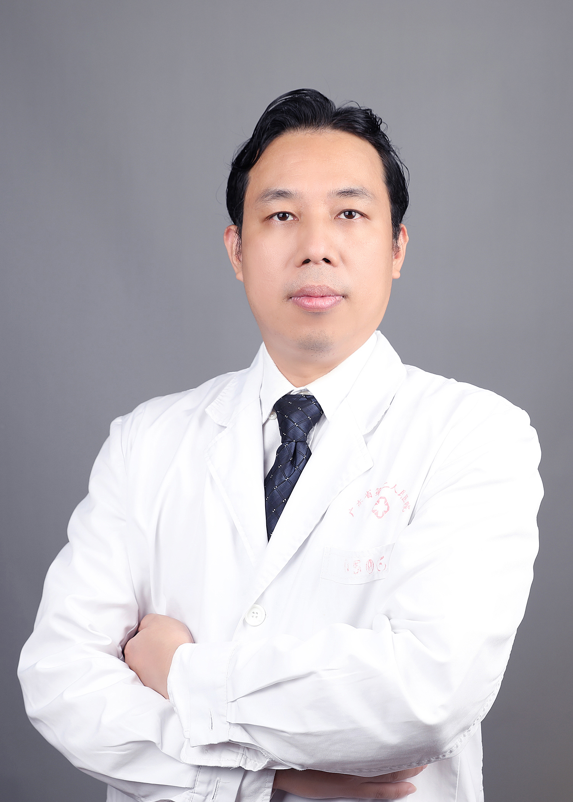

<!-- AUTO-GENERATED-BY: work/generate_obsidian_profiles.py -->

<!-- TEMPLATE: D:\workspace\信息收集整理\医生画像仓库\模板\医生画像模板.md -->

# 肖平

## 基础信息

| 字段 | 内容 |
|---|---|
| 姓名 | 肖平 |
| 医院 | 广东省第二人民医院 |
| 科室 | 耳鼻咽喉头颈外科（琶洲院区） |
| 职称/身份 | 副主任医师 |
| 来源链接 | [官网原文](https://gd2h.com/site/detail/42028.html) |
| 采集日期 | 2026-08-15 |

## 简介/擅长

从事耳鼻咽喉-头颈外科专业工作10余年，熟练掌握耳鼻咽喉头颈外科常见病、多发病的诊断与治疗，多年来致力于内窥镜微创手术，如鼻内镜下鼻窦炎并伴鼻息肉等良恶性肿瘤手术，耳内镜水下内镜操作技术及中耳手术，内镜及显微镜下双镜联合手术方式，内镜激光、低温等离子治疗鼻鼾症等咽喉肿瘤微创手术，对头颈部良恶性肿瘤及过敏性鼻炎有较深的研究。

## 教育与进修经历

- 住院医师规范化培训全程导师。

## 科研项目与成果

- 主持和主要参与广东省科技计划及广东省医学基金多项，发表论著 10 余篇。

## 论文与学术产出

- 主持和主要参与广东省科技计划及广东省医学基金多项，发表论著 10 余篇。

## 可包装亮点

- 个人介绍 副主任医师，医学博士。
- 广东省医师协会耳鼻咽喉头颈外科分会委员；
- 广东省临床医学学会咽喉肿瘤专业委员会委员；
- 中国医促会肿瘤整形外科分会委员，中国整形美容协会肿瘤整复分会委员。

## 重点疾病/人群标签

- 慢性病：
- 肿瘤：肿瘤
- 生殖疾病：
- 免疫/风湿：
- 术后恢复/康复：
- 疑难重症：

## 证据摘录

> 只摘录官网公开信息中的短句或关键字段，不复制大段原文。

- 官网身份字段：副主任医师
- 官网简介/擅长：从事耳鼻咽喉-头颈外科专业工作10余年，熟练掌握耳鼻咽喉头颈外科常见病、多发病的诊断与治疗，多年来致力于内窥镜微创手术，如鼻内镜下鼻窦炎并伴鼻息肉等良恶性肿瘤手术，耳内镜水下内镜操作技术及中耳手术，内镜及显微镜下双镜联合手术方式，内镜激光、低温等离子治疗鼻鼾症等咽喉肿瘤微创手术，对头颈部良恶性肿瘤及过敏性鼻炎有较深的研究。
- 官网亮眼经历线索：个人介绍 副主任医师，医学博士。 广东省医师协会耳鼻咽喉头颈外科分会委员； 广东省临床医学学会咽喉肿瘤专业委员会委员； 中国医促会肿瘤整形外科分会委员，中国整形美容协会肿瘤整复分会委员。
- 来源链接：https://gd2h.com/site/detail/42028.html

## BD 画像摘要

肖平医生可作为肿瘤方向的基础画像候选。后续 BD 使用应继续以官网来源和人工复核为准，不添加疗效承诺或无来源包装。

## 合规边界

- 仅使用医院官网、官方公众号、官方小程序等公开渠道。
- 不采集私人电话、私人微信、家庭住址、患者隐私或非公开排班信息。
- 不写“保证治愈”“疗效第一”“包治疑难杂症”等无法由官网证明的表述。
