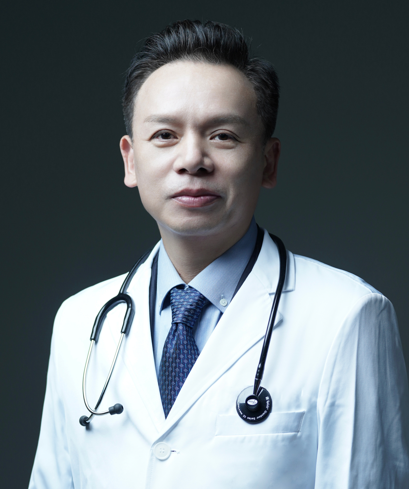

<!-- AUTO-GENERATED-BY: work/generate_obsidian_profiles.py -->

<!-- TEMPLATE: D:\workspace\信息收集整理\医生画像仓库\模板\医生画像模板.md -->

# 苏诚

## 基础信息

| 字段 | 内容 |
|---|---|
| 姓名 | 苏诚 |
| 医院 | 广东省第二人民医院 |
| 科室 | 小儿外科（琶洲院区） |
| 职称/身份 | 副主任医师 |
| 来源链接 | [官网原文](https://gd2h.com/site/detail/42025.html) |
| 采集日期 | 2026-08-15 |

## 简介/擅长

擅长专业领域包括：1、新生儿外科，2、小儿胃肠外科，3、小儿肝胆胰外科，4、小儿泌尿外科，5、小儿实体瘤，6、小儿普外科。近年培养毕业研究生多名，发表国际国内主流刊物论文20余篇，参编与绘画人民卫生出版社外科手术专著多部。

## 教育与进修经历

- 1979-1984年中山医学院临床医学（医疗系）本科毕业，1984-1987年中山医科大学外科学（小儿外科）硕士研究生毕业，1999-2002年中山大学外科学（小儿外科）临床医学博士毕业。

## 科研项目与成果

- 1983-2023中山大学附属第一医院小儿外科工作，1995-1997美国UCLA医学院工作学习，从事小儿肝移植临床与科研，1998-2006任中山大学附属第一医院小儿外科副主任。

## 可包装亮点

- 个人介绍 广东省第二人民医院小儿外科学科带头人、特聘教授、科主任。
- 1983-2023中山大学附属第一医院小儿外科工作，1995-1997美国UCLA医学院工作学习，从事小儿肝移植临床与科研，1998-2006任中山大学附属第一医院小儿外科副主任。
- 从事小儿外科工作40年，具有丰富的小儿外科临床诊治能力，尤其对小儿外科疑难复杂少见病例有经验丰富的处理知识，手术操作优秀，治疗效果好，40年临床工作无医疗差错与事故。

## 重点疾病/人群标签

- 慢性病：
- 肿瘤：瘤、疑难、复杂
- 生殖疾病：
- 免疫/风湿：
- 术后恢复/康复：
- 疑难重症：瘤、疑难、复杂

## 证据摘录

> 只摘录官网公开信息中的短句或关键字段，不复制大段原文。

- 官网身份字段：副主任医师
- 官网简介/擅长：擅长专业领域包括：1、新生儿外科，2、小儿胃肠外科，3、小儿肝胆胰外科，4、小儿泌尿外科，5、小儿实体瘤，6、小儿普外科。近年培养毕业研究生多名，发表国际国内主流刊物论文20余篇，参编与绘画人民卫生出版社外科手术专著多部。
- 官网亮眼经历线索：个人介绍 广东省第二人民医院小儿外科学科带头人、特聘教授、科主任。 1983-2023中山大学附属第一医院小儿外科工作，1995-1997美国UCLA医学院工作学习，从事小儿肝移植临床与科研，1998-2006任中山大学附属第一医院小儿外科副主任。 从事小儿外科工作40年，具有丰富的小儿外科临床诊治能力，尤其对小儿外科疑难复杂少见病例有经验丰富的处理知识，手术操作优秀，治疗效果好，40年临床工作无医疗差错与事故。
- 来源链接：https://gd2h.com/site/detail/42025.html

## BD 画像摘要

苏诚医生可作为肿瘤、疑难重症方向的基础画像候选。后续 BD 使用应继续以官网来源和人工复核为准，不添加疗效承诺或无来源包装。

## 合规边界

- 仅使用医院官网、官方公众号、官方小程序等公开渠道。
- 不采集私人电话、私人微信、家庭住址、患者隐私或非公开排班信息。
- 不写“保证治愈”“疗效第一”“包治疑难杂症”等无法由官网证明的表述。
