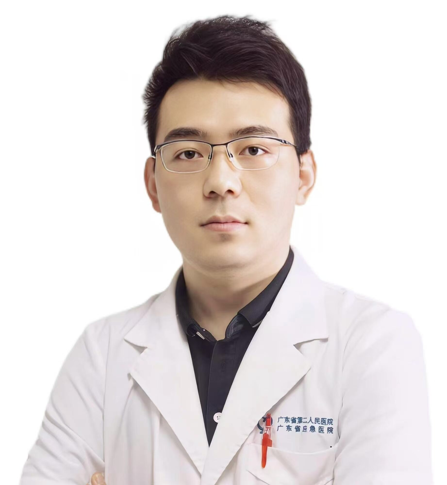

<!-- AUTO-GENERATED-BY: work/generate_obsidian_profiles.py -->

<!-- TEMPLATE: D:\workspace\信息收集整理\医生画像仓库\模板\医生画像模板.md -->

# 许长鹏

## 基础信息

| 字段 | 内容 |
|---|---|
| 姓名 | 许长鹏 |
| 医院 | 广东省第二人民医院 |
| 科室 | 关节骨一科（琶洲院区） |
| 职称/身份 | 副主任医师 |
| 来源链接 | [官网原文](https://gd2h.com/site/detail/41978.html) |
| 采集日期 | 2026-08-15 |

## 简介/擅长

医学博士，科室主任 开设“保膝特色门诊”，带领团队开发“非常6+2”保膝运动处方进行膝关节炎保守治疗且效果显著。擅长膝骨关节炎的保膝微创治疗。在人工智能AI虚拟手术规划、3D打印辅助以及手术机器人辅助关节置换精准治疗方面积累了丰富的经验。肩、髋、膝、踝关节运动损伤的关节镜微创治疗及快速康复有较深造诣。赴中国人民解放军总医院（301医院）进修学习人工智能辅助微创关节置换及关节镜技术。熟练掌握DAA微创全髋置换和HTO、UKA等保膝治疗手术，实现关节置换术后不限制体位的快速正常活动。多次主办人工智能辅助微创髋膝关节置换培训学习班。

## 教育与进修经历

- 广东省第二人民医院关节骨科科室主任，医学博士，南方医科大学、暨南大学、广东医科大学、广东工业大学硕士研究生导师，暨南大学博士后联合培养合作导师，第七届羊城青年好医生，WHO国际应急医疗队成员。

## 科研项目与成果

- 科研方面：国家自然科学基金委员会及广东省自然科学基金委员会同行评审专家。
- 主要针对骨感染相关分子机制及骨缺损修复材料研发研究，在炎症抑制成骨分化以及骨修复材料研究领域积累了一定原创性成果。
- 主持国家自然科学基金项目2项，广东省自然科学基金2项，广州市科技计划基金项目3项，广东省第二人民医院院级科研项目3项，参与国家科技部“十四五”重点研发项目1项。
- 发表SCI论文30余篇，申请专利5项。

## 论文与学术产出

- 发表SCI论文30余篇，申请专利5项。

## 可包装亮点

- 广东省第二人民医院关节骨科科室主任，医学博士，南方医科大学、暨南大学、广东医科大学、广东工业大学硕士研究生导师，暨南大学博士后联合培养合作导师，第七届羊城青年好医生，WHO国际应急医疗队成员。
- 学术任职：中国老年医学学会骨与关节分会委员，中华预防医学会关节病预防与运动医学专委会委员，中国医师协会骨科医师分会青年委员，广东省医学会关节外科学分会常务委员，广东省医学会运动医学分会委员，中国医药教育协会骨科专业委员会广东省骨科分会委员，广东省生物医学工程学会骨科远程医学分会委员。
- 科研方面：国家自然科学基金委员会及广东省自然科学基金委员会同行评审专家。
- 主持国家自然科学基金项目2项，广东省自然科学基金2项，广州市科技计划基金项目3项，广东省第二人民医院院级科研项目3项，参与国家科技部“十四五”重点研发项目1项。

## 重点疾病/人群标签

- 慢性病：
- 肿瘤：
- 生殖疾病：
- 免疫/风湿：感染、术后、康复
- 术后恢复/康复：感染、术后、康复
- 疑难重症：

## 证据摘录

> 只摘录官网公开信息中的短句或关键字段，不复制大段原文。

- 官网身份字段：副主任医师
- 官网简介/擅长：医学博士，科室主任 开设“保膝特色门诊”，带领团队开发“非常6+2”保膝运动处方进行膝关节炎保守治疗且效果显著。擅长膝骨关节炎的保膝微创治疗。在人工智能AI虚拟手术规划、3D打印辅助以及手术机器人辅助关节置换精准治疗方面积累了丰富的经验。肩、髋、膝、踝关节运动损伤的关节镜微创治疗及快速康复有较深造诣。赴中国人民解放军总医院（301医院）进修学习人工智能辅助微创关节置换及关节镜技术。熟练掌握DAA微创全髋置换和HTO、UKA等保膝治疗手…
- 官网亮眼经历线索：广东省第二人民医院关节骨科科室主任，医学博士，南方医科大学、暨南大学、广东医科大学、广东工业大学硕士研究生导师，暨南大学博士后联合培养合作导师，第七届羊城青年好医生，WHO国际应急医疗队成员。 学术任职：中国老年医学学会骨与关节分会委员，中华预防医学会关节病预防与运动医学专委会委员，中国医师协会骨科医师分会青年委员，广东省医学会关节外科学分会常务委员，广东省医学会运动医学分会委员，中国医药教育协会骨科专业委员会广东省骨科分会委员，广东…
- 来源链接：https://gd2h.com/site/detail/41978.html

## BD 画像摘要

许长鹏医生可作为免疫/风湿/感染、术后恢复/康复方向的基础画像候选。后续 BD 使用应继续以官网来源和人工复核为准，不添加疗效承诺或无来源包装。

## 合规边界

- 仅使用医院官网、官方公众号、官方小程序等公开渠道。
- 不采集私人电话、私人微信、家庭住址、患者隐私或非公开排班信息。
- 不写“保证治愈”“疗效第一”“包治疑难杂症”等无法由官网证明的表述。
