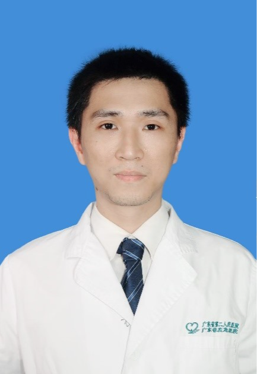

<!-- AUTO-GENERATED-BY: work/generate_obsidian_profiles.py -->

<!-- TEMPLATE: D:\workspace\信息收集整理\医生画像仓库\模板\医生画像模板.md -->

# 谢烨权

## 基础信息

| 字段 | 内容 |
|---|---|
| 姓名 | 谢烨权 |
| 医院 | 广东省第二人民医院 |
| 科室 | 胃肠外科（琶洲院区）、结直肠癌诊治中心（琶洲院区） |
| 职称/身份 | 医师 |
| 来源链接 | [官网原文](https://gd2h.com/site/detail/8ca5a8f10e8e4eda9c11614cca774a9f.html) |
| 采集日期 | 2026-08-15 |

## 简介/擅长

掌握胃肠外科常见病、多发病的诊断和治疗，掌握胃肠肿瘤的精准化治疗。

## 教育与进修经历

- 医学博士，现为广东省第二人民医院胃肠外科医师，毕业于中山大学中山医学院临床医学八年制。

## 论文与学术产出

- 致力于胃肠肿瘤、急腹症、疝气的诊治及研究，熟悉掌握胃肠外科相关疾病规范化诊疗过程，发表 SCI 论文 1 篇，中文核心 2 篇。

## 可包装亮点

- 致力于胃肠肿瘤、急腹症、疝气的诊治及研究，熟悉掌握胃肠外科相关疾病规范化诊疗过程，发表 SCI 论文 1 篇，中文核心 2 篇。

## 重点疾病/人群标签

- 慢性病：
- 肿瘤：
- 生殖疾病：
- 免疫/风湿：
- 术后恢复/康复：
- 疑难重症：

## 证据摘录

> 只摘录官网公开信息中的短句或关键字段，不复制大段原文。

- 官网身份字段：医师
- 官网简介/擅长：掌握胃肠外科常见病、多发病的诊断和治疗，掌握胃肠肿瘤的精准化治疗。
- 官网亮眼经历线索：致力于胃肠肿瘤、急腹症、疝气的诊治及研究，熟悉掌握胃肠外科相关疾病规范化诊疗过程，发表 SCI 论文 1 篇，中文核心 2 篇。
- 异常提示：职称/身份需人工复核
- 来源链接：https://gd2h.com/site/detail/8ca5a8f10e8e4eda9c11614cca774a9f.html

## BD 画像摘要

谢烨权医生可作为广东省第二人民医院胃肠外科（琶洲院区）、结直肠癌诊治中心（琶洲院区）的基础医生资料入库。当前重点方向以总底表标签为准，官网未展示的信息保持空白。

## 合规边界

- 仅使用医院官网、官方公众号、官方小程序等公开渠道。
- 不采集私人电话、私人微信、家庭住址、患者隐私或非公开排班信息。
- 不写“保证治愈”“疗效第一”“包治疑难杂症”等无法由官网证明的表述。
