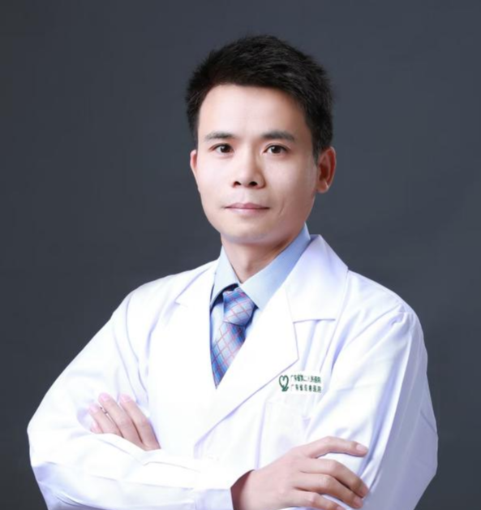

<!-- AUTO-GENERATED-BY: work/generate_obsidian_profiles.py -->

<!-- TEMPLATE: D:\workspace\信息收集整理\医生画像仓库\模板\医生画像模板.md -->

# 赖勇强

## 基础信息

| 字段 | 内容 |
|---|---|
| 姓名 | 赖勇强 |
| 医院 | 广东省第二人民医院 |
| 科室 | 胸壁外科（民航院区） |
| 职称/身份 | 副主任医师 |
| 来源链接 | [官网原文](https://gd2h.com/site/detail/924f7d572bcd4dd4b2ed5b81fda1c276.html) |
| 采集日期 | 2026-08-15 |

## 简介/擅长

在乳腺结节微创切除、腔镜乳腺癌根治、保乳手术，乳腺癌术后假体重建、自体皮瓣重建、腔镜甲状腺癌根治手术上经验独到

## 教育与进修经历

- 硕士研究生毕业于南方医科大学，博士研究生毕业于圣玛丽安医科大学（日本），现任广东省健康管理协会乳房重建及美学专业委员会委员，广东省保健协会乳腺保健分会委员，广东省预防医学会乳腺癌防治专业委员会委员，广东省医院协会第一届乳腺外科管理专业委员会委员。

## 科研项目与成果

- 赖勇强 广东省第二人民医院民航院区胸壁外科研究所，乳腺、胸壁肿瘤，甲状腺结节甲癌专科，副主任医师，医学博士。
- 主持或参与省市级科研项目3项，第一作者在国内外期刊发表论文10余篇，其中SCI论文3篇。

## 论文与学术产出

- 主持或参与省市级科研项目3项，第一作者在国内外期刊发表论文10余篇，其中SCI论文3篇。

## 可包装亮点

- 赖勇强 广东省第二人民医院民航院区胸壁外科研究所，乳腺、胸壁肿瘤，甲状腺结节甲癌专科，副主任医师，医学博士。
- 从事普外科、乳腺甲状腺外科工作近20年，擅长乳腺、甲状腺良恶性肿瘤的诊疗，尤其在乳腺结节微创切除、腔镜乳腺癌根治、保乳手术，乳腺癌术后假体重建、自体皮瓣重建、腔镜甲状腺癌根治手术上经验独到，率先在省二医民航院区开展乳腺结节微创旋切、腔镜皮下乳房全切、一期假体重建术，横行腹直肌肌皮瓣（Tram)胸部修复术，腔镜经锁骨下切口甲状腺癌根治术。
- 硕士研究生毕业于南方医科大学，博士研究生毕业于圣玛丽安医科大学（日本），现任广东省健康管理协会乳房重建及美学专业委员会委员，广东省保健协会乳腺保健分会委员，广东省预防医学会乳腺癌防治专业委员会委员，广东省医院协会第一届乳腺外科管理专业委员会委员。
- 主持或参与省市级科研项目3项，第一作者在国内外期刊发表论文10余篇，其中SCI论文3篇。

## 重点疾病/人群标签

- 慢性病：
- 肿瘤：肿瘤、癌、乳腺癌、术后
- 生殖疾病：
- 免疫/风湿：
- 术后恢复/康复：肿瘤、癌、乳腺癌、术后
- 疑难重症：

## 证据摘录

> 只摘录官网公开信息中的短句或关键字段，不复制大段原文。

- 官网身份字段：副主任医师
- 官网简介/擅长：在乳腺结节微创切除、腔镜乳腺癌根治、保乳手术，乳腺癌术后假体重建、自体皮瓣重建、腔镜甲状腺癌根治手术上经验独到
- 官网亮眼经历线索：赖勇强 广东省第二人民医院民航院区胸壁外科研究所，乳腺、胸壁肿瘤，甲状腺结节甲癌专科，副主任医师，医学博士。 从事普外科、乳腺甲状腺外科工作近20年，擅长乳腺、甲状腺良恶性肿瘤的诊疗，尤其在乳腺结节微创切除、腔镜乳腺癌根治、保乳手术，乳腺癌术后假体重建、自体皮瓣重建、腔镜甲状腺癌根治手术上经验独到，率先在省二医民航院区开展乳腺结节微创旋切、腔镜皮下乳房全切、一期假体重建术，横行腹直肌肌皮瓣（Tram)胸部修复术，腔镜经锁骨下切口甲状腺…
- 来源链接：https://gd2h.com/site/detail/924f7d572bcd4dd4b2ed5b81fda1c276.html

## BD 画像摘要

赖勇强医生可作为肿瘤、术后恢复/康复方向的基础画像候选。后续 BD 使用应继续以官网来源和人工复核为准，不添加疗效承诺或无来源包装。

## 合规边界

- 仅使用医院官网、官方公众号、官方小程序等公开渠道。
- 不采集私人电话、私人微信、家庭住址、患者隐私或非公开排班信息。
- 不写“保证治愈”“疗效第一”“包治疑难杂症”等无法由官网证明的表述。
