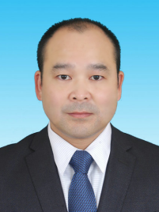

<!-- AUTO-GENERATED-BY: work/generate_obsidian_profiles.py -->

<!-- TEMPLATE: D:\workspace\信息收集整理\医生画像仓库\模板\医生画像模板.md -->

# 赖远辉

## 基础信息

| 字段 | 内容 |
|---|---|
| 姓名 | 赖远辉 |
| 医院 | 广东省第二人民医院 |
| 科室 | 甲状腺乳腺外科（琶洲院区） |
| 职称/身份 | 主任医师 |
| 来源链接 | [官网原文](https://gd2h.com/site/detail/42302.html) |
| 采集日期 | 2026-08-15 |

## 简介/擅长

甲状腺、甲状旁腺良恶性疾病的诊断及以手术为主的综合治疗，对术中喉返神经和甲状旁腺保护技术有丰富经验；擅长乳腺疾病的诊治以及乳腺癌的规范化治疗，对各期乳腺癌的手术、化疗、内分泌治疗、靶向治疗及免疫治疗有丰富的临床经验。

## 科研项目与成果

- 在中山大学附属第一医院工作 20年，曾任中山大学附属第一医院东院甲状腺乳腺外科主任，长期从事甲状腺乳腺疾病临床、科研和教学工作， 擅长 经胸乳入路 腔镜 下 甲状腺 切除 术、乳腺癌保乳根治术 和乳腺癌术后乳房重建手术，对复发和转移性乳腺癌的综合治疗有丰富的临床经验 。
- 参与国家自然科学基金研究项目 2项，主持或参与省市区级课题6项，在国内外专业期刊发表论文20余篇。

## 论文与学术产出

- 参与国家自然科学基金研究项目 2项，主持或参与省市区级课题6项，在国内外专业期刊发表论文20余篇。

## 可包装亮点

- 简介：主任医师、医学博士。
- 在中山大学附属第一医院工作 20年，曾任中山大学附属第一医院东院甲状腺乳腺外科主任，长期从事甲状腺乳腺疾病临床、科研和教学工作， 擅长 经胸乳入路 腔镜 下 甲状腺 切除 术、乳腺癌保乳根治术 和乳腺癌术后乳房重建手术，对复发和转移性乳腺癌的综合治疗有丰富的临床经验 。
- 任广东省医师协会甲状腺专业医师学会常委，广东省抗癌协会专业委员会甲状腺癌专业委员会委员，广东省药学会甲状腺专家委员会常委，广东省中医药学会甲状腺疾病防治专业委员会委员，广东省基层医药学会肿瘤多学科综合诊治专业委员会常委，广东省保健协会乳腺保健分会第二届常委，广东省精准医学应用学会乳腺肿瘤分会第二届委员会委员，广东省医疗行业协会乳腺病整形修复管理分会委员，广…
- 参与国家自然科学基金研究项目 2项，主持或参与省市区级课题6项，在国内外专业期刊发表论文20余篇。

## 重点疾病/人群标签

- 慢性病：
- 肿瘤：肿瘤、癌、化疗、靶向、乳腺癌、免疫、术后、多学科
- 生殖疾病：
- 免疫/风湿：肿瘤、癌、化疗、靶向、乳腺癌、免疫、术后、多学科
- 术后恢复/康复：肿瘤、癌、化疗、靶向、乳腺癌、免疫、术后、多学科
- 疑难重症：肿瘤、癌、化疗、靶向、乳腺癌、免疫、术后、多学科

## 证据摘录

> 只摘录官网公开信息中的短句或关键字段，不复制大段原文。

- 官网身份字段：主任医师
- 官网简介/擅长：甲状腺、甲状旁腺良恶性疾病的诊断及以手术为主的综合治疗，对术中喉返神经和甲状旁腺保护技术有丰富经验；擅长乳腺疾病的诊治以及乳腺癌的规范化治疗，对各期乳腺癌的手术、化疗、内分泌治疗、靶向治疗及免疫治疗有丰富的临床经验。
- 官网亮眼经历线索：简介：主任医师、医学博士。 在中山大学附属第一医院工作 20年，曾任中山大学附属第一医院东院甲状腺乳腺外科主任，长期从事甲状腺乳腺疾病临床、科研和教学工作， 擅长 经胸乳入路 腔镜 下 甲状腺 切除 术、乳腺癌保乳根治术 和乳腺癌术后乳房重建手术，对复发和转移性乳腺癌的综合治疗有丰富的临床经验 。 任广东省医师协会甲状腺专业医师学会常委，广东省抗癌协会专业委员会甲状腺癌专业委员会委员，广东省药学会甲状腺专家委员会常委，广东省中医药学会…
- 来源链接：https://gd2h.com/site/detail/42302.html

## BD 画像摘要

赖远辉医生可作为肿瘤、免疫/风湿/感染、术后恢复/康复、疑难重症方向的基础画像候选。后续 BD 使用应继续以官网来源和人工复核为准，不添加疗效承诺或无来源包装。

## 合规边界

- 仅使用医院官网、官方公众号、官方小程序等公开渠道。
- 不采集私人电话、私人微信、家庭住址、患者隐私或非公开排班信息。
- 不写“保证治愈”“疗效第一”“包治疑难杂症”等无法由官网证明的表述。
