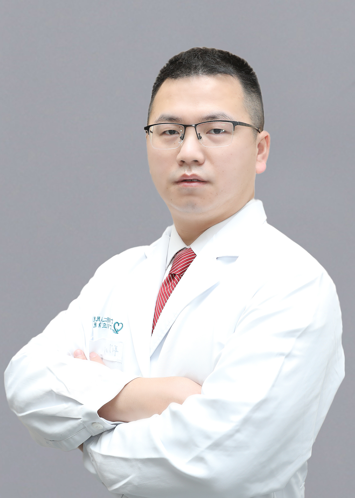

<!-- AUTO-GENERATED-BY: work/generate_obsidian_profiles.py -->

<!-- TEMPLATE: D:\workspace\信息收集整理\医生画像仓库\模板\医生画像模板.md -->

# 赵向东

## 基础信息

| 字段 | 内容 |
|---|---|
| 姓名 | 赵向东 |
| 医院 | 广东省第二人民医院 |
| 科室 | 耳鼻咽喉头颈外科（琶洲院区） |
| 职称/身份 | 副主任医师 |
| 来源链接 | [官网原文](https://gd2h.com/site/detail/42033.html) |
| 采集日期 | 2026-08-15 |

## 简介/擅长

擅长慢性化脓性中耳炎、先天性感音神经性耳聋、突发性耳聋、鼻窦炎等疾病的诊治。

## 教育与进修经历

- 2017-2018 年美国 AUGUSTA UNIVERSITY 访问学者，同时在哈佛医学院附属医院 Beth Israel Deaconess Medical Center 和 Cleveland Clinic 的耳显微外科研究所进修学习，进一步提高在慢性化脓性中耳炎、中耳胆脂瘤、听觉植入（人工耳蜗植入、振动声桥和 BAHA 植入）及听神经瘤等疾病诊治方面的临床技能。

## 科研项目与成果

- 2017-2018 年美国 AUGUSTA UNIVERSITY 访问学者，同时在哈佛医学院附属医院 Beth Israel Deaconess Medical Center 和 Cleveland Clinic 的耳显微外科研究所进修学习，进一步提高在慢性化脓性中耳炎、中耳胆脂瘤、听觉植入（人工耳蜗植入、振动声桥和 BAHA 植入）及听神经瘤等疾病诊治方面的临床技能。

## 论文与学术产出

- 以第一作者 / 第二作者发表 SCI 论文 4 篇。

## 可包装亮点

- 广东省医疗行业协会耳鼻咽喉科分会委员，广东省精准医学应用学会听觉与前庭障碍分会委员。
- 以第一作者 / 第二作者发表 SCI 论文 4 篇。
- 2017-2018 年美国 AUGUSTA UNIVERSITY 访问学者，同时在哈佛医学院附属医院 Beth Israel Deaconess Medical Center 和 Cleveland Clinic 的耳显微外科研究所进修学习，进一步提高在慢性化脓性中耳炎、中耳胆脂瘤、听觉植入（人工耳蜗植入、振动声桥和 BAHA 植入）及听神经瘤等疾病诊治方…

## 重点疾病/人群标签

- 慢性病：慢性、瘤
- 肿瘤：慢性、瘤
- 生殖疾病：
- 免疫/风湿：
- 术后恢复/康复：
- 疑难重症：

## 证据摘录

> 只摘录官网公开信息中的短句或关键字段，不复制大段原文。

- 官网身份字段：副主任医师
- 官网简介/擅长：擅长慢性化脓性中耳炎、先天性感音神经性耳聋、突发性耳聋、鼻窦炎等疾病的诊治。
- 官网亮眼经历线索：广东省医疗行业协会耳鼻咽喉科分会委员，广东省精准医学应用学会听觉与前庭障碍分会委员。 以第一作者 / 第二作者发表 SCI 论文 4 篇。 2017-2018 年美国 AUGUSTA UNIVERSITY 访问学者，同时在哈佛医学院附属医院 Beth Israel Deaconess Medical Center 和 Cleveland Clinic 的耳显微外科研究所进修学习，进一步提高在慢性化脓性中耳炎、中耳胆脂瘤、听觉植入（人工…
- 来源链接：https://gd2h.com/site/detail/42033.html

## BD 画像摘要

赵向东医生可作为慢性病、肿瘤方向的基础画像候选。后续 BD 使用应继续以官网来源和人工复核为准，不添加疗效承诺或无来源包装。

## 合规边界

- 仅使用医院官网、官方公众号、官方小程序等公开渠道。
- 不采集私人电话、私人微信、家庭住址、患者隐私或非公开排班信息。
- 不写“保证治愈”“疗效第一”“包治疑难杂症”等无法由官网证明的表述。
