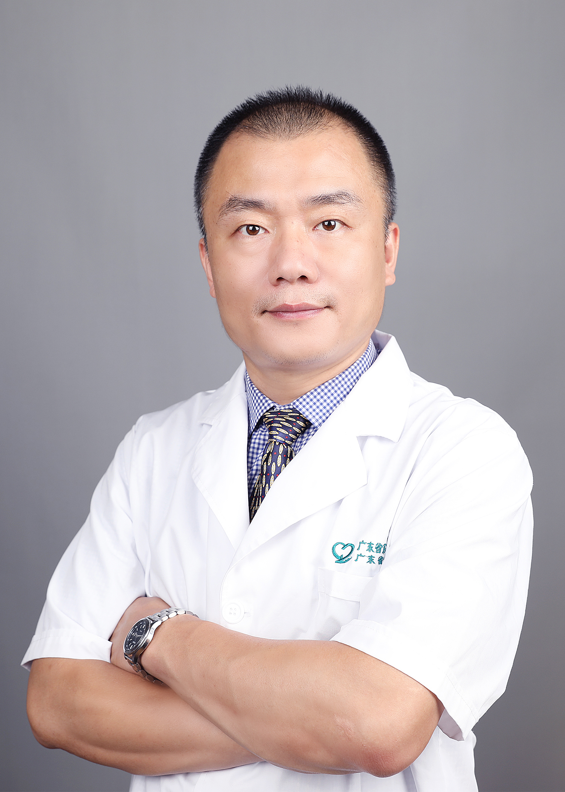

<!-- AUTO-GENERATED-BY: work/generate_obsidian_profiles.py -->

<!-- TEMPLATE: D:\workspace\信息收集整理\医生画像仓库\模板\医生画像模板.md -->

# 邓泽义

## 基础信息

| 字段 | 内容 |
|---|---|
| 姓名 | 邓泽义 |
| 医院 | 广东省第二人民医院 |
| 科室 | 耳鼻咽喉头颈外科（琶洲院区） |
| 职称/身份 | 主任医师 |
| 来源链接 | [官网原文](https://gd2h.com/site/detail/42026.html) |
| 采集日期 | 2026-08-15 |

## 简介/擅长

擅长：1、喉癌、口咽下咽癌、鼻咽癌、甲状腺良恶性肿瘤、口腔颌面部及涎腺肿瘤等以手术为主的综合治疗，能熟练开展复杂的甲状腺癌手术、颈淋巴结清扫术、喉部分切除术、喉全切除术、上颌骨切除术及术后皮瓣修复重建，并能完成颈动脉体瘤等高难度手术；2、激光微创手术治疗早期喉癌下咽癌；3、成人及小儿鼾症手术；4、鼻内镜微创手术治疗慢性鼻窦炎、鼻息肉、鼻腔鼻窦肿瘤；5、慢性化脓性中耳炎、中耳胆脂瘤等的手术治疗。

## 教育与进修经历

- 教授，留日医学博士、博士后，硕导。
- 美国匹兹堡大学、密歇根大学访问学者。

## 科研项目与成果

- 主持国家及省部级课题 7 项， SCI 论文 27 篇。

## 论文与学术产出

- 主持国家及省部级课题 7 项， SCI 论文 27 篇。

## 可包装亮点

- 个人介绍 科主任。
- 美国匹兹堡大学、密歇根大学访问学者。
- 广东省医学会、广东医师协会耳鼻喉科分会委员，中国抗癌协会肿瘤整形专委会委员。
- 获美国外科医师学会奖、广东实力中青年医师奖、羊城好医生。

## 重点疾病/人群标签

- 慢性病：慢性、肿瘤、癌、瘤、鼻咽癌、术后、复杂
- 肿瘤：慢性、肿瘤、癌、瘤、鼻咽癌、术后、复杂
- 生殖疾病：
- 免疫/风湿：
- 术后恢复/康复：慢性、肿瘤、癌、瘤、鼻咽癌、术后、复杂
- 疑难重症：慢性、肿瘤、癌、瘤、鼻咽癌、术后、复杂

## 证据摘录

> 只摘录官网公开信息中的短句或关键字段，不复制大段原文。

- 官网身份字段：主任医师
- 官网简介/擅长：擅长：1、喉癌、口咽下咽癌、鼻咽癌、甲状腺良恶性肿瘤、口腔颌面部及涎腺肿瘤等以手术为主的综合治疗，能熟练开展复杂的甲状腺癌手术、颈淋巴结清扫术、喉部分切除术、喉全切除术、上颌骨切除术及术后皮瓣修复重建，并能完成颈动脉体瘤等高难度手术；2、激光微创手术治疗早期喉癌下咽癌；3、成人及小儿鼾症手术；4、鼻内镜微创手术治疗慢性鼻窦炎、鼻息肉、鼻腔鼻窦肿瘤；5、慢性化脓性中耳炎、中耳胆脂瘤等的手术治疗。
- 官网亮眼经历线索：个人介绍 科主任。 美国匹兹堡大学、密歇根大学访问学者。 广东省医学会、广东医师协会耳鼻喉科分会委员，中国抗癌协会肿瘤整形专委会委员。 获美国外科医师学会奖、广东实力中青年医师奖、羊城好医生。
- 来源链接：https://gd2h.com/site/detail/42026.html

## BD 画像摘要

邓泽义医生可作为慢性病、肿瘤、术后恢复/康复、疑难重症方向的基础画像候选。后续 BD 使用应继续以官网来源和人工复核为准，不添加疗效承诺或无来源包装。

## 合规边界

- 仅使用医院官网、官方公众号、官方小程序等公开渠道。
- 不采集私人电话、私人微信、家庭住址、患者隐私或非公开排班信息。
- 不写“保证治愈”“疗效第一”“包治疑难杂症”等无法由官网证明的表述。
