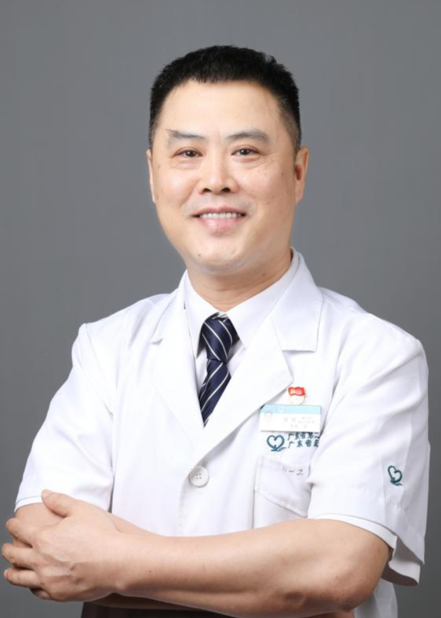

<!-- AUTO-GENERATED-BY: work/generate_obsidian_profiles.py -->

<!-- TEMPLATE: D:\workspace\信息收集整理\医生画像仓库\模板\医生画像模板.md -->

# 郑权

## 基础信息

| 字段 | 内容 |
|---|---|
| 姓名 | 郑权 |
| 医院 | 广东省第二人民医院 |
| 科室 | 普通外科（民航院区） |
| 职称/身份 | 主任医师 |
| 来源链接 | [官网原文](https://gd2h.com/site/detail/e93d5c316a9245a7bf0618d142e30e59.html) |
| 采集日期 | 2026-08-15 |

## 简介/擅长

尤其擅长结肠癌、直肠癌、胃癌、腹腔肿瘤、胆囊结石、肝胆管结石、腹股沟疝、痔疮、肛瘘、甲状腺结节、乳腺结节、大隐静脉曲张等普通外科疾病的诊断与手术治疗。

## 教育与进修经历

- 毕业于中山大学医学院。

## 科研项目与成果

- 主持及参与省级、厅局级科研项目3项，在《中华胃肠外科杂志》、《中国普通外科杂志》等核心期刊发表学术论文10余篇（其中SCI收录2篇），曾获广东省医学科技奖三等奖。

## 论文与学术产出

- 主持及参与省级、厅局级科研项目3项，在《中华胃肠外科杂志》、《中国普通外科杂志》等核心期刊发表学术论文10余篇（其中SCI收录2篇），曾获广东省医学科技奖三等奖。

## 可包装亮点

- 广东省第二人民医院民航院区普通外科负责人、主任医师、暨南大学兼职副教授，荣获“第七届羊城好医生”称号。
- 在广东省率先开展痔疮微创消融治疗，该技术具有创伤小、疼痛轻、恢复快的显著优势。
- 现任广东省医师协会胃肠外科医师分会委员、广东省医学会外科学分会青年委员、广东省抗癌协会大肠癌专业委员会委员。
- 主持及参与省级、厅局级科研项目3项，在《中华胃肠外科杂志》、《中国普通外科杂志》等核心期刊发表学术论文10余篇（其中SCI收录2篇），曾获广东省医学科技奖三等奖。

## 重点疾病/人群标签

- 慢性病：
- 肿瘤：肿瘤、癌、胃癌、肠癌、术后、恢复、疼痛
- 生殖疾病：
- 免疫/风湿：
- 术后恢复/康复：肿瘤、癌、胃癌、肠癌、术后、恢复、疼痛
- 疑难重症：

## 证据摘录

> 只摘录官网公开信息中的短句或关键字段，不复制大段原文。

- 官网身份字段：主任医师
- 官网简介/擅长：尤其擅长结肠癌、直肠癌、胃癌、腹腔肿瘤、胆囊结石、肝胆管结石、腹股沟疝、痔疮、肛瘘、甲状腺结节、乳腺结节、大隐静脉曲张等普通外科疾病的诊断与手术治疗。
- 官网亮眼经历线索：广东省第二人民医院民航院区普通外科负责人、主任医师、暨南大学兼职副教授，荣获“第七届羊城好医生”称号。 在广东省率先开展痔疮微创消融治疗，该技术具有创伤小、疼痛轻、恢复快的显著优势。 现任广东省医师协会胃肠外科医师分会委员、广东省医学会外科学分会青年委员、广东省抗癌协会大肠癌专业委员会委员。 主持及参与省级、厅局级科研项目3项，在《中华胃肠外科杂志》、《中国普通外科杂志》等核心期刊发表学术论文10余篇（其中SCI收录2篇），曾获广东省…
- 来源链接：https://gd2h.com/site/detail/e93d5c316a9245a7bf0618d142e30e59.html

## BD 画像摘要

郑权医生可作为肿瘤、术后恢复/康复方向的基础画像候选。后续 BD 使用应继续以官网来源和人工复核为准，不添加疗效承诺或无来源包装。

## 合规边界

- 仅使用医院官网、官方公众号、官方小程序等公开渠道。
- 不采集私人电话、私人微信、家庭住址、患者隐私或非公开排班信息。
- 不写“保证治愈”“疗效第一”“包治疑难杂症”等无法由官网证明的表述。
