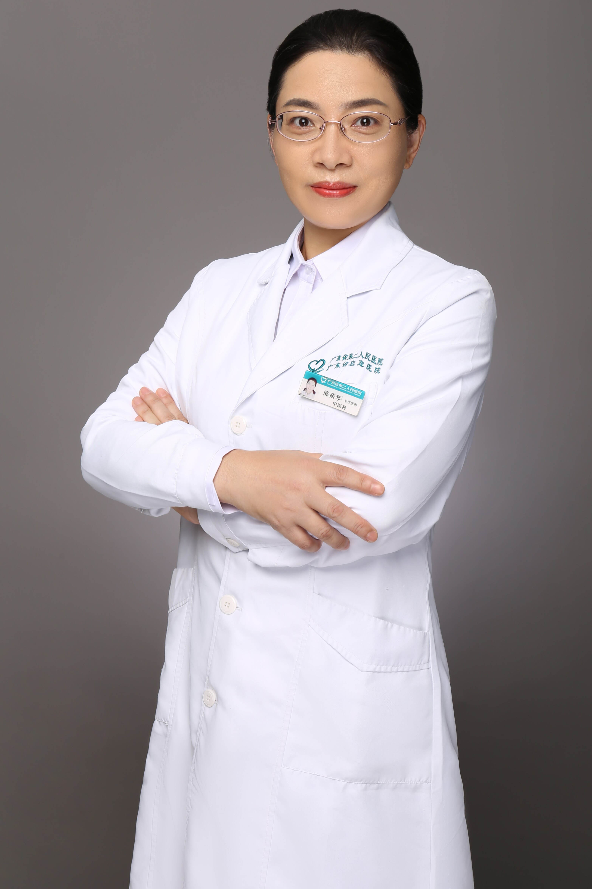

<!-- AUTO-GENERATED-BY: work/generate_obsidian_profiles.py -->

<!-- TEMPLATE: D:\workspace\信息收集整理\医生画像仓库\模板\医生画像模板.md -->

# 陈茹琴

## 基础信息

| 字段 | 内容 |
|---|---|
| 姓名 | 陈茹琴 |
| 医院 | 广东省第二人民医院 |
| 科室 | 中医科（琶洲院区） |
| 职称/身份 | 主任中医师 |
| 来源链接 | [官网原文](https://gd2h.com/site/detail/42188.html) |
| 采集日期 | 2026-08-15 |

## 简介/擅长

1、中西医结合诊治妇科内分泌疾病，如：月经不调、不孕症、更年期综合症、子宫内膜异位症、先兆流产等疾病。2、中西医结合诊治妇科急、慢炎症。3、中西医结合诊治胃肠、呼吸、心血管、高血压、风湿病、头晕、头痛、失眠、肝炎等内科杂病。

## 科研项目与成果

- 主持广东省自然科学基金1项，广东省中医药局科研基金1项，参与广东省自然科学基金1项、广东省中医药局科研基金2项，发表学术论文30余篇。

## 论文与学术产出

- 主持广东省自然科学基金1项，广东省中医药局科研基金1项，参与广东省自然科学基金1项、广东省中医药局科研基金2项，发表学术论文30余篇。

## 可包装亮点

- 中国中西医结合学会脑心同治专业委员会第一届冠心病专家组组员;
- 广东省中西医结合心血管学会常委、高血压学会常委、脑心同治专业委员会常委、脾胃消化病专业委员会委员;
- 广东省医疗行业协会睡眠管理分会常委，广东省保健协会睡眠与心理分会副主任委员，广东省医学会风湿病学会委员、广东省医学会医史学分会委员会委员、《中华现代中西医杂志》专家编辑委员会委员。
- 主持广东省自然科学基金1项，广东省中医药局科研基金1项，参与广东省自然科学基金1项、广东省中医药局科研基金2项，发表学术论文30余篇。

## 重点疾病/人群标签

- 慢性病：高血压、冠心病、不孕、妇科内分泌、月经、风湿
- 肿瘤：
- 生殖疾病：高血压、冠心病、不孕、妇科内分泌、月经、风湿
- 免疫/风湿：高血压、冠心病、不孕、妇科内分泌、月经、风湿
- 术后恢复/康复：
- 疑难重症：

## 证据摘录

> 只摘录官网公开信息中的短句或关键字段，不复制大段原文。

- 官网身份字段：主任中医师
- 官网简介/擅长：1、中西医结合诊治妇科内分泌疾病，如：月经不调、不孕症、更年期综合症、子宫内膜异位症、先兆流产等疾病。2、中西医结合诊治妇科急、慢炎症。3、中西医结合诊治胃肠、呼吸、心血管、高血压、风湿病、头晕、头痛、失眠、肝炎等内科杂病。
- 官网亮眼经历线索：中国中西医结合学会脑心同治专业委员会第一届冠心病专家组组员; 广东省中西医结合心血管学会常委、高血压学会常委、脑心同治专业委员会常委、脾胃消化病专业委员会委员; 广东省医疗行业协会睡眠管理分会常委，广东省保健协会睡眠与心理分会副主任委员，广东省医学会风湿病学会委员、广东省医学会医史学分会委员会委员、《中华现代中西医杂志》专家编辑委员会委员。 主持广东省自然科学基金1项，广东省中医药局科研基金1项，参与广东省自然科学基金1项、广东省中医…
- 来源链接：https://gd2h.com/site/detail/42188.html

## BD 画像摘要

陈茹琴医生可作为慢性病、生殖疾病、免疫/风湿/感染方向的基础画像候选。后续 BD 使用应继续以官网来源和人工复核为准，不添加疗效承诺或无来源包装。

## 合规边界

- 仅使用医院官网、官方公众号、官方小程序等公开渠道。
- 不采集私人电话、私人微信、家庭住址、患者隐私或非公开排班信息。
- 不写“保证治愈”“疗效第一”“包治疑难杂症”等无法由官网证明的表述。
