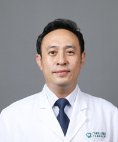

<!-- AUTO-GENERATED-BY: work/generate_obsidian_profiles.py -->

<!-- TEMPLATE: D:\workspace\信息收集整理\医生画像仓库\模板\医生画像模板.md -->

# 颜剑豪

## 基础信息

| 字段 | 内容 |
|---|---|
| 姓名 | 颜剑豪 |
| 医院 | 广东省第二人民医院 |
| 科室 | 影像科（琶洲院区） |
| 职称/身份 | 主任医师 |
| 来源链接 | [官网原文](https://gd2h.com/site/detail/42421.html) |
| 采集日期 | 2026-08-15 |

## 简介/擅长

医疗特长为头颈五官、神经系统和呼吸系统的良恶性肿瘤、先天性病变等的CT和MR诊断，具有扎实的理论基础和丰富的临床经验。

## 教育与进修经历

- 第七届羊城好医生，2021年获得白云区劳动模范，2020年获得九三学社中央委员会抗击新冠肺炎先进个人，2019年度全国住院医师规范化培训优秀带教老师，并多次被评为年度优秀老师等荣誉。

## 科研项目与成果

- 以第一研究者身份主持广东省科技计划项目2项，广东省科研基金资助立项4项，广东省中医药局课题2项，参与国家自然基金及广东省自然基金项目各3项，并撰写SCI文章5篇，国家级论著30余篇。

## 论文与学术产出

- 以第一研究者身份主持广东省科技计划项目2项，广东省科研基金资助立项4项，广东省中医药局课题2项，参与国家自然基金及广东省自然基金项目各3项，并撰写SCI文章5篇，国家级论著30余篇。

## 可包装亮点

- 个人介绍 民航院区影像科负责人，影像科副主任，主任医师，博士研究生，同时担任南方医科大学、暨南大学、广东工业大学硕士研究生导师，兼任暨南大学授课教授。
- 第7届羊城好医生，首批广东省杰出青年医学人才，广东省基层医药学会放射委员会副主任委员，广东省医药质量管理协会放射诊断委员会常务委员，广东省放射学会头颈五官学组委员，广东省临床医学会放射诊断分会常务委员，广东省中西医结合学会委员。
- 以第一研究者身份主持广东省科技计划项目2项，广东省科研基金资助立项4项，广东省中医药局课题2项，参与国家自然基金及广东省自然基金项目各3项，并撰写SCI文章5篇，国家级论著30余篇。
- 第七届羊城好医生，2021年获得白云区劳动模范，2020年获得九三学社中央委员会抗击新冠肺炎先进个人，2019年度全国住院医师规范化培训优秀带教老师，并多次被评为年度优秀老师等荣誉。

## 重点疾病/人群标签

- 慢性病：
- 肿瘤：
- 生殖疾病：
- 免疫/风湿：
- 术后恢复/康复：
- 疑难重症：

## 证据摘录

> 只摘录官网公开信息中的短句或关键字段，不复制大段原文。

- 官网身份字段：主任医师
- 官网简介/擅长：医疗特长为头颈五官、神经系统和呼吸系统的良恶性肿瘤、先天性病变等的CT和MR诊断，具有扎实的理论基础和丰富的临床经验。
- 官网亮眼经历线索：个人介绍 民航院区影像科负责人，影像科副主任，主任医师，博士研究生，同时担任南方医科大学、暨南大学、广东工业大学硕士研究生导师，兼任暨南大学授课教授。 第7届羊城好医生，首批广东省杰出青年医学人才，广东省基层医药学会放射委员会副主任委员，广东省医药质量管理协会放射诊断委员会常务委员，广东省放射学会头颈五官学组委员，广东省临床医学会放射诊断分会常务委员，广东省中西医结合学会委员。 以第一研究者身份主持广东省科技计划项目2项，广东省科研基…
- 异常提示：同名待甄别
- 来源链接：https://gd2h.com/site/detail/42421.html

## BD 画像摘要

颜剑豪医生可作为广东省第二人民医院影像科（琶洲院区）的基础医生资料入库。当前重点方向以总底表标签为准，官网未展示的信息保持空白。

## 合规边界

- 仅使用医院官网、官方公众号、官方小程序等公开渠道。
- 不采集私人电话、私人微信、家庭住址、患者隐私或非公开排班信息。
- 不写“保证治愈”“疗效第一”“包治疑难杂症”等无法由官网证明的表述。
