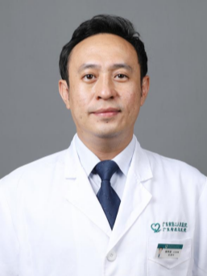

<!-- AUTO-GENERATED-BY: work/generate_obsidian_profiles.py -->

<!-- TEMPLATE: D:\workspace\信息收集整理\医生画像仓库\模板\医生画像模板.md -->

# 颜剑豪

## 基础信息

| 字段 | 内容 |
|---|---|
| 姓名 | 颜剑豪 |
| 医院 | 广东省第二人民医院 |
| 科室 | 影像科（民航院区） |
| 职称/身份 | 主任医师 |
| 来源链接 | [官网原文](https://gd2h.com/site/detail/35e8a6767c504c408d2e8e3749bb49a5.html) |
| 采集日期 | 2026-08-15 |

## 简介/擅长

擅长早期肺癌筛查与肺结节良恶性精准鉴别，以及头颈部肿瘤、血管病变及复杂炎症的影像诊断与分期。

## 教育与进修经历

- 因其精湛医术和高尚医德，深受患者信赖与好评，并评为广东省卫健委首批“广东省杰出青年医学人才”，荣获2021年度“羊城好医生”“白云区劳动模范”及“2019年全国住院医师规范化培训优秀带教老师”等荣誉称号。

## 科研项目与成果

- 主持广东省科技计划项目4项，广东省科研基金资助立项4项，参与国家自然基金及广东省自然基金项目各3项，发表SCI文章20余篇，国家级论著30余篇。

## 论文与学术产出

- 主持广东省科技计划项目4项，广东省科研基金资助立项4项，参与国家自然基金及广东省自然基金项目各3项，发表SCI文章20余篇，国家级论著30余篇。

## 可包装亮点

- 颜剑豪，广东省第二人民医院民航院区影像科负责人，主任医师，博士研究生，同时担任南方医科大学、暨南大学、广东医科大学、广东工业大学硕士研究生导师，兼任暨南大学等授课教授。
- 从事医学影像诊断工作20余年，在胸部及头颈疾病影像诊断方面均拥有深厚造诣与领先优势，尤其擅长早期肺癌筛查与肺结节良恶性精准鉴别，以及头颈部肿瘤、血管病变及复杂炎症的影像诊断与分期。
- 能通过对磨玻璃及实性结节的精细化判读，清晰区分不典型腺瘤样增生（AAH）、原位癌（AIS）、微浸润腺癌（MIA）与浸润性腺癌（IAC），为患者提供是否手术或随访的精准决策依据，累计完成肺结节专病评估逾10000例。
- 尤其擅长鼻咽癌、喉癌、腮腺肿瘤、颈部淋巴结病变及颅内肿瘤的早期检出、精准分期和疗效评估，并能对头颈部血管斑块性质、动脉夹层、血管炎等进行精准诊断，为临床制定手术及放化疗方案提供关键影像“路线图”。

## 重点疾病/人群标签

- 慢性病：
- 肿瘤：
- 生殖疾病：
- 免疫/风湿：
- 术后恢复/康复：
- 疑难重症：

## 证据摘录

> 只摘录官网公开信息中的短句或关键字段，不复制大段原文。

- 官网身份字段：主任医师
- 官网简介/擅长：擅长早期肺癌筛查与肺结节良恶性精准鉴别，以及头颈部肿瘤、血管病变及复杂炎症的影像诊断与分期。
- 官网亮眼经历线索：颜剑豪，广东省第二人民医院民航院区影像科负责人，主任医师，博士研究生，同时担任南方医科大学、暨南大学、广东医科大学、广东工业大学硕士研究生导师，兼任暨南大学等授课教授。 从事医学影像诊断工作20余年，在胸部及头颈疾病影像诊断方面均拥有深厚造诣与领先优势，尤其擅长早期肺癌筛查与肺结节良恶性精准鉴别，以及头颈部肿瘤、血管病变及复杂炎症的影像诊断与分期。 能通过对磨玻璃及实性结节的精细化判读，清晰区分不典型腺瘤样增生（AAH）、原位癌（AI…
- 异常提示：同名待甄别
- 来源链接：https://gd2h.com/site/detail/35e8a6767c504c408d2e8e3749bb49a5.html

## BD 画像摘要

颜剑豪医生可作为广东省第二人民医院影像科（民航院区）的基础医生资料入库。当前重点方向以总底表标签为准，官网未展示的信息保持空白。

## 合规边界

- 仅使用医院官网、官方公众号、官方小程序等公开渠道。
- 不采集私人电话、私人微信、家庭住址、患者隐私或非公开排班信息。
- 不写“保证治愈”“疗效第一”“包治疑难杂症”等无法由官网证明的表述。
