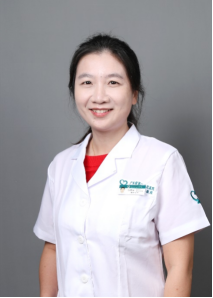

<!-- AUTO-GENERATED-BY: work/generate_obsidian_profiles.py -->

<!-- TEMPLATE: D:\workspace\信息收集整理\医生画像仓库\模板\医生画像模板.md -->

# 马晓芬

## 基础信息

| 字段 | 内容 |
|---|---|
| 姓名 | 马晓芬 |
| 医院 | 广东省第二人民医院 |
| 科室 | 影像科（琶洲院区）、核医学科（琶洲院区） |
| 职称/身份 | 主任医师 |
| 来源链接 | [官网原文](https://gd2h.com/site/detail/42451.html) |
| 采集日期 | 2026-08-15 |

## 简介/擅长

## 科研项目与成果

- 主持多项国家及省市级项目。

## 论文与学术产出

- 以第一/通讯作者发表SCI论文30篇，最高影响因子为10.345；

## 可包装亮点

- 个人介绍 马晓芬，广东省第二人民医院核医学科学科带头人、主任、主任医师，博士研究生导师。
- 中国感光学会生物与医学影像专业委员会委员、广东省医学会核医学分会常务委员、广东省医师协会核医学医师分会委员、广东省辐射防护协会医学专委会常务委员、广州市医师协会核医学与分子影像分会副主任委员、广州市医学会核医学分会常务委员。
- 以第一/通讯作者发表SCI论文30篇，最高影响因子为10.345；
- 荣获广东省科技进步奖二等奖及首届广东省医学科技奖二等奖，参与编写多部影像书刊。

## 重点疾病/人群标签

- 慢性病：
- 肿瘤：
- 生殖疾病：
- 免疫/风湿：
- 术后恢复/康复：
- 疑难重症：

## 证据摘录

> 只摘录官网公开信息中的短句或关键字段，不复制大段原文。

- 官网身份字段：主任医师
- 官网亮眼经历线索：个人介绍 马晓芬，广东省第二人民医院核医学科学科带头人、主任、主任医师，博士研究生导师。 中国感光学会生物与医学影像专业委员会委员、广东省医学会核医学分会常务委员、广东省医师协会核医学医师分会委员、广东省辐射防护协会医学专委会常务委员、广州市医师协会核医学与分子影像分会副主任委员、广州市医学会核医学分会常务委员。 以第一/通讯作者发表SCI论文30篇，最高影响因子为10.345； 荣获广东省科技进步奖二等奖及首届广东省医学科技奖二等奖…
- 来源链接：https://gd2h.com/site/detail/42451.html

## BD 画像摘要

马晓芬医生可作为广东省第二人民医院影像科（琶洲院区）、核医学科（琶洲院区）的基础医生资料入库。当前重点方向以总底表标签为准，官网未展示的信息保持空白。

## 合规边界

- 仅使用医院官网、官方公众号、官方小程序等公开渠道。
- 不采集私人电话、私人微信、家庭住址、患者隐私或非公开排班信息。
- 不写“保证治愈”“疗效第一”“包治疑难杂症”等无法由官网证明的表述。
