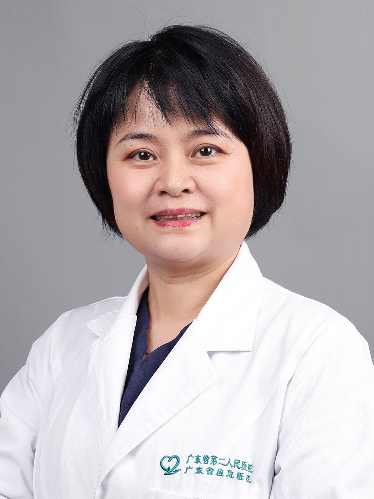

<!-- AUTO-GENERATED-BY: work/generate_obsidian_profiles.py -->

<!-- TEMPLATE: D:\workspace\信息收集整理\医生画像仓库\模板\医生画像模板.md -->

# 高天旸

## 基础信息

| 字段 | 内容 |
|---|---|
| 姓名 | 高天旸 |
| 医院 | 广东省第二人民医院 |
| 科室 | 生殖医学中心（琶洲院区） |
| 职称/身份 | 主任医师 |
| 来源链接 | [官网原文](https://gd2h.com/site/detail/41958.html) |
| 采集日期 | 2026-08-15 |

## 简介/擅长

熟练运用试管婴儿的各种方案，尤其擅长“微刺激”方案治疗高龄女性不孕，对反复自然流产、子宫内膜异位症有较深入的研究。

## 教育与进修经历

- 意大利锡耶纳大学医院访问学者，并曾在美国New Hope Fertility Center及Reprogenetic中心短期访问学习。

## 科研项目与成果

- 主持多项省部级科研课题，在国家核心期刊发表论文40余篇，并有多篇论文入选国际妇产科联盟大会（FIGO）、亚太生殖年会、美国生殖医学年会等重大的国际会议发言，获广东省科技进步二等奖1项。

## 论文与学术产出

- 主持多项省部级科研课题，在国家核心期刊发表论文40余篇，并有多篇论文入选国际妇产科联盟大会（FIGO）、亚太生殖年会、美国生殖医学年会等重大的国际会议发言，获广东省科技进步二等奖1项。

## 可包装亮点

- 个人介绍 主任医师，硕士研究生导师，医学博士。
- 原广东省第二人民医院生殖医学科主任；
- 广东省医学会妇产科学分会委员；
- 广东省医学会生殖医学分会委员（第一届）；

## 重点疾病/人群标签

- 慢性病：
- 肿瘤：
- 生殖疾病：生殖、不孕、卵巢、辅助生殖、试管
- 免疫/风湿：
- 术后恢复/康复：
- 疑难重症：

## 证据摘录

> 只摘录官网公开信息中的短句或关键字段，不复制大段原文。

- 官网身份字段：主任医师
- 官网简介/擅长：熟练运用试管婴儿的各种方案，尤其擅长“微刺激”方案治疗高龄女性不孕，对反复自然流产、子宫内膜异位症有较深入的研究。
- 官网亮眼经历线索：个人介绍 主任医师，硕士研究生导师，医学博士。 原广东省第二人民医院生殖医学科主任； 广东省医学会妇产科学分会委员； 广东省医学会生殖医学分会委员（第一届）；
- 来源链接：https://gd2h.com/site/detail/41958.html

## BD 画像摘要

高天旸医生可作为生殖疾病方向的基础画像候选。后续 BD 使用应继续以官网来源和人工复核为准，不添加疗效承诺或无来源包装。

## 合规边界

- 仅使用医院官网、官方公众号、官方小程序等公开渠道。
- 不采集私人电话、私人微信、家庭住址、患者隐私或非公开排班信息。
- 不写“保证治愈”“疗效第一”“包治疑难杂症”等无法由官网证明的表述。
