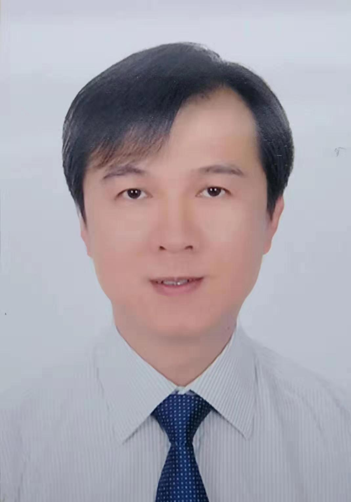

<!-- AUTO-GENERATED-BY: work/generate_obsidian_profiles.py -->

<!-- TEMPLATE: D:\workspace\信息收集整理\医生画像仓库\模板\医生画像模板.md -->

# 黄乔东

## 基础信息

| 字段 | 内容 |
|---|---|
| 姓名 | 黄乔东 |
| 医院 | 广东省第二人民医院 |
| 科室 | 疼痛科（琶洲院区） |
| 职称/身份 | 主任医师 |
| 来源链接 | [官网原文](https://gd2h.com/site/detail/42339.html) |
| 采集日期 | 2026-08-15 |

## 简介/擅长

擅长各种微创介入手术，如射频、臭氧、等离子、椎体成形、硬膜外腔镜、椎间孔镜、脊髓电刺激、鞘内镇痛泵等

## 可包装亮点

- 黄乔东 主任医师 广东省第二人民医院疼痛科主任。
- 现为中华中医药学会脊柱微创专家委员会常委；
- 中国生命关怀协会疼痛诊疗委员会常委；
- 广东省医师协会疼痛科医师分会副主任委员、脊柱微创专业组组长；

## 重点疾病/人群标签

- 慢性病：糖尿病、慢性、癌、术后、康复、疼痛
- 肿瘤：糖尿病、慢性、癌、术后、康复、疼痛
- 生殖疾病：
- 免疫/风湿：
- 术后恢复/康复：糖尿病、慢性、癌、术后、康复、疼痛
- 疑难重症：

## 证据摘录

> 只摘录官网公开信息中的短句或关键字段，不复制大段原文。

- 官网身份字段：主任医师
- 官网简介/擅长：擅长各种微创介入手术，如射频、臭氧、等离子、椎体成形、硬膜外腔镜、椎间孔镜、脊髓电刺激、鞘内镇痛泵等
- 官网亮眼经历线索：黄乔东 主任医师 广东省第二人民医院疼痛科主任。 现为中华中医药学会脊柱微创专家委员会常委； 中国生命关怀协会疼痛诊疗委员会常委； 广东省医师协会疼痛科医师分会副主任委员、脊柱微创专业组组长；
- 来源链接：https://gd2h.com/site/detail/42339.html

## BD 画像摘要

黄乔东医生可作为慢性病、肿瘤、术后恢复/康复方向的基础画像候选。后续 BD 使用应继续以官网来源和人工复核为准，不添加疗效承诺或无来源包装。

## 合规边界

- 仅使用医院官网、官方公众号、官方小程序等公开渠道。
- 不采集私人电话、私人微信、家庭住址、患者隐私或非公开排班信息。
- 不写“保证治愈”“疗效第一”“包治疑难杂症”等无法由官网证明的表述。
