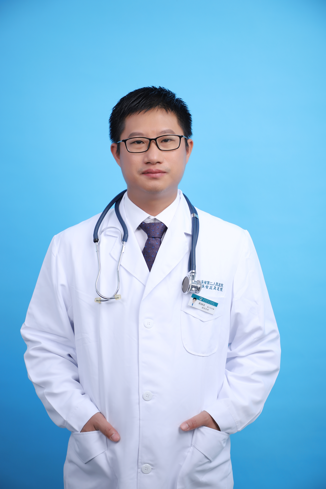

<!-- AUTO-GENERATED-BY: work/generate_obsidian_profiles.py -->

<!-- TEMPLATE: D:\workspace\信息收集整理\医生画像仓库\模板\医生画像模板.md -->

# 黄国英

## 基础信息

| 字段 | 内容 |
|---|---|
| 姓名 | 黄国英 |
| 医院 | 广东省第二人民医院 |
| 科室 | 创伤骨科（琶洲院区） |
| 职称/身份 | 副主任医师 |
| 来源链接 | [官网原文](https://gd2h.com/site/detail/41967.html) |
| 采集日期 | 2026-08-15 |

## 简介/擅长

四肢严重创伤的救治与修复重建，四肢骨折及各种后遗症与骨不连、骨缺损、畸形愈合的治疗，手指多指、并指畸形的治疗，外伤、烧伤后各种疤痕增生挛缩畸形的治疗。

## 教育与进修经历

- 先后于国内外著名专科研究所对创伤骨科、显微外科、手外科进行了专门培训学习。

## 科研项目与成果

- 先后于国内外著名专科研究所对创伤骨科、显微外科、手外科进行了专门培训学习。
- 主持广东省医学科研基金两项。

## 论文与学术产出

- 在国家级及省级学术期刊上发表学术论文多篇，曾在广东省显微外科学青年论文竞赛中获得一等奖。

## 可包装亮点

- 个人介绍 中华医学会显微外科学分会第十届委员会青年委员、广东省医学会显微外科学分会青年副主任委员。
- 在国家级及省级学术期刊上发表学术论文多篇，曾在广东省显微外科学青年论文竞赛中获得一等奖。

## 重点疾病/人群标签

- 慢性病：
- 肿瘤：
- 生殖疾病：
- 免疫/风湿：
- 术后恢复/康复：创面、烧伤
- 疑难重症：

## 证据摘录

> 只摘录官网公开信息中的短句或关键字段，不复制大段原文。

- 官网身份字段：副主任医师
- 官网简介/擅长：四肢严重创伤的救治与修复重建，四肢骨折及各种后遗症与骨不连、骨缺损、畸形愈合的治疗，手指多指、并指畸形的治疗，外伤、烧伤后各种疤痕增生挛缩畸形的治疗。
- 官网亮眼经历线索：个人介绍 中华医学会显微外科学分会第十届委员会青年委员、广东省医学会显微外科学分会青年副主任委员。 在国家级及省级学术期刊上发表学术论文多篇，曾在广东省显微外科学青年论文竞赛中获得一等奖。
- 来源链接：https://gd2h.com/site/detail/41967.html

## BD 画像摘要

黄国英医生可作为术后恢复/康复方向的基础画像候选。后续 BD 使用应继续以官网来源和人工复核为准，不添加疗效承诺或无来源包装。

## 合规边界

- 仅使用医院官网、官方公众号、官方小程序等公开渠道。
- 不采集私人电话、私人微信、家庭住址、患者隐私或非公开排班信息。
- 不写“保证治愈”“疗效第一”“包治疑难杂症”等无法由官网证明的表述。
