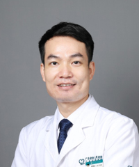

<!-- AUTO-GENERATED-BY: work/generate_obsidian_profiles.py -->

<!-- TEMPLATE: D:\workspace\信息收集整理\医生画像仓库\模板\医生画像模板.md -->

# 黄晓青

## 基础信息

| 字段 | 内容 |
|---|---|
| 姓名 | 黄晓青 |
| 医院 | 广东省第二人民医院 |
| 科室 | 传统医学研究所（琶洲院区） |
| 职称/身份 | 主任中医师 |
| 来源链接 | [官网原文](https://gd2h.com/site/detail/42401.html) |
| 采集日期 | 2026-08-15 |

## 简介/擅长

擅长于利用传统疗法治疗临床常见疾病；体质辨证，运用传统中医药调理脏腑气机，从“肝肾脾”三脏一体调经治带，并通过针药结合治疗等传统疗法提高女性内膜容受性，改善生殖系统功能。内外结合治疗颈肩腰腿病、周围神经病，以及外感咳嗽、胃肠病、疑难杂病的治疗。

## 教育与进修经历

- 毕业于广州中医药大学，从事中医临床工作16年，擅长于利用传统疗法治疗临床常见疾病；

## 科研项目与成果

- 个人介绍 黄晓青 科室负责人 主任中医师 第六届羊城好医生 广东省名中医传承工作室负责人 广东省首批名中医师承项目继承人；
- 主持和参与科研项目7项；

## 论文与学术产出

- 主编和副主编专著3部；
- 发表学术论文20余篇，其中SCI论文2篇。

## 可包装亮点

- 个人介绍 黄晓青 科室负责人 主任中医师 第六届羊城好医生 广东省名中医传承工作室负责人 广东省首批名中医师承项目继承人；
- 广东省临床医学学会全科医学与基层卫生专委会常务委员，广东省自然医学研究会-中医膏方专业委员会委员，广东省中医药学会肿瘤专业委员会委员。
- 内外结合治疗颈肩腰腿病、周围神经病，以及外感咳嗽、胃肠病、疑难杂病的治疗。
- 发表学术论文20余篇，其中SCI论文2篇。

## 重点疾病/人群标签

- 慢性病：
- 肿瘤：肿瘤、生殖、疑难
- 生殖疾病：肿瘤、生殖、疑难
- 免疫/风湿：
- 术后恢复/康复：
- 疑难重症：肿瘤、生殖、疑难

## 证据摘录

> 只摘录官网公开信息中的短句或关键字段，不复制大段原文。

- 官网身份字段：主任中医师
- 官网简介/擅长：擅长于利用传统疗法治疗临床常见疾病；体质辨证，运用传统中医药调理脏腑气机，从“肝肾脾”三脏一体调经治带，并通过针药结合治疗等传统疗法提高女性内膜容受性，改善生殖系统功能。内外结合治疗颈肩腰腿病、周围神经病，以及外感咳嗽、胃肠病、疑难杂病的治疗。
- 官网亮眼经历线索：个人介绍 黄晓青 科室负责人 主任中医师 第六届羊城好医生 广东省名中医传承工作室负责人 广东省首批名中医师承项目继承人； 广东省临床医学学会全科医学与基层卫生专委会常务委员，广东省自然医学研究会-中医膏方专业委员会委员，广东省中医药学会肿瘤专业委员会委员。 内外结合治疗颈肩腰腿病、周围神经病，以及外感咳嗽、胃肠病、疑难杂病的治疗。 发表学术论文20余篇，其中SCI论文2篇。
- 来源链接：https://gd2h.com/site/detail/42401.html

## BD 画像摘要

黄晓青医生可作为肿瘤、生殖疾病、疑难重症方向的基础画像候选。后续 BD 使用应继续以官网来源和人工复核为准，不添加疗效承诺或无来源包装。

## 合规边界

- 仅使用医院官网、官方公众号、官方小程序等公开渠道。
- 不采集私人电话、私人微信、家庭住址、患者隐私或非公开排班信息。
- 不写“保证治愈”“疗效第一”“包治疑难杂症”等无法由官网证明的表述。
