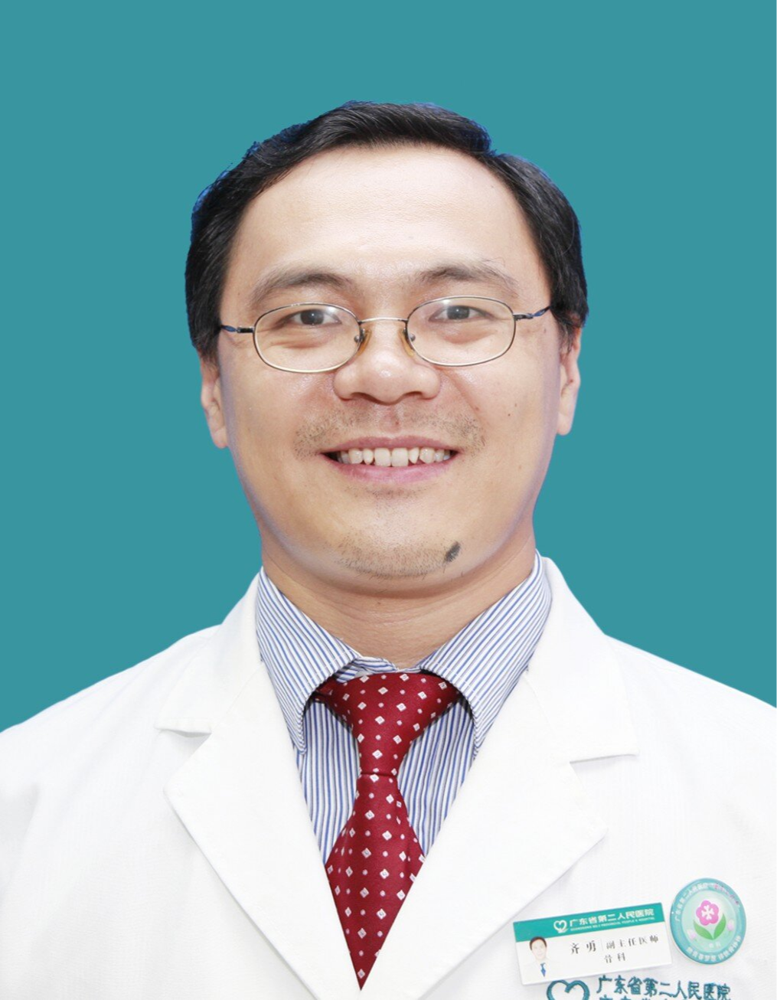

<!-- AUTO-GENERATED-BY: work/generate_obsidian_profiles.py -->

<!-- TEMPLATE: D:\workspace\信息收集整理\医生画像仓库\模板\医生画像模板.md -->

# 齐勇

## 基础信息

| 字段 | 内容 |
|---|---|
| 姓名 | 齐勇 |
| 医院 | 广东省第二人民医院 |
| 科室 | 关节骨一科（琶洲院区） |
| 职称/身份 | 主任医师 |
| 来源链接 | [官网原文](https://gd2h.com/site/detail/41979.html) |
| 采集日期 | 2026-08-15 |

## 简介/擅长

医学博士，擅长微创保髋、保膝及复杂的髋膝关节置换手术。成功为众多糖尿病足患者进行保肢治疗。同时具有丰富的关节镜手术经验，尤其是交叉韧带重建、半月板损伤修复、肩关节损伤修复等手术治疗。

## 科研项目与成果

- 科研：近年来发表论著30篇，参研骨科领域相关课题10多项，作为主要负责人承担省厅级课题7项。

## 论文与学术产出

- 科研：近年来发表论著30篇，参研骨科领域相关课题10多项，作为主要负责人承担省厅级课题7项。

## 可包装亮点

- 主任医师、博士、硕士研究生导师，副院长。
- 社会任职：广东省医疗安全协会副会长、中国医师协会糖尿病足胫骨横向骨搬移学组委员、粤港澳大湾区骨关节疾病中心副主任委员、广州市医学会关节骨科分会副主任委员 临床：主要研究方向骨关节疾病诊治和运动创伤的修复，擅长骨科DAA入路全髋关节置换、计算机辅助骨科手术、糖尿病足的保肢术，具有丰富的关节镜手术经验，以及膜诱导技术的临床应用，尤其在交叉韧带重建、半月板损伤修…
- 科研：近年来发表论著30篇，参研骨科领域相关课题10多项，作为主要负责人承担省厅级课题7项。

## 重点疾病/人群标签

- 慢性病：
- 肿瘤：
- 生殖疾病：
- 免疫/风湿：
- 术后恢复/康复：
- 疑难重症：

## 证据摘录

> 只摘录官网公开信息中的短句或关键字段，不复制大段原文。

- 官网身份字段：主任医师
- 官网简介/擅长：医学博士，擅长微创保髋、保膝及复杂的髋膝关节置换手术。成功为众多糖尿病足患者进行保肢治疗。同时具有丰富的关节镜手术经验，尤其是交叉韧带重建、半月板损伤修复、肩关节损伤修复等手术治疗。
- 官网亮眼经历线索：主任医师、博士、硕士研究生导师，副院长。 社会任职：广东省医疗安全协会副会长、中国医师协会糖尿病足胫骨横向骨搬移学组委员、粤港澳大湾区骨关节疾病中心副主任委员、广州市医学会关节骨科分会副主任委员 临床：主要研究方向骨关节疾病诊治和运动创伤的修复，擅长骨科DAA入路全髋关节置换、计算机辅助骨科手术、糖尿病足的保肢术，具有丰富的关节镜手术经验，以及膜诱导技术的临床应用，尤其在交叉韧带重建、半月板损伤修复、肩关节损伤修复等方面。 科研：近年…
- 异常提示：同名待甄别
- 来源链接：https://gd2h.com/site/detail/41979.html

## BD 画像摘要

齐勇医生可作为广东省第二人民医院关节骨一科（琶洲院区）的基础医生资料入库。当前重点方向以总底表标签为准，官网未展示的信息保持空白。

## 合规边界

- 仅使用医院官网、官方公众号、官方小程序等公开渠道。
- 不采集私人电话、私人微信、家庭住址、患者隐私或非公开排班信息。
- 不写“保证治愈”“疗效第一”“包治疑难杂症”等无法由官网证明的表述。
