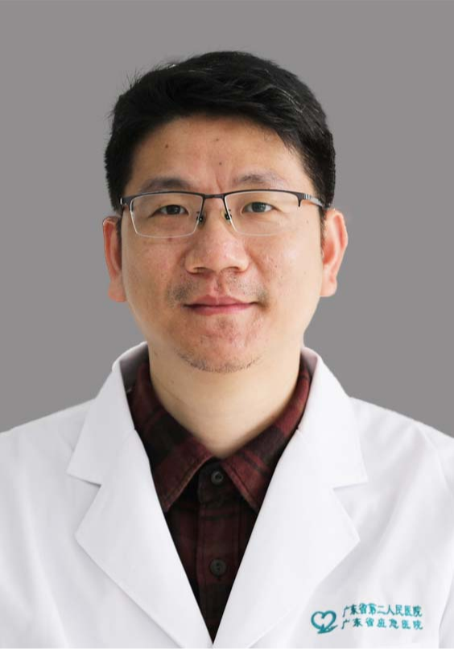

<!-- AUTO-GENERATED-BY: work/generate_obsidian_profiles.py -->

<!-- TEMPLATE: D:\workspace\信息收集整理\医生画像仓库\模板\医生画像模板.md -->

# 龙伟光

## 基础信息

| 字段 | 内容 |
|---|---|
| 姓名 | 龙伟光 |
| 医院 | 广东省第二人民医院 |
| 科室 | 胸外科（琶洲院区） |
| 职称/身份 | 副主治医师 |
| 来源链接 | [官网原文](https://gd2h.com/site/detail/42311.html) |
| 采集日期 | 2026-08-15 |

## 简介/擅长

擅长各类胸壁畸形、胸壁肿瘤、肺癌肺结节、乳糜胸、乳糜心包、手汗症、食道肿瘤、食道失驰缓症、心房颤动、先心病、冠心病、心脏瓣膜病、大血管动脉瘤等疾病的个体化微创诊治。

## 教育与进修经历

- 毕业于广州医科大学（国家呼吸中心）、新加坡国立大学。

## 科研项目与成果

- 个人介绍 广东省第二人民医院民航院区常务副院长，广东省第二人民医院胸壁外科研究院常务副院长，胸壁外科研究所副所长，多汗症微创中心学科带头人，心胸外科副主任医师。
- 主持/参与9项省市级科研课题研究，重点研究方向为胸部外科微创技术。
- 在国内外权威医学期刊上发表高质量论文31篇，其中SCI收录8篇，获国家发明专利5项。

## 论文与学术产出

- 在国内外权威医学期刊上发表高质量论文31篇，其中SCI收录8篇，获国家发明专利5项。

## 可包装亮点

- 个人介绍 广东省第二人民医院民航院区常务副院长，广东省第二人民医院胸壁外科研究院常务副院长，胸壁外科研究所副所长，多汗症微创中心学科带头人，心胸外科副主任医师。
- 精通并率先开展胸壁疾病、肺癌肺结节超微创手术技术，独创乳糜心包LONG手术，尤其在复杂疑难乳糜胸方面经验独到。
- 2012-2013年国家心脏中心研修，2012-2015年医院团委委员、医院志愿服务队副队长、团委副书记，2014年11月-2015年5月广东省卫计委医政处挂职，2015年8月-2016年8月国家首批医疗人才“组团式”援藏干部；
- 现任广东省胸部疾病学会胸壁外科专委会常务委员兼秘书长，广东省医学会航空医学分会常务委员、肺部肿瘤学分会委员。

## 重点疾病/人群标签

- 慢性病：
- 肿瘤：
- 生殖疾病：
- 免疫/风湿：
- 术后恢复/康复：
- 疑难重症：

## 证据摘录

> 只摘录官网公开信息中的短句或关键字段，不复制大段原文。

- 官网身份字段：副主治医师
- 官网简介/擅长：擅长各类胸壁畸形、胸壁肿瘤、肺癌肺结节、乳糜胸、乳糜心包、手汗症、食道肿瘤、食道失驰缓症、心房颤动、先心病、冠心病、心脏瓣膜病、大血管动脉瘤等疾病的个体化微创诊治。
- 官网亮眼经历线索：个人介绍 广东省第二人民医院民航院区常务副院长，广东省第二人民医院胸壁外科研究院常务副院长，胸壁外科研究所副所长，多汗症微创中心学科带头人，心胸外科副主任医师。 精通并率先开展胸壁疾病、肺癌肺结节超微创手术技术，独创乳糜心包LONG手术，尤其在复杂疑难乳糜胸方面经验独到。 2012-2013年国家心脏中心研修，2012-2015年医院团委委员、医院志愿服务队副队长、团委副书记，2014年11月-2015年5月广东省卫计委医政处挂职，2…
- 异常提示：同名待甄别
- 来源链接：https://gd2h.com/site/detail/42311.html

## BD 画像摘要

龙伟光医生可作为广东省第二人民医院胸外科（琶洲院区）的基础医生资料入库。当前重点方向以总底表标签为准，官网未展示的信息保持空白。

## 合规边界

- 仅使用医院官网、官方公众号、官方小程序等公开渠道。
- 不采集私人电话、私人微信、家庭住址、患者隐私或非公开排班信息。
- 不写“保证治愈”“疗效第一”“包治疑难杂症”等无法由官网证明的表述。
