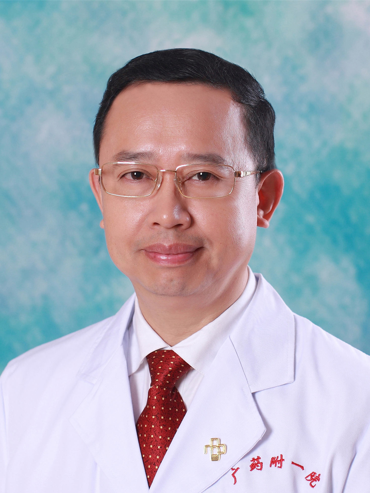

<!-- AUTO-GENERATED-BY: work/generate_obsidian_profiles.py -->

<!-- TEMPLATE: D:\workspace\信息收集整理\医生画像仓库\模板\医生画像模板.md -->

# 何兴祥

## 基础信息

| 字段 | 内容 |
|---|---|
| 姓名 | 何兴祥 |
| 医院 | 广东药科大学附属第一医院 |
| 科室 | 消化内科（健康管理中心） |
| 职称/身份 | 二级教授、主任医师、博士研究生导师 |
| 来源链接 | [官网原文](https://www.gy120.net/articleshow.asp?articleid=156) |
| 采集日期 | 2026-08-15 |

## 简介/擅长

食道、胃、肠、胰、肝脏疾病的诊断与治疗，尤其是消化系肿瘤的早期诊断与脂肪肝的个体化诊疗。

## 论文与学术产出

- 55（6）：797-802（SCI收录，2013年IF 13.319） 4.Xing-Xiang He, Ken Chen, Jun Yang, Xiao-Yu Li, Huo-Ye Gan, Cheng-Yong Liu, Thomas R Coleman,Yousef Al-Abed. Macrophage Migration Inhibitory Factor Promotes Colorectal Cancer. Mol Med 2009, 15(1-2):1-10（SCI收录，发表当年IF 5.02）…

## 可包装亮点

- 官网目录标注：首席专家；
- 2013年6月至2018年7月担任医院副院长职务 2018年8月起担任医院党委书记职务 社会任职：《2017年度、2018年度、2019年度、2020年度、 2021年度、2022年度岭南名医》 ，《第六届羊城好医生》 广州地区消化疾病医疗质量控制中心专家委员会副主任委员 广东省微生态治疗工程技术研究中心主任 广东省生物医学大数据库建设单位主任 2017年…

## 重点疾病/人群标签

- 慢性病：
- 肿瘤：肿瘤、重症
- 生殖疾病：
- 免疫/风湿：
- 术后恢复/康复：
- 疑难重症：肿瘤、重症

## 证据摘录

> 只摘录官网公开信息中的短句或关键字段，不复制大段原文。

- 官网身份字段：二级教授、主任医师、博士研究生导师
- 官网简介/擅长：食道、胃、肠、胰、肝脏疾病的诊断与治疗，尤其是消化系肿瘤的早期诊断与脂肪肝的个体化诊疗。
- 官网亮眼经历线索：官网目录标注：首席专家；2013年6月至2018年7月担任医院副院长职务 2018年8月起担任医院党委书记职务 社会任职：《2017年度、2018年度、2019年度、2020年度、 2021年度、2022年度岭南名医》 ，《第六届羊城好医生》 广州地区消化疾病医疗质量控制中心专家委员会副主任委员 广东省微生态治疗工程技术研究中心主任 广东省生物医学大数据库建设单位主任 2017年被中华粪菌库授予“菌群移植领域进步的重要贡献者” 中国老…
- 来源链接：https://www.gy120.net/articleshow.asp?articleid=156

## BD 画像摘要

何兴祥医生可作为肿瘤、疑难重症方向的基础画像候选。后续 BD 使用应继续以官网来源和人工复核为准，不添加疗效承诺或无来源包装。

## 合规边界

- 仅使用医院官网、官方公众号、官方小程序等公开渠道。
- 不采集私人电话、私人微信、家庭住址、患者隐私或非公开排班信息。
- 不写“保证治愈”“疗效第一”“包治疑难杂症”等无法由官网证明的表述。
