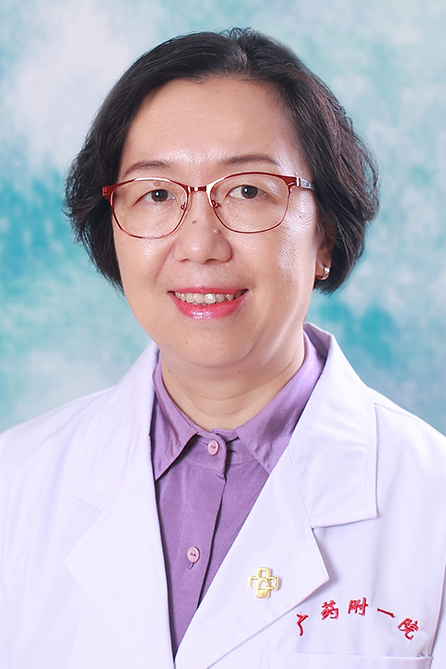

<!-- AUTO-GENERATED-BY: work/generate_obsidian_profiles.py -->

<!-- TEMPLATE: D:\workspace\信息收集整理\医生画像仓库\模板\医生画像模板.md -->

# 何力

## 基础信息

| 字段 | 内容 |
|---|---|
| 姓名 | 何力 |
| 医院 | 广东药科大学附属第一医院 |
| 科室 | 妇产科（农林门诊） |
| 职称/身份 | 主任医师、教授 |
| 来源链接 | [官网原文](https://www.gy120.net/articleshow.asp?articleid=100) |
| 采集日期 | 2026-08-15 |

## 简介/擅长

擅长妇科肿瘤、不孕症的诊治及腹腔镜手术、产科危重症的抢救。

## 教育与进修经历

- 个人介绍：毕业于东南大学医学院（原南京铁道医学院）医疗系毕业，一直从事妇产科临床工作，担任妇产科主任近 20 年，具有丰富的妇产科临床经验，熟练掌握妇产科三、四级手术及四级腹腔镜技术。

## 科研项目与成果

- 社会任职：广东省医师协会妇产科医师分会委员会委员 越秀区妇女儿童保健工作委员会委员 妇女保健专家委员会委员 广东省广州市医疗鉴定专家库评审专家 科研与获奖：曾多次获得医院新科技进步奖（二、三等奖）

## 可包装亮点

- 个人介绍：毕业于东南大学医学院（原南京铁道医学院）医疗系毕业，一直从事妇产科临床工作，担任妇产科主任近 20 年，具有丰富的妇产科临床经验，熟练掌握妇产科三、四级手术及四级腹腔镜技术。
- 社会任职：广东省医师协会妇产科医师分会委员会委员 越秀区妇女儿童保健工作委员会委员 妇女保健专家委员会委员 广东省广州市医疗鉴定专家库评审专家 科研与获奖：曾多次获得医院新科技进步奖（二、三等奖）

## 重点疾病/人群标签

- 慢性病：
- 肿瘤：肿瘤、不孕、危重
- 生殖疾病：肿瘤、不孕、危重
- 免疫/风湿：
- 术后恢复/康复：
- 疑难重症：肿瘤、不孕、危重

## 证据摘录

> 只摘录官网公开信息中的短句或关键字段，不复制大段原文。

- 官网身份字段：主任医师、教授
- 官网简介/擅长：擅长妇科肿瘤、不孕症的诊治及腹腔镜手术、产科危重症的抢救。
- 官网亮眼经历线索：个人介绍：毕业于东南大学医学院（原南京铁道医学院）医疗系毕业，一直从事妇产科临床工作，担任妇产科主任近 20 年，具有丰富的妇产科临床经验，熟练掌握妇产科三、四级手术及四级腹腔镜技术。 社会任职：广东省医师协会妇产科医师分会委员会委员 越秀区妇女儿童保健工作委员会委员 妇女保健专家委员会委员 广东省广州市医疗鉴定专家库评审专家 科研与获奖：曾多次获得医院新科技进步奖（二、三等奖）
- 来源链接：https://www.gy120.net/articleshow.asp?articleid=100

## BD 画像摘要

何力医生可作为肿瘤、生殖疾病、疑难重症方向的基础画像候选。后续 BD 使用应继续以官网来源和人工复核为准，不添加疗效承诺或无来源包装。

## 合规边界

- 仅使用医院官网、官方公众号、官方小程序等公开渠道。
- 不采集私人电话、私人微信、家庭住址、患者隐私或非公开排班信息。
- 不写“保证治愈”“疗效第一”“包治疑难杂症”等无法由官网证明的表述。
