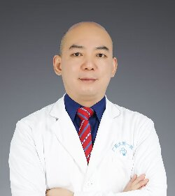

<!-- AUTO-GENERATED-BY: work/generate_obsidian_profiles.py -->

<!-- TEMPLATE: D:\workspace\信息收集整理\医生画像仓库\模板\医生画像模板.md -->

# 余文林

## 基础信息

| 字段 | 内容 |
|---|---|
| 姓名 | 余文林 |
| 医院 | 广东药科大学附属第一医院 |
| 科室 | 普外三科（整形美容科） |
| 职称/身份 | 副主任医师 |
| 来源链接 | [官网原文](https://www.gy120.net/articleshow.asp?articleid=590) |
| 采集日期 | 2026-08-15 |

## 简介/擅长

五官整形修复（以耳修复、唇裂鼻畸形修复为主）、腹壁整形、整形失败再修复、形体雕塑、瘢痕畸形修复、微创整形等多种整形手术。

## 科研项目与成果

- 主要论著：一、主编专著： 1.激光美容外科图谱 2.激光美容外科治疗学 二、主译专著：皮肤与美容激光外科 三、副主编专著1部：激光整形美容外科学 四、参编专著： 1.微创美容外科学 2.美容外科学 3.脂肪移植的基础与临床 4.麦卡锡整形外科学 科研与获奖：广东省科技进步一等奖 1项 中国人民解放军医疗成果二等奖 1项 军队医疗成果三等奖 3项 军队科技进步三等奖 2项

## 论文与学术产出

- 主要论著：一、主编专著： 1.激光美容外科图谱 2.激光美容外科治疗学 二、主译专著：皮肤与美容激光外科 三、副主编专著1部：激光整形美容外科学 四、参编专著： 1.微创美容外科学 2.美容外科学 3.脂肪移植的基础与临床 4.麦卡锡整形外科学 科研与获奖：广东省科技进步一等奖 1项 中国人民解放军医疗成果二等奖 1项 军队医疗成果三等奖 3项 军队科技进步三等奖 2项

## 可包装亮点

- 社会任职：中国康复医学会修复重建外科专业委员会皮瓣学组委员 中国美容与整形医师分会乳房专业委员会委员 中华医学会整形外科学会分会第七届委员会血管瘤与脉管畸形学组委员 中国整形美容协会线技术委员会常务理事 中国非公立医疗协会整形美容分会面部年轻化学组常务委员 广东省中西医结合学会医学美容专业委员会常委 广东省医学会整形外科学分会第四届委员会委员 广东省整形美…
- 主要论著：一、主编专著： 1.激光美容外科图谱 2.激光美容外科治疗学 二、主译专著：皮肤与美容激光外科 三、副主编专著1部：激光整形美容外科学 四、参编专著： 1.微创美容外科学 2.美容外科学 3.脂肪移植的基础与临床 4.麦卡锡整形外科学 科研与获奖：广东省科技进步一等奖 1项 中国人民解放军医疗成果二等奖 1项 军队医疗成果三等奖 3项 军队科技进…

## 重点疾病/人群标签

- 慢性病：
- 肿瘤：瘤、康复
- 生殖疾病：
- 免疫/风湿：
- 术后恢复/康复：瘤、康复
- 疑难重症：

## 证据摘录

> 只摘录官网公开信息中的短句或关键字段，不复制大段原文。

- 官网身份字段：副主任医师
- 官网简介/擅长：五官整形修复（以耳修复、唇裂鼻畸形修复为主）、腹壁整形、整形失败再修复、形体雕塑、瘢痕畸形修复、微创整形等多种整形手术。
- 官网亮眼经历线索：社会任职：中国康复医学会修复重建外科专业委员会皮瓣学组委员 中国美容与整形医师分会乳房专业委员会委员 中华医学会整形外科学会分会第七届委员会血管瘤与脉管畸形学组委员 中国整形美容协会线技术委员会常务理事 中国非公立医疗协会整形美容分会面部年轻化学组常务委员 广东省中西医结合学会医学美容专业委员会常委 广东省医学会整形外科学分会第四届委员会委员 广东省整形美容协会青年委员会副主任委员 广东省医学会医学鉴定专家库成员。 主要论著：一、主编…
- 来源链接：https://www.gy120.net/articleshow.asp?articleid=590

## BD 画像摘要

余文林医生可作为肿瘤、术后恢复/康复方向的基础画像候选。后续 BD 使用应继续以官网来源和人工复核为准，不添加疗效承诺或无来源包装。

## 合规边界

- 仅使用医院官网、官方公众号、官方小程序等公开渠道。
- 不采集私人电话、私人微信、家庭住址、患者隐私或非公开排班信息。
- 不写“保证治愈”“疗效第一”“包治疑难杂症”等无法由官网证明的表述。
