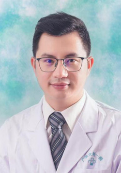

<!-- AUTO-GENERATED-BY: work/generate_obsidian_profiles.py -->

<!-- TEMPLATE: D:\workspace\信息收集整理\医生画像仓库\模板\医生画像模板.md -->

# 余炯标

## 基础信息

| 字段 | 内容 |
|---|---|
| 姓名 | 余炯标 |
| 医院 | 广东药科大学附属第一医院 |
| 科室 | 足踝与创面修复科（骨四科）（农林门诊） |
| 职称/身份 | 副主任医师，副教授，硕士研究生导师 |
| 来源链接 | [官网原文](https://www.gy120.net/articleshow.asp?articleid=614) |
| 采集日期 | 2026-08-15 |

## 简介/擅长

肝胆及甲状腺疾病、慢性创面、压疮、糖尿病足、手术后伤口愈合不佳等疑难创面的修复领域

## 可包装亮点

- 个人介绍：荣获第五届“羊城青年好医生”称号 投身普通外科及创面修复外科工作已近二十载，精通普通外科常见病症与多发疾病的诊断和治疗，尤其擅长肝胆及甲状腺疾病、慢性创面、压疮、糖尿病足、手术后伤口愈合不佳等疑难创面的修复领域。
- 能够熟练运用封闭式负压吸引、皮片移植、邻近和游离皮瓣移植等综合手段，治疗各类难愈性创面及急危重症创面患者。

## 重点疾病/人群标签

- 慢性病：
- 肿瘤：
- 生殖疾病：
- 免疫/风湿：
- 术后恢复/康复：
- 疑难重症：

## 证据摘录

> 只摘录官网公开信息中的短句或关键字段，不复制大段原文。

- 官网身份字段：副主任医师，副教授，硕士研究生导师
- 官网简介/擅长：肝胆及甲状腺疾病、慢性创面、压疮、糖尿病足、手术后伤口愈合不佳等疑难创面的修复领域
- 官网亮眼经历线索：个人介绍：荣获第五届“羊城青年好医生”称号 投身普通外科及创面修复外科工作已近二十载，精通普通外科常见病症与多发疾病的诊断和治疗，尤其擅长肝胆及甲状腺疾病、慢性创面、压疮、糖尿病足、手术后伤口愈合不佳等疑难创面的修复领域。 能够熟练运用封闭式负压吸引、皮片移植、邻近和游离皮瓣移植等综合手段，治疗各类难愈性创面及急危重症创面患者。
- 异常提示：同名待甄别
- 来源链接：https://www.gy120.net/articleshow.asp?articleid=614

## BD 画像摘要

余炯标医生可作为广东药科大学附属第一医院足踝与创面修复科（骨四科）（农林门诊）的基础医生资料入库。当前重点方向以总底表标签为准，官网未展示的信息保持空白。

## 合规边界

- 仅使用医院官网、官方公众号、官方小程序等公开渠道。
- 不采集私人电话、私人微信、家庭住址、患者隐私或非公开排班信息。
- 不写“保证治愈”“疗效第一”“包治疑难杂症”等无法由官网证明的表述。
