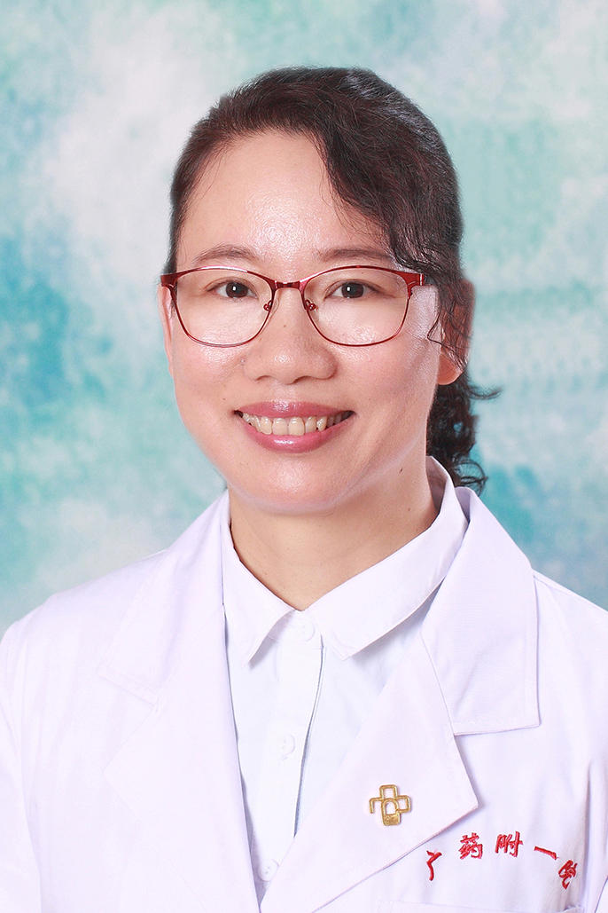

<!-- AUTO-GENERATED-BY: work/generate_obsidian_profiles.py -->

<!-- TEMPLATE: D:\workspace\信息收集整理\医生画像仓库\模板\医生画像模板.md -->

# 关向群

## 基础信息

| 字段 | 内容 |
|---|---|
| 姓名 | 关向群 |
| 医院 | 广东药科大学附属第一医院 |
| 科室 | 呼吸与危重症医学科（农林门诊） |
| 职称/身份 | 副教授、副主任医师 |
| 来源链接 | [官网原文](https://www.gy120.net/articleshow.asp?articleid=223) |
| 采集日期 | 2026-08-15 |

## 简介/擅长

慢性阻塞性肺疾病、急慢性呼吸衰竭、支气管哮喘、肺部感染、支气管扩张、肺结核等呼吸系统疾病的诊断与治疗。能熟练进行肺功能、纤维支气管镜检查并做出诊断。

## 教育与进修经历

- 个人介绍：1992年毕业于广州中山医科大学临床医学系，从事呼吸内科临床工作20余年 2001年3月至2002年3月在广州医学院第一附属医院广州呼吸疾病研究所进修学习呼吸疾病诊治与重症治疗；
- 2003年1月至4月在广东省人民医院进修学习纤支镜检查 科研与获奖：主持两项省级科研课题，在国家、省市级医学核心期刊公开发表数篇较高水平论文

## 科研项目与成果

- 2003年1月至4月在广东省人民医院进修学习纤支镜检查 科研与获奖：主持两项省级科研课题，在国家、省市级医学核心期刊公开发表数篇较高水平论文

## 论文与学术产出

- 2003年1月至4月在广东省人民医院进修学习纤支镜检查 科研与获奖：主持两项省级科研课题，在国家、省市级医学核心期刊公开发表数篇较高水平论文

## 可包装亮点

- 个人介绍：1992年毕业于广州中山医科大学临床医学系，从事呼吸内科临床工作20余年 2001年3月至2002年3月在广州医学院第一附属医院广州呼吸疾病研究所进修学习呼吸疾病诊治与重症治疗；
- 2003年1月至4月在广东省人民医院进修学习纤支镜检查 科研与获奖：主持两项省级科研课题，在国家、省市级医学核心期刊公开发表数篇较高水平论文

## 重点疾病/人群标签

- 慢性病：慢性、感染、危重、重症
- 肿瘤：
- 生殖疾病：
- 免疫/风湿：慢性、感染、危重、重症
- 术后恢复/康复：
- 疑难重症：慢性、感染、危重、重症

## 证据摘录

> 只摘录官网公开信息中的短句或关键字段，不复制大段原文。

- 官网身份字段：副教授、副主任医师
- 官网简介/擅长：慢性阻塞性肺疾病、急慢性呼吸衰竭、支气管哮喘、肺部感染、支气管扩张、肺结核等呼吸系统疾病的诊断与治疗。能熟练进行肺功能、纤维支气管镜检查并做出诊断。
- 官网亮眼经历线索：个人介绍：1992年毕业于广州中山医科大学临床医学系，从事呼吸内科临床工作20余年 2001年3月至2002年3月在广州医学院第一附属医院广州呼吸疾病研究所进修学习呼吸疾病诊治与重症治疗； 2003年1月至4月在广东省人民医院进修学习纤支镜检查 科研与获奖：主持两项省级科研课题，在国家、省市级医学核心期刊公开发表数篇较高水平论文
- 来源链接：https://www.gy120.net/articleshow.asp?articleid=223

## BD 画像摘要

关向群医生可作为慢性病、免疫/风湿/感染、疑难重症方向的基础画像候选。后续 BD 使用应继续以官网来源和人工复核为准，不添加疗效承诺或无来源包装。

## 合规边界

- 仅使用医院官网、官方公众号、官方小程序等公开渠道。
- 不采集私人电话、私人微信、家庭住址、患者隐私或非公开排班信息。
- 不写“保证治愈”“疗效第一”“包治疑难杂症”等无法由官网证明的表述。
