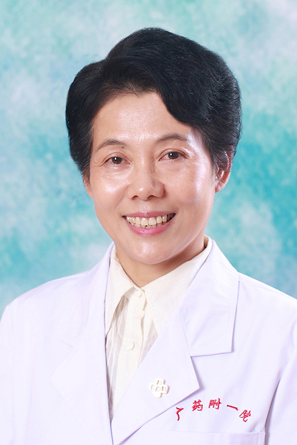

<!-- AUTO-GENERATED-BY: work/generate_obsidian_profiles.py -->

<!-- TEMPLATE: D:\workspace\信息收集整理\医生画像仓库\模板\医生画像模板.md -->

# 冯卓玲

## 基础信息

| 字段 | 内容 |
|---|---|
| 姓名 | 冯卓玲 |
| 医院 | 广东药科大学附属第一医院 |
| 科室 | 儿科 |
| 职称/身份 | 副教授、副主任医师 |
| 来源链接 | [官网原文](https://www.gy120.net/articleshow.asp?articleid=11) |
| 采集日期 | 2026-08-15 |

## 简介/擅长

新生儿疾病的诊断及治疗，熟悉机械通气，换血疗法，肺表面活性物质的应用,高危儿出院后的评估及健康指导，儿童喂养.

## 教育与进修经历

- 个人介绍：1984 年 毕业于南京铁道医学院医疗系, 从事儿科 临床工作31余年，现任广东药学院儿科教研室主任、副教授，广东药学院附属第一医院儿科科主任、副主任医师，历经多种重大疾病的抢救及疑难疾病的诊治，常年轮转于儿科门急诊、病房的工作 社会任职：广东省优生优育专家委员会委员 广东省医师学会委员 广东省新生儿专业委员会委员 主要论著：1984 年 毕业于南京铁道医学院医疗系, 从事儿科 临床工作31余年，现任广东药学院儿科教研室主任、副教授，广东药学院附属第一医院儿科科主任、副主任医师，历经多种重大疾病的抢救及…

## 可包装亮点

- 个人介绍：1984 年 毕业于南京铁道医学院医疗系, 从事儿科 临床工作31余年，现任广东药学院儿科教研室主任、副教授，广东药学院附属第一医院儿科科主任、副主任医师，历经多种重大疾病的抢救及疑难疾病的诊治，常年轮转于儿科门急诊、病房的工作 社会任职：广东省优生优育专家委员会委员 广东省医师学会委员 广东省新生儿专业委员会委员 主要论著：1984 年 毕业于…

## 重点疾病/人群标签

- 慢性病：
- 肿瘤：
- 生殖疾病：
- 免疫/风湿：
- 术后恢复/康复：
- 疑难重症：疑难、高危

## 证据摘录

> 只摘录官网公开信息中的短句或关键字段，不复制大段原文。

- 官网身份字段：副教授、副主任医师
- 官网简介/擅长：新生儿疾病的诊断及治疗，熟悉机械通气，换血疗法，肺表面活性物质的应用,高危儿出院后的评估及健康指导，儿童喂养.
- 官网亮眼经历线索：个人介绍：1984 年 毕业于南京铁道医学院医疗系, 从事儿科 临床工作31余年，现任广东药学院儿科教研室主任、副教授，广东药学院附属第一医院儿科科主任、副主任医师，历经多种重大疾病的抢救及疑难疾病的诊治，常年轮转于儿科门急诊、病房的工作 社会任职：广东省优生优育专家委员会委员 广东省医师学会委员 广东省新生儿专业委员会委员 主要论著：1984 年 毕业于南京铁道医学院医疗系, 从事儿科 临床工作31余年，现任广东药学院儿科教研室主任…
- 来源链接：https://www.gy120.net/articleshow.asp?articleid=11

## BD 画像摘要

冯卓玲医生可作为疑难重症方向的基础画像候选。后续 BD 使用应继续以官网来源和人工复核为准，不添加疗效承诺或无来源包装。

## 合规边界

- 仅使用医院官网、官方公众号、官方小程序等公开渠道。
- 不采集私人电话、私人微信、家庭住址、患者隐私或非公开排班信息。
- 不写“保证治愈”“疗效第一”“包治疑难杂症”等无法由官网证明的表述。
