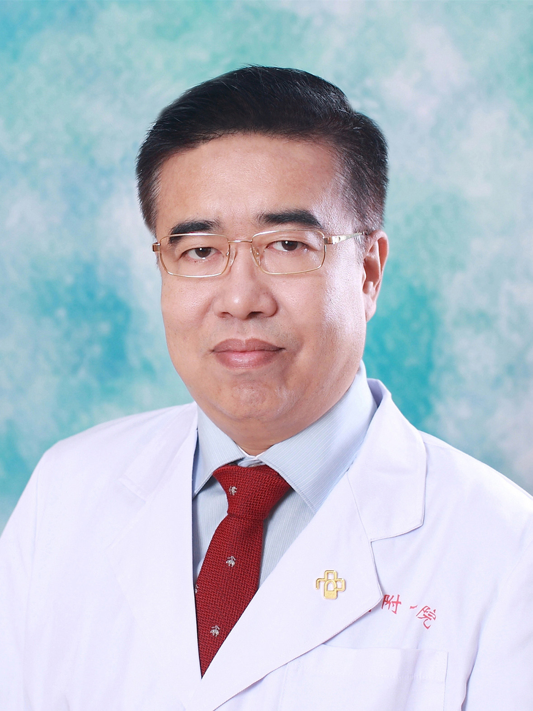

<!-- AUTO-GENERATED-BY: work/generate_obsidian_profiles.py -->

<!-- TEMPLATE: D:\workspace\信息收集整理\医生画像仓库\模板\医生画像模板.md -->

# 冯铁军

## 基础信息

| 字段 | 内容 |
|---|---|
| 姓名 | 冯铁军 |
| 医院 | 广东药科大学附属第一医院 |
| 科室 | 口腔科（农林门诊） |
| 职称/身份 | 副教授 主任医师、 |
| 来源链接 | [官网原文](https://www.gy120.net/articleshow.asp?articleid=94) |
| 采集日期 | 2026-08-15 |

## 简介/擅长

口腔美容修复、义齿修复、烤瓷冠桥修复

## 教育与进修经历

- 个人介绍：1992年毕业于暨南大学医学院，主修口腔专业。

## 科研项目与成果

- 社会任职：中华口腔医学会全科口腔医学专业委员会常务委员 广东省口腔医学会口腔修复学专业委员会常务委员 广东省保健协会副秘书长 广东省医院协会行政管理专业委员会副主委 广东省卫生经济学会卫生经济与文化专业委员会副主委 科研与获奖：近年公开发表学术论文 10 余篇，主编 / 参与编写论著 2 部，主持 / 参与国家及省部级课题 2 项 ,2018 年度获得广东省科技进步二等奖。

## 论文与学术产出

- 社会任职：中华口腔医学会全科口腔医学专业委员会常务委员 广东省口腔医学会口腔修复学专业委员会常务委员 广东省保健协会副秘书长 广东省医院协会行政管理专业委员会副主委 广东省卫生经济学会卫生经济与文化专业委员会副主委 科研与获奖：近年公开发表学术论文 10 余篇，主编 / 参与编写论著 2 部，主持 / 参与国家及省部级课题 2 项 ,2018 年度获得广东省科技进步二等奖。

## 可包装亮点

- 社会任职：中华口腔医学会全科口腔医学专业委员会常务委员 广东省口腔医学会口腔修复学专业委员会常务委员 广东省保健协会副秘书长 广东省医院协会行政管理专业委员会副主委 广东省卫生经济学会卫生经济与文化专业委员会副主委 科研与获奖：近年公开发表学术论文 10 余篇，主编 / 参与编写论著 2 部，主持 / 参与国家及省部级课题 2 项 ,2018 年度获得广东…

## 重点疾病/人群标签

- 慢性病：
- 肿瘤：
- 生殖疾病：
- 免疫/风湿：
- 术后恢复/康复：
- 疑难重症：

## 证据摘录

> 只摘录官网公开信息中的短句或关键字段，不复制大段原文。

- 官网身份字段：副教授 主任医师、
- 官网简介/擅长：口腔美容修复、义齿修复、烤瓷冠桥修复
- 官网亮眼经历线索：社会任职：中华口腔医学会全科口腔医学专业委员会常务委员 广东省口腔医学会口腔修复学专业委员会常务委员 广东省保健协会副秘书长 广东省医院协会行政管理专业委员会副主委 广东省卫生经济学会卫生经济与文化专业委员会副主委 科研与获奖：近年公开发表学术论文 10 余篇，主编 / 参与编写论著 2 部，主持 / 参与国家及省部级课题 2 项 ,2018 年度获得广东省科技进步二等奖。
- 来源链接：https://www.gy120.net/articleshow.asp?articleid=94

## BD 画像摘要

冯铁军医生可作为广东药科大学附属第一医院口腔科（农林门诊）的基础医生资料入库。当前重点方向以总底表标签为准，官网未展示的信息保持空白。

## 合规边界

- 仅使用医院官网、官方公众号、官方小程序等公开渠道。
- 不采集私人电话、私人微信、家庭住址、患者隐私或非公开排班信息。
- 不写“保证治愈”“疗效第一”“包治疑难杂症”等无法由官网证明的表述。
