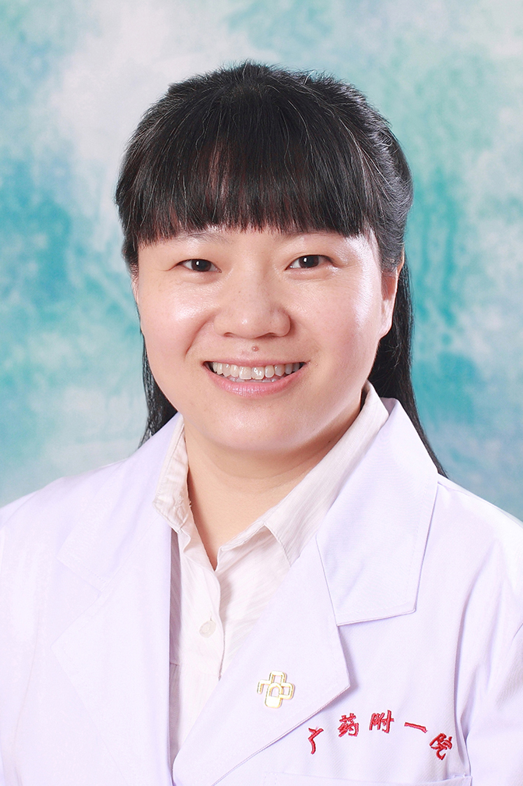

<!-- AUTO-GENERATED-BY: work/generate_obsidian_profiles.py -->

<!-- TEMPLATE: D:\workspace\信息收集整理\医生画像仓库\模板\医生画像模板.md -->

# 刁蔚欣

## 基础信息

| 字段 | 内容 |
|---|---|
| 姓名 | 刁蔚欣 |
| 医院 | 广东药科大学附属第一医院 |
| 科室 | 中西医结合代谢病科（健康管理中心） |
| 职称/身份 | 副主任医师 |
| 来源链接 | [官网原文](https://www.gy120.net/articleshow.asp?articleid=324) |
| 采集日期 | 2026-08-15 |

## 简介/擅长

擅长于脂肪肝、非酒精性肝硬化、糖尿病合并肺结核、糖尿病酮症酸中毒、感染性休克等疾病的诊断和治疗，对老年的心脑血管病和骨质疏松症等亦有丰富的临床经验。

## 教育与进修经历

- 个人介绍：2003 年获得暨南大学医学院临床医学本科学学士学位，就职于广东药学院附属第一医院（原广州市铁路中心医院）。
- 2009 年获得广州医学院临床医学内科学硕士研究生学位。

## 科研项目与成果

- 社会任职：广东省中西医结合学会委员 广东省医疗行业协会门脉高压症管理分会委员 主要论著：在医学核心期刊发表论文10余篇 “医院铜绿假单胞菌耐药状况分析” 《 国际医药卫生导》 2013年10月第19卷第20期 “1412株金黄色葡萄球菌耐药状况分析” 《今日药学>》 2013年12月第23卷第12期 “拉米夫定联合阿德福韦酯治疗110例HBeAg阳性慢性乙型肝炎疗效分析” 《广州医学院学报》 2014年4月第31卷第4期 科研与获奖：“基因HLA-DR13表达及BCP突变与HBV感染后临床转归的相关性研究”于20…

## 论文与学术产出

- 社会任职：广东省中西医结合学会委员 广东省医疗行业协会门脉高压症管理分会委员 主要论著：在医学核心期刊发表论文10余篇 “医院铜绿假单胞菌耐药状况分析” 《 国际医药卫生导》 2013年10月第19卷第20期 “1412株金黄色葡萄球菌耐药状况分析” 《今日药学>》 2013年12月第23卷第12期 “拉米夫定联合阿德福韦酯治疗110例HBeAg阳性慢性乙型肝炎疗效分析” 《广州医学院学报》 2014年4月第31卷第4期 科研与获奖：“基因HLA-DR13表达及BCP突变与HBV感染后临床转归的相关性研究”于20…

## 可包装亮点

- 2014年获得感染科副主任医师资格。
- 社会任职：广东省中西医结合学会委员 广东省医疗行业协会门脉高压症管理分会委员 主要论著：在医学核心期刊发表论文10余篇 “医院铜绿假单胞菌耐药状况分析” 《 国际医药卫生导》 2013年10月第19卷第20期 “1412株金黄色葡萄球菌耐药状况分析” 《今日药学>》 2013年12月第23卷第12期 “拉米夫定联合阿德福韦酯治疗110例HBeAg阳性慢性乙…

## 重点疾病/人群标签

- 慢性病：糖尿病、慢性、代谢、感染
- 肿瘤：
- 生殖疾病：
- 免疫/风湿：糖尿病、慢性、代谢、感染
- 术后恢复/康复：
- 疑难重症：

## 证据摘录

> 只摘录官网公开信息中的短句或关键字段，不复制大段原文。

- 官网身份字段：副主任医师
- 官网简介/擅长：擅长于脂肪肝、非酒精性肝硬化、糖尿病合并肺结核、糖尿病酮症酸中毒、感染性休克等疾病的诊断和治疗，对老年的心脑血管病和骨质疏松症等亦有丰富的临床经验。
- 官网亮眼经历线索：2014年获得感染科副主任医师资格。 社会任职：广东省中西医结合学会委员 广东省医疗行业协会门脉高压症管理分会委员 主要论著：在医学核心期刊发表论文10余篇 “医院铜绿假单胞菌耐药状况分析” 《 国际医药卫生导》 2013年10月第19卷第20期 “1412株金黄色葡萄球菌耐药状况分析” 《今日药学>》 2013年12月第23卷第12期 “拉米夫定联合阿德福韦酯治疗110例HBeAg阳性慢性乙型肝炎疗效分析” 《广州医学院学报》 20…
- 来源链接：https://www.gy120.net/articleshow.asp?articleid=324

## BD 画像摘要

刁蔚欣医生可作为慢性病、免疫/风湿/感染方向的基础画像候选。后续 BD 使用应继续以官网来源和人工复核为准，不添加疗效承诺或无来源包装。

## 合规边界

- 仅使用医院官网、官方公众号、官方小程序等公开渠道。
- 不采集私人电话、私人微信、家庭住址、患者隐私或非公开排班信息。
- 不写“保证治愈”“疗效第一”“包治疑难杂症”等无法由官网证明的表述。
