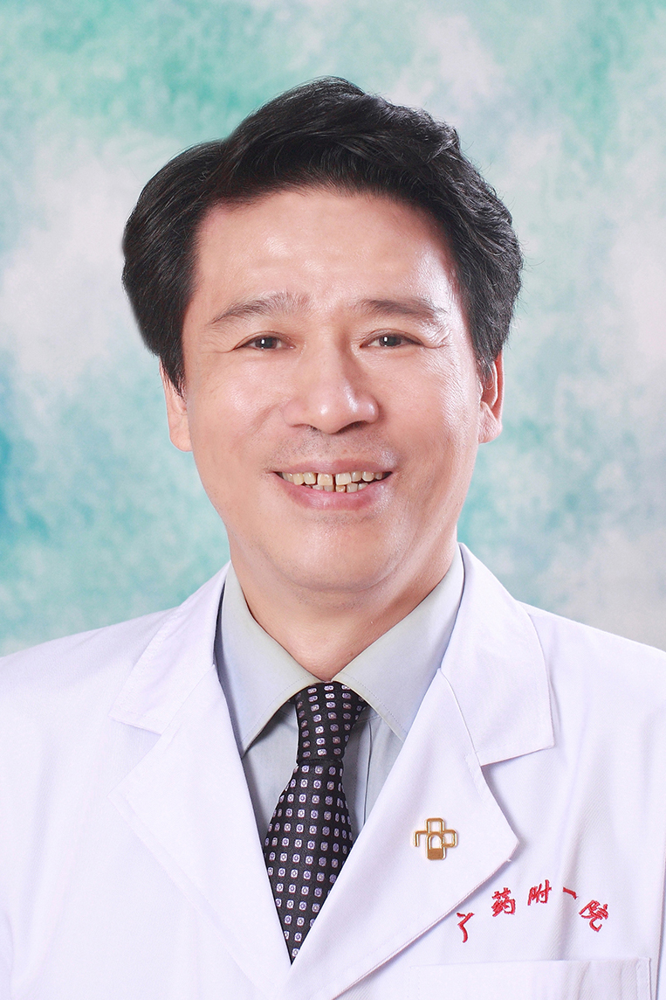

<!-- AUTO-GENERATED-BY: work/generate_obsidian_profiles.py -->

<!-- TEMPLATE: D:\workspace\信息收集整理\医生画像仓库\模板\医生画像模板.md -->

# 刘华

## 基础信息

| 字段 | 内容 |
|---|---|
| 姓名 | 刘华 |
| 医院 | 广东药科大学附属第一医院 |
| 科室 | 全科医学科（健康管理中心） |
| 职称/身份 | 教授、主任医师、 |
| 来源链接 | [官网原文](https://www.gy120.net/articleshow.asp?articleid=1) |
| 采集日期 | 2026-08-15 |

## 简介/擅长

急慢性肺损伤的诊治、支气管哮喘的诊治、难治性肺炎的诊治、肺间质性疾病的诊治、肺癌的诊治及相关分子生物学研究。

## 教育与进修经历

- 个人介绍：1986 年 7 月从贵州医科大学毕业后，一直从事内科临床工作 1993 年晋升内科主治医师 1999 年晋升呼吸内科副主任医师 2006 年晋升呼吸内科主任医师 2014 年晋升内科学教授 社会任职：省保健协会老年专委会付主委 中华医学会省医学会老年医学分会常委 省中西医结合学会脑心同治专委会常委 中华医学会省医学会全科医学分会委员 省自然科学基金评委 广州市自然科学基金评委 主要论著：主编著作一部：《临床医学研究》内科学分册 以第一作者或通讯作者共发表学术20余篇，其中中文核心期刊2篇，被SCI收录…

## 科研项目与成果

- 个人介绍：1986 年 7 月从贵州医科大学毕业后，一直从事内科临床工作 1993 年晋升内科主治医师 1999 年晋升呼吸内科副主任医师 2006 年晋升呼吸内科主任医师 2014 年晋升内科学教授 社会任职：省保健协会老年专委会付主委 中华医学会省医学会老年医学分会常委 省中西医结合学会脑心同治专委会常委 中华医学会省医学会全科医学分会委员 省自然科学基金评委 广州市自然科学基金评委 主要论著：主编著作一部：《临床医学研究》内科学分册 以第一作者或通讯作者共发表学术20余篇，其中中文核心期刊2篇，被SCI收录…
- 老年住院患者多药耐药鲍氏不动杆菌肺部感染的临床研究发表在中华医院感染学杂志重度慢性阻塞性肺疾病患者稳定期不同治疗方案的比较发表在武汉大学学报（医学版） Association of p73 G4C14-to-A4T14 polymorphism with lung cancer risk发表在Tumor Biol 科研与获奖：作为项目负责人 承担了如下课题： 2005 年广东省医学科研基金课题 1 项（ 2008 结题）： 1. 《个体化综合呼吸康复计划对 COPD 患者生存质量影响的研究》， 2. 2011 年…
- 3.2013 年广东省财政技术研究开发与推广应用专项资金课题（正在研究中）：骨髓间充质干细胞对急性肺损伤大鼠的治疗作用及对 MMP-2/9 表达的影响，目前正在开展中医药对急慢性肺损伤的相关研究。
- 与 广州呼吸疾病 研 究所合作 参 加 国 家“十五科技攻 关 ” 课题 —— 《急性大面 积 和次大面 积 肺血栓栓塞症不同溶栓 —— 抗疑治 疗 的 研 究》 ，取得了较好的经济效益和社会效益。

## 论文与学术产出

- 个人介绍：1986 年 7 月从贵州医科大学毕业后，一直从事内科临床工作 1993 年晋升内科主治医师 1999 年晋升呼吸内科副主任医师 2006 年晋升呼吸内科主任医师 2014 年晋升内科学教授 社会任职：省保健协会老年专委会付主委 中华医学会省医学会老年医学分会常委 省中西医结合学会脑心同治专委会常委 中华医学会省医学会全科医学分会委员 省自然科学基金评委 广州市自然科学基金评委 主要论著：主编著作一部：《临床医学研究》内科学分册 以第一作者或通讯作者共发表学术20余篇，其中中文核心期刊2篇，被SCI收录…
- 老年住院患者多药耐药鲍氏不动杆菌肺部感染的临床研究发表在中华医院感染学杂志重度慢性阻塞性肺疾病患者稳定期不同治疗方案的比较发表在武汉大学学报（医学版） Association of p73 G4C14-to-A4T14 polymorphism with lung cancer risk发表在Tumor Biol 科研与获奖：作为项目负责人 承担了如下课题： 2005 年广东省医学科研基金课题 1 项（ 2008 结题）： 1. 《个体化综合呼吸康复计划对 COPD 患者生存质量影响的研究》， 2. 2011 年…
- 近 5 年发表学术论文 15 篇，其中北大中文核心期刊 6 篇、 SCI2 篇，作为主编出版专著一部、作为副主编出版专著一部。

## 可包装亮点

- 官网目录标注：首席专家；
- 个人介绍：1986 年 7 月从贵州医科大学毕业后，一直从事内科临床工作 1993 年晋升内科主治医师 1999 年晋升呼吸内科副主任医师 2006 年晋升呼吸内科主任医师 2014 年晋升内科学教授 社会任职：省保健协会老年专委会付主委 中华医学会省医学会老年医学分会常委 省中西医结合学会脑心同治专委会常委 中华医学会省医学会全科医学分会委员 省自然科学…
- 老年住院患者多药耐药鲍氏不动杆菌肺部感染的临床研究发表在中华医院感染学杂志重度慢性阻塞性肺疾病患者稳定期不同治疗方案的比较发表在武汉大学学报（医学版） Association of p73 G4C14-to-A4T14 polymorphism with lung cancer risk发表在Tumor B...

## 重点疾病/人群标签

- 慢性病：慢性、肺癌、感染、康复、难治
- 肿瘤：慢性、肺癌、感染、康复、难治
- 生殖疾病：
- 免疫/风湿：慢性、肺癌、感染、康复、难治
- 术后恢复/康复：慢性、肺癌、感染、康复、难治
- 疑难重症：慢性、肺癌、感染、康复、难治

## 证据摘录

> 只摘录官网公开信息中的短句或关键字段，不复制大段原文。

- 官网身份字段：教授、主任医师、
- 官网简介/擅长：急慢性肺损伤的诊治、支气管哮喘的诊治、难治性肺炎的诊治、肺间质性疾病的诊治、肺癌的诊治及相关分子生物学研究。
- 官网亮眼经历线索：官网目录标注：首席专家；个人介绍：1986 年 7 月从贵州医科大学毕业后，一直从事内科临床工作 1993 年晋升内科主治医师 1999 年晋升呼吸内科副主任医师 2006 年晋升呼吸内科主任医师 2014 年晋升内科学教授 社会任职：省保健协会老年专委会付主委 中华医学会省医学会老年医学分会常委 省中西医结合学会脑心同治专委会常委 中华医学会省医学会全科医学分会委员 省自然科学基金评委 广州市自然科学基金评委 主要论著：主编著作一部…
- 来源链接：https://www.gy120.net/articleshow.asp?articleid=1

## BD 画像摘要

刘华医生可作为慢性病、肿瘤、免疫/风湿/感染、术后恢复/康复、疑难重症方向的基础画像候选。后续 BD 使用应继续以官网来源和人工复核为准，不添加疗效承诺或无来源包装。

## 合规边界

- 仅使用医院官网、官方公众号、官方小程序等公开渠道。
- 不采集私人电话、私人微信、家庭住址、患者隐私或非公开排班信息。
- 不写“保证治愈”“疗效第一”“包治疑难杂症”等无法由官网证明的表述。
