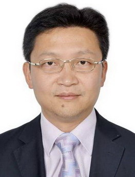

<!-- AUTO-GENERATED-BY: work/generate_obsidian_profiles.py -->

<!-- TEMPLATE: D:\workspace\信息收集整理\医生画像仓库\模板\医生画像模板.md -->

# 刘沣

## 基础信息

| 字段 | 内容 |
|---|---|
| 姓名 | 刘沣 |
| 医院 | 广东药科大学附属第一医院 |
| 科室 | 神经外科（健康管理中心） |
| 职称/身份 | 教授、副主任医师、硕士生导师 |
| 来源链接 | [官网原文](https://www.gy120.net/articleshow.asp?articleid=467) |
| 采集日期 | 2026-08-15 |

## 简介/擅长

颅内动脉瘤、动静脉畸形、颅底肿瘤、椎管内肿瘤、颅脑外伤的诊治

## 教育与进修经历

- 个人介绍：贵州医科大学硕士生导师 1999 年从事神经外科工作，贵州医科大学博士研究生毕业 2017 年 9 月— 2018 年 11 月，在国家留学基金委选派资助下，到美国南佛罗里达大学附属 TGH 医院神经外科及脑修复科学习， 导师 Vale Fernando 教授。
- 2007 年 09 月— 2008 年 10 月，在国家留学基金委选派资助下，到比利时列日大学 Sart Tilman 医院神经外科学习，导师 Martin Didier 教授，获比利时神经外科部分专业学位。

## 科研项目与成果

- 个人介绍：贵州医科大学硕士生导师 1999 年从事神经外科工作，贵州医科大学博士研究生毕业 2017 年 9 月— 2018 年 11 月，在国家留学基金委选派资助下，到美国南佛罗里达大学附属 TGH 医院神经外科及脑修复科学习， 导师 Vale Fernando 教授。
- 2007 年 09 月— 2008 年 10 月，在国家留学基金委选派资助下，到比利时列日大学 Sart Tilman 医院神经外科学习，导师 Martin Didier 教授，获比利时神经外科部分专业学位。

## 可包装亮点

- 个人介绍：贵州医科大学硕士生导师 1999 年从事神经外科工作，贵州医科大学博士研究生毕业 2017 年 9 月— 2018 年 11 月，在国家留学基金委选派资助下，到美国南佛罗里达大学附属 TGH 医院神经外科及脑修复科学习， 导师 Vale Fernando 教授。
- 社会任职：1 中国医师协会脑胶质瘤专业委员会 第一届青年委员会委员 2 中华医学会贵州省神经外科分会 学会秘书、常务委员 3 中国医师协会颅底显微外科专业委员会 第一届委员 4 贵阳市医学会第九届神经外科分科学会 委员 主要论著：1 ） A novel approach to glioma therapy using an oncolytic adenov…

## 重点疾病/人群标签

- 慢性病：
- 肿瘤：肿瘤、瘤
- 生殖疾病：
- 免疫/风湿：
- 术后恢复/康复：
- 疑难重症：

## 证据摘录

> 只摘录官网公开信息中的短句或关键字段，不复制大段原文。

- 官网身份字段：教授、副主任医师、硕士生导师
- 官网简介/擅长：颅内动脉瘤、动静脉畸形、颅底肿瘤、椎管内肿瘤、颅脑外伤的诊治
- 官网亮眼经历线索：个人介绍：贵州医科大学硕士生导师 1999 年从事神经外科工作，贵州医科大学博士研究生毕业 2017 年 9 月— 2018 年 11 月，在国家留学基金委选派资助下，到美国南佛罗里达大学附属 TGH 医院神经外科及脑修复科学习， 导师 Vale Fernando 教授。 社会任职：1 中国医师协会脑胶质瘤专业委员会 第一届青年委员会委员 2 中华医学会贵州省神经外科分会 学会秘书、常务委员 3 中国医师协会颅底显微外科专业委员会 第…
- 来源链接：https://www.gy120.net/articleshow.asp?articleid=467

## BD 画像摘要

刘沣医生可作为肿瘤方向的基础画像候选。后续 BD 使用应继续以官网来源和人工复核为准，不添加疗效承诺或无来源包装。

## 合规边界

- 仅使用医院官网、官方公众号、官方小程序等公开渠道。
- 不采集私人电话、私人微信、家庭住址、患者隐私或非公开排班信息。
- 不写“保证治愈”“疗效第一”“包治疑难杂症”等无法由官网证明的表述。
