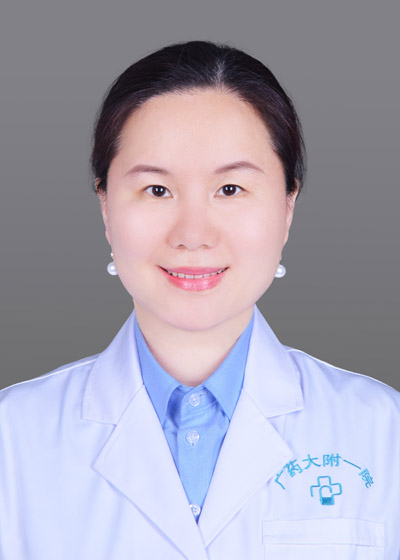

<!-- AUTO-GENERATED-BY: work/generate_obsidian_profiles.py -->

<!-- TEMPLATE: D:\workspace\信息收集整理\医生画像仓库\模板\医生画像模板.md -->

# 刘琦

## 基础信息

| 字段 | 内容 |
|---|---|
| 姓名 | 刘琦 |
| 医院 | 广东药科大学附属第一医院 |
| 科室 | 口腔科（农林门诊、健康管理中心） |
| 职称/身份 | 主任医师，教授。医学博士，留美学者，研究生导师，博士后合作导师 |
| 来源链接 | [官网原文](https://www.gy120.net/articleshow.asp?articleid=523) |
| 采集日期 | 2026-08-15 |

## 简介/擅长

目前主要从事口腔软硬组织的美学及功能修复、口腔生物材料的基础与临床研究。擅长复杂牙体、牙列缺损或缺失的各项功能修复（固定、活动、种植义齿等）及全口咬合重建；微创美学修复（贴面、嵌体等）及数字化技术的应用；精密附着体、套筒冠义齿的临床应用；牙周病、颞下颌关节病的修复治疗；颌面部软硬组织缺损的贋复及再生治疗等。

## 教育与进修经历

- 全国精准修复与数字化培训师资；
- 东盟国家口腔医疗技术国际培训班修复培训专家；
- 指导或辅导研究生10余名，规范化培训住院医师或进修生50余名。

## 科研项目与成果

- 授权国家发明专利3项，第一发明人2项。
- 科研与获奖：主持或参与科研课题30余项，其中主持国家自然科学基金1项，省市级基金5项，临床研究2项。

## 论文与学术产出

- 主要论著：发表学术论文30余篇，其中第一或通讯作者SCI论文10余篇。
- 主编或参编专著14部，其中主编2部，副主编5部。
- 发表专业译文19篇。

## 可包装亮点

- 官网目录标注：科室负责人；
- 羊城好医生；
- 广东省高等学校“千百十工程”培养人才；
- 全国精准修复与数字化培训师资；
- 社会任职：中华口腔医学会口腔修复学专委会委员，中华口腔医学会口腔材料学专委会委员，中国整形美容协会口腔整形美容分会理事。

## 重点疾病/人群标签

- 慢性病：
- 肿瘤：
- 生殖疾病：
- 免疫/风湿：
- 术后恢复/康复：
- 疑难重症：复杂

## 证据摘录

> 只摘录官网公开信息中的短句或关键字段，不复制大段原文。

- 官网身份字段：主任医师，教授。医学博士，留美学者，研究生导师，博士后合作导师
- 官网简介/擅长：目前主要从事口腔软硬组织的美学及功能修复、口腔生物材料的基础与临床研究。擅长复杂牙体、牙列缺损或缺失的各项功能修复（固定、活动、种植义齿等）及全口咬合重建；微创美学修复（贴面、嵌体等）及数字化技术的应用；精密附着体、套筒冠义齿的临床应用；牙周病、颞下颌关节病的修复治疗；颌面部软硬组织缺损的贋复及再生治疗等。
- 官网亮眼经历线索：官网目录标注：科室负责人；羊城好医生； 广东省高等学校“千百十工程”培养人才； 全国精准修复与数字化培训师资； 社会任职：中华口腔医学会口腔修复学专委会委员，中华口腔医学会口腔材料学专委会委员，中国整形美容协会口腔整形美容分会理事。
- 来源链接：https://www.gy120.net/articleshow.asp?articleid=523

## BD 画像摘要

刘琦医生可作为疑难重症方向的基础画像候选。后续 BD 使用应继续以官网来源和人工复核为准，不添加疗效承诺或无来源包装。

## 合规边界

- 仅使用医院官网、官方公众号、官方小程序等公开渠道。
- 不采集私人电话、私人微信、家庭住址、患者隐私或非公开排班信息。
- 不写“保证治愈”“疗效第一”“包治疑难杂症”等无法由官网证明的表述。
