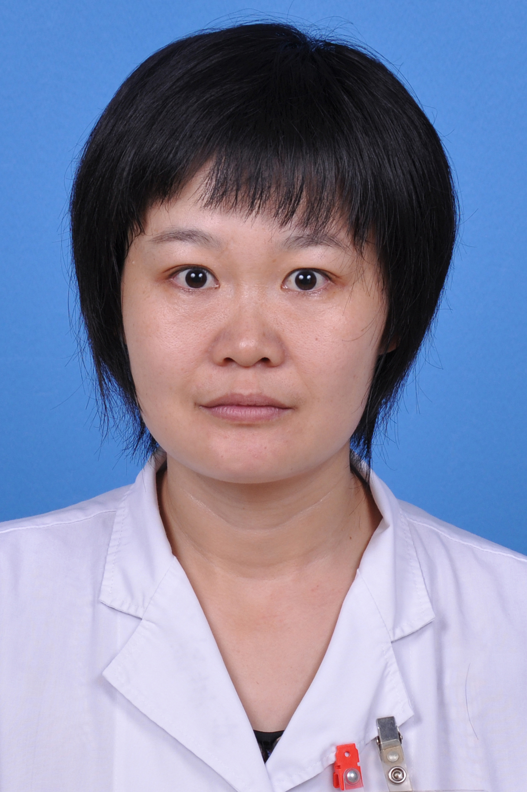

<!-- AUTO-GENERATED-BY: work/generate_obsidian_profiles.py -->

<!-- TEMPLATE: D:\workspace\信息收集整理\医生画像仓库\模板\医生画像模板.md -->

# 刘雄英

## 基础信息

| 字段 | 内容 |
|---|---|
| 姓名 | 刘雄英 |
| 医院 | 广东药科大学附属第一医院 |
| 科室 | 核医学科（农林门诊） |
| 职称/身份 | 副主任医师 |
| 来源链接 | [官网原文](https://www.gy120.net/articleshow.asp?articleid=272) |
| 采集日期 | 2026-08-15 |

## 简介/擅长

具有丰富的PET/CT、SPECT/CT影像诊断和核素治疗经验，擅长格雷夫斯甲亢和分化型甲状腺癌的碘-131治疗、皮肤疤痕和血管瘤的32P敷贴治疗。

## 教育与进修经历

- 个人介绍：1、2003年9月至2006年6月：在中山大学孙逸仙纪念医院攻读硕士学位，师从蒋宁一教授。

## 可包装亮点

- 社会任职：广东省医学会核医学分会青年委员；
- 广东省医师协会核医学医师分会 SPECT/CT 专业组成员；
- 广东省 放射防护学会青年 委员

## 重点疾病/人群标签

- 慢性病：
- 肿瘤：癌、瘤、胚胎、康复
- 生殖疾病：癌、瘤、胚胎、康复
- 免疫/风湿：
- 术后恢复/康复：癌、瘤、胚胎、康复
- 疑难重症：

## 证据摘录

> 只摘录官网公开信息中的短句或关键字段，不复制大段原文。

- 官网身份字段：副主任医师
- 官网简介/擅长：具有丰富的PET/CT、SPECT/CT影像诊断和核素治疗经验，擅长格雷夫斯甲亢和分化型甲状腺癌的碘-131治疗、皮肤疤痕和血管瘤的32P敷贴治疗。
- 官网亮眼经历线索：社会任职：广东省医学会核医学分会青年委员； 广东省医师协会核医学医师分会 SPECT/CT 专业组成员； 广东省 放射防护学会青年 委员
- 来源链接：https://www.gy120.net/articleshow.asp?articleid=272

## BD 画像摘要

刘雄英医生可作为肿瘤、生殖疾病、术后恢复/康复方向的基础画像候选。后续 BD 使用应继续以官网来源和人工复核为准，不添加疗效承诺或无来源包装。

## 合规边界

- 仅使用医院官网、官方公众号、官方小程序等公开渠道。
- 不采集私人电话、私人微信、家庭住址、患者隐私或非公开排班信息。
- 不写“保证治愈”“疗效第一”“包治疑难杂症”等无法由官网证明的表述。
