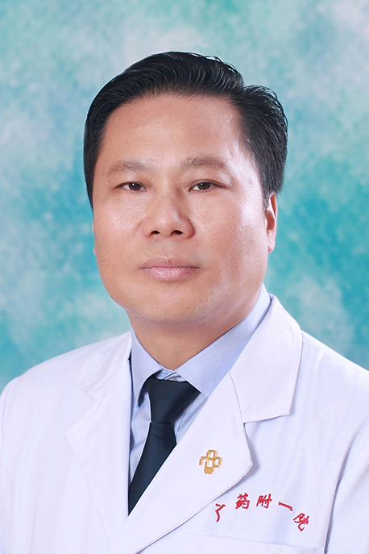

<!-- AUTO-GENERATED-BY: work/generate_obsidian_profiles.py -->

<!-- TEMPLATE: D:\workspace\信息收集整理\医生画像仓库\模板\医生画像模板.md -->

# 区奕猛

## 基础信息

| 字段 | 内容 |
|---|---|
| 姓名 | 区奕猛 |
| 医院 | 广东药科大学附属第一医院 |
| 科室 | 普外一科（肝胆外科） |
| 职称/身份 | 教授、主任医师、硕士生导师 |
| 来源链接 | [官网原文](https://www.gy120.net/articleshow.asp?articleid=7) |
| 采集日期 | 2026-08-15 |

## 简介/擅长

擅长重大疑难的肝胆胰脾、胃肠肿瘤、乳腺、甲状腺诊断与手术治疗，尤其精于重大疑难的肝胆脾胰、胃肠肿瘤、甲状腺肿瘤腔镜治疗。

## 教育与进修经历

- 个人介绍：1987年毕业于上海铁道学院医学系本科 长期从事普通外科工作，在不断提高、完善传统的开腹肝胆脾胰高疑难手术的基础上，不断创新，开展新技术，独立完成了高难度的腹腔镜下肝癌切除术、腔镜下脾切除 + 贲门周围血管离断术、腔镜下胃肠道恶性肿瘤根治和腹腔镜下胰十二指肠切除术等手术。

## 科研项目与成果

- 主持和参与多项课题，发表文献 20 篇

## 论文与学术产出

- 主持和参与多项课题，发表文献 20 篇

## 可包装亮点

- 官网目录标注：首席专家；
- 个人介绍：1987年毕业于上海铁道学院医学系本科 长期从事普通外科工作，在不断提高、完善传统的开腹肝胆脾胰高疑难手术的基础上，不断创新，开展新技术，独立完成了高难度的腹腔镜下肝癌切除术、腔镜下脾切除 + 贲门周围血管离断术、腔镜下胃肠道恶性肿瘤根治和腹腔镜下胰十二指肠切除术等手术。
- 社会任职：广东省医学会肝胆外科分会委员 广东省医学会微创外科学分会委员 广州市医师协会外科分会副主任委员 广东省医师协会外科医师分会常委 广东省医师协会肝胆外科医师分会常委 广东省医疗行业协会门静脉高压症管理委员会副主任委员 广东省健康管理学会压疮慢性伤口康复专业委员会副主任委员 岭南现代临床外科编委 主要论著：胰头十二指肠切除术胰瘘、胆瘘的相关因素 （肝…

## 重点疾病/人群标签

- 慢性病：慢性、肿瘤、肝癌、康复、伤口、疑难、难治
- 肿瘤：慢性、肿瘤、肝癌、康复、伤口、疑难、难治
- 生殖疾病：
- 免疫/风湿：
- 术后恢复/康复：慢性、肿瘤、肝癌、康复、伤口、疑难、难治
- 疑难重症：慢性、肿瘤、肝癌、康复、伤口、疑难、难治

## 证据摘录

> 只摘录官网公开信息中的短句或关键字段，不复制大段原文。

- 官网身份字段：教授、主任医师、硕士生导师
- 官网简介/擅长：擅长重大疑难的肝胆胰脾、胃肠肿瘤、乳腺、甲状腺诊断与手术治疗，尤其精于重大疑难的肝胆脾胰、胃肠肿瘤、甲状腺肿瘤腔镜治疗。
- 官网亮眼经历线索：官网目录标注：首席专家；个人介绍：1987年毕业于上海铁道学院医学系本科 长期从事普通外科工作，在不断提高、完善传统的开腹肝胆脾胰高疑难手术的基础上，不断创新，开展新技术，独立完成了高难度的腹腔镜下肝癌切除术、腔镜下脾切除 + 贲门周围血管离断术、腔镜下胃肠道恶性肿瘤根治和腹腔镜下胰十二指肠切除术等手术。 社会任职：广东省医学会肝胆外科分会委员 广东省医学会微创外科学分会委员 广州市医师协会外科分会副主任委员 广东省医师协会外科医师分…
- 来源链接：https://www.gy120.net/articleshow.asp?articleid=7

## BD 画像摘要

区奕猛医生可作为慢性病、肿瘤、术后恢复/康复、疑难重症方向的基础画像候选。后续 BD 使用应继续以官网来源和人工复核为准，不添加疗效承诺或无来源包装。

## 合规边界

- 仅使用医院官网、官方公众号、官方小程序等公开渠道。
- 不采集私人电话、私人微信、家庭住址、患者隐私或非公开排班信息。
- 不写“保证治愈”“疗效第一”“包治疑难杂症”等无法由官网证明的表述。
