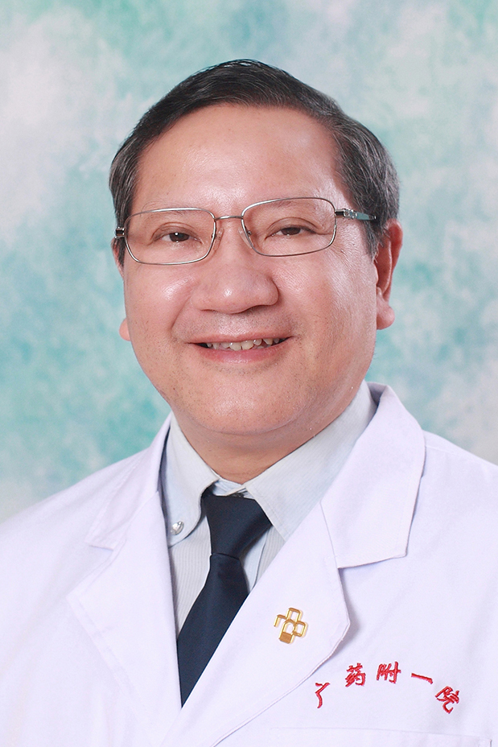

<!-- AUTO-GENERATED-BY: work/generate_obsidian_profiles.py -->

<!-- TEMPLATE: D:\workspace\信息收集整理\医生画像仓库\模板\医生画像模板.md -->

# 单孔荣

## 基础信息

| 字段 | 内容 |
|---|---|
| 姓名 | 单孔荣 |
| 医院 | 广东药科大学附属第一医院 |
| 科室 | 皮肤科（健康管理中心、共和门诊） |
| 职称/身份 | 副教授、副主任医师、 |
| 来源链接 | [官网原文](https://www.gy120.net/articleshow.asp?articleid=5) |
| 采集日期 | 2026-08-15 |

## 简介/擅长

专长于湿疹、特异性皮炎、荨麻疹、瘙痒症、痤疮、白癜风、真菌病、疱疹病的诊治。激光技术治疗尖锐湿疣、色素痣、色素斑。

## 教育与进修经历

- 个人介绍：1987 年医科大学毕业后一直从事皮肤科专业的临床和教学工作，曾先后到全国重点医科大学、医院进修深造，现是肤科性病专业副主任医师。

## 可包装亮点

- 个人介绍：1987 年医科大学毕业后一直从事皮肤科专业的临床和教学工作，曾先后到全国重点医科大学、医院进修深造，现是肤科性病专业副主任医师。
- 社会任职：广东医学会皮肤性病分会委员 广东医师协会皮肤性病分会委员

## 重点疾病/人群标签

- 慢性病：
- 肿瘤：
- 生殖疾病：
- 免疫/风湿：
- 术后恢复/康复：
- 疑难重症：

## 证据摘录

> 只摘录官网公开信息中的短句或关键字段，不复制大段原文。

- 官网身份字段：副教授、副主任医师、
- 官网简介/擅长：专长于湿疹、特异性皮炎、荨麻疹、瘙痒症、痤疮、白癜风、真菌病、疱疹病的诊治。激光技术治疗尖锐湿疣、色素痣、色素斑。
- 官网亮眼经历线索：个人介绍：1987 年医科大学毕业后一直从事皮肤科专业的临床和教学工作，曾先后到全国重点医科大学、医院进修深造，现是肤科性病专业副主任医师。 社会任职：广东医学会皮肤性病分会委员 广东医师协会皮肤性病分会委员
- 来源链接：https://www.gy120.net/articleshow.asp?articleid=5

## BD 画像摘要

单孔荣医生可作为广东药科大学附属第一医院皮肤科（健康管理中心、共和门诊）的基础医生资料入库。当前重点方向以总底表标签为准，官网未展示的信息保持空白。

## 合规边界

- 仅使用医院官网、官方公众号、官方小程序等公开渠道。
- 不采集私人电话、私人微信、家庭住址、患者隐私或非公开排班信息。
- 不写“保证治愈”“疗效第一”“包治疑难杂症”等无法由官网证明的表述。
