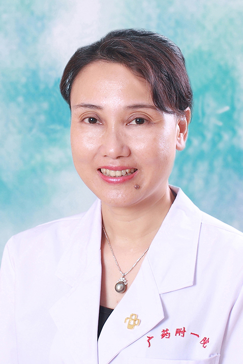

<!-- AUTO-GENERATED-BY: work/generate_obsidian_profiles.py -->

<!-- TEMPLATE: D:\workspace\信息收集整理\医生画像仓库\模板\医生画像模板.md -->

# 叶健华

## 基础信息

| 字段 | 内容 |
|---|---|
| 姓名 | 叶健华 |
| 医院 | 广东药科大学附属第一医院 |
| 科室 | 内分泌科（共和门诊） |
| 职称/身份 | 教授、主任医师、硕士生导师 |
| 来源链接 | [官网原文](https://www.gy120.net/articleshow.asp?articleid=53) |
| 采集日期 | 2026-08-15 |

## 简介/擅长

糖尿病及其急慢性并发症，代谢综合症，甲状腺疾病，内分泌性高血压，妇科及妊娠相关性内分泌代谢性疾病，垂体，肾上腺，骨质疏松，钙磷代谢异常及其他内分泌代谢疾病。

## 教育与进修经历

- 毕业后一直在广铁中心医院即广东药学院附一院工作。
- 1996.4＿1997.4中山医附二及附一院内分泌科进修。

## 科研项目与成果

- 科研与获奖：作为第一负责人分别承担广州市科委，广铁集团公司及省卫生厅的科研课题的研究。
- 研究成果撰写多篇论文发表在国家及省部级的专业期刊上。
- 作为分中心 PI 进行多项多中心横向研究项目。

## 论文与学术产出

- 研究成果撰写多篇论文发表在国家及省部级的专业期刊上。

## 可包装亮点

- 官网目录标注：科室负责人；
- 1996.4＿1997.4中山医附二及附一院内分泌科进修。
- 1996.1＿2000.12内分泌科主治医师 2000..12＿2007.11内分泌科主任医师 2007.11＿2014..9门诊内科主任医师 2014.10＿至今内分泌科科主任 社会任职：广东省医师协会内分泌分会常委 广东省医学会内分泌分会委员、 广东省医学会 糖尿病分会委员 广东省药学会内分泌代谢病分会委员 广东省及广州市医师协会内分泌代谢分会常委 广…
- 科研与获奖：作为第一负责人分别承担广州市科委，广铁集团公司及省卫生厅的科研课题的研究。
- 研究成果撰写多篇论文发表在国家及省部级的专业期刊上。

## 重点疾病/人群标签

- 慢性病：高血压、糖尿病、慢性、代谢
- 肿瘤：
- 生殖疾病：
- 免疫/风湿：
- 术后恢复/康复：
- 疑难重症：

## 证据摘录

> 只摘录官网公开信息中的短句或关键字段，不复制大段原文。

- 官网身份字段：教授、主任医师、硕士生导师
- 官网简介/擅长：糖尿病及其急慢性并发症，代谢综合症，甲状腺疾病，内分泌性高血压，妇科及妊娠相关性内分泌代谢性疾病，垂体，肾上腺，骨质疏松，钙磷代谢异常及其他内分泌代谢疾病。
- 官网亮眼经历线索：官网目录标注：科室负责人；1996.4＿1997.4中山医附二及附一院内分泌科进修。 1996.1＿2000.12内分泌科主治医师 2000..12＿2007.11内分泌科主任医师 2007.11＿2014..9门诊内科主任医师 2014.10＿至今内分泌科科主任 社会任职：广东省医师协会内分泌分会常委 广东省医学会内分泌分会委员、 广东省医学会 糖尿病分会委员 广东省药学会内分泌代谢病分会委员 广东省及广州市医师协会内分泌代谢分会常…
- 来源链接：https://www.gy120.net/articleshow.asp?articleid=53

## BD 画像摘要

叶健华医生可作为慢性病方向的基础画像候选。后续 BD 使用应继续以官网来源和人工复核为准，不添加疗效承诺或无来源包装。

## 合规边界

- 仅使用医院官网、官方公众号、官方小程序等公开渠道。
- 不采集私人电话、私人微信、家庭住址、患者隐私或非公开排班信息。
- 不写“保证治愈”“疗效第一”“包治疑难杂症”等无法由官网证明的表述。
