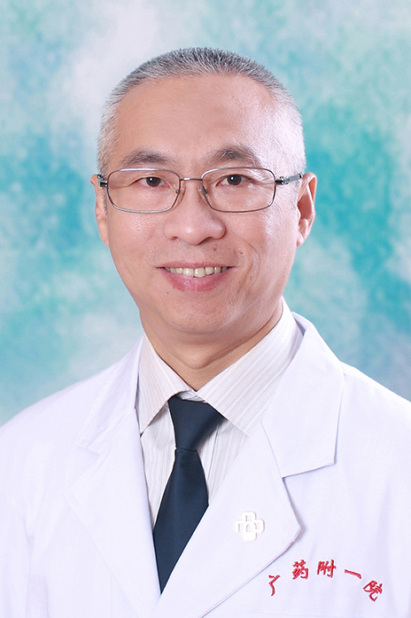

<!-- AUTO-GENERATED-BY: work/generate_obsidian_profiles.py -->

<!-- TEMPLATE: D:\workspace\信息收集整理\医生画像仓库\模板\医生画像模板.md -->

# 吴敏华

## 基础信息

| 字段 | 内容 |
|---|---|
| 姓名 | 吴敏华 |
| 医院 | 广东药科大学附属第一医院 |
| 科室 | 普外二科（胃肠外科）（健康管理中心） |
| 职称/身份 | 副教授、副主任医师 |
| 来源链接 | [官网原文](https://www.gy120.net/articleshow.asp?articleid=15) |
| 采集日期 | 2026-08-15 |

## 简介/擅长

擅长胃肠道肿瘤、疝、痔瘘、腹腔镜下结直肠肿瘤的手术

## 教育与进修经历

- 个人介绍：1982-1987年大学本科上海铁道医学院(现上海同济大学医学院) 1987年8月至今在广州铁路中心医院普外科工作（三级甲等医院） 1993年在广东省人民医院进修普外科 1994年4月聘为主治医师 2002年3月聘为副主任医师 1996年及2000年获得院优秀医师 社会任职：中华医学会会员 中国抗癌协会会员 主要论著：《35例复发性大肠癌治疗体会》 《综合疗法治疗环形混合痔41例报告》 《31例肠系膜软组织恶性肿瘤治疗体会》 科研与获奖：腹腔镜结肠癌根治术获2000年科技进步三等奖

## 科研项目与成果

- 个人介绍：1982-1987年大学本科上海铁道医学院(现上海同济大学医学院) 1987年8月至今在广州铁路中心医院普外科工作（三级甲等医院） 1993年在广东省人民医院进修普外科 1994年4月聘为主治医师 2002年3月聘为副主任医师 1996年及2000年获得院优秀医师 社会任职：中华医学会会员 中国抗癌协会会员 主要论著：《35例复发性大肠癌治疗体会》 《综合疗法治疗环形混合痔41例报告》 《31例肠系膜软组织恶性肿瘤治疗体会》 科研与获奖：腹腔镜结肠癌根治术获2000年科技进步三等奖

## 可包装亮点

- 个人介绍：1982-1987年大学本科上海铁道医学院(现上海同济大学医学院) 1987年8月至今在广州铁路中心医院普外科工作（三级甲等医院） 1993年在广东省人民医院进修普外科 1994年4月聘为主治医师 2002年3月聘为副主任医师 1996年及2000年获得院优秀医师 社会任职：中华医学会会员 中国抗癌协会会员 主要论著：《35例复发性大肠癌治疗体会…

## 重点疾病/人群标签

- 慢性病：
- 肿瘤：肿瘤、癌、肠癌
- 生殖疾病：
- 免疫/风湿：
- 术后恢复/康复：
- 疑难重症：

## 证据摘录

> 只摘录官网公开信息中的短句或关键字段，不复制大段原文。

- 官网身份字段：副教授、副主任医师
- 官网简介/擅长：擅长胃肠道肿瘤、疝、痔瘘、腹腔镜下结直肠肿瘤的手术
- 官网亮眼经历线索：个人介绍：1982-1987年大学本科上海铁道医学院(现上海同济大学医学院) 1987年8月至今在广州铁路中心医院普外科工作（三级甲等医院） 1993年在广东省人民医院进修普外科 1994年4月聘为主治医师 2002年3月聘为副主任医师 1996年及2000年获得院优秀医师 社会任职：中华医学会会员 中国抗癌协会会员 主要论著：《35例复发性大肠癌治疗体会》 《综合疗法治疗环形混合痔41例报告》 《31例肠系膜软组织恶性肿瘤治疗体会》…
- 来源链接：https://www.gy120.net/articleshow.asp?articleid=15

## BD 画像摘要

吴敏华医生可作为肿瘤方向的基础画像候选。后续 BD 使用应继续以官网来源和人工复核为准，不添加疗效承诺或无来源包装。

## 合规边界

- 仅使用医院官网、官方公众号、官方小程序等公开渠道。
- 不采集私人电话、私人微信、家庭住址、患者隐私或非公开排班信息。
- 不写“保证治愈”“疗效第一”“包治疑难杂症”等无法由官网证明的表述。
