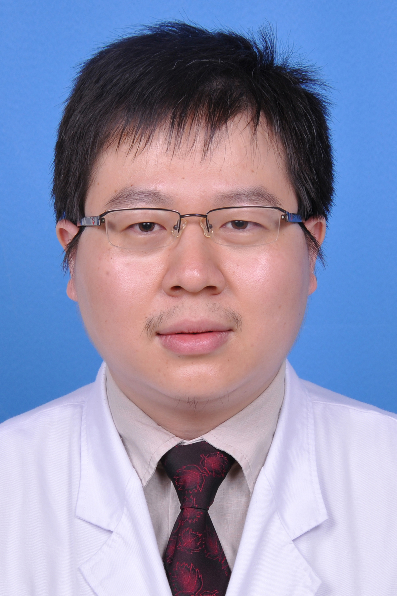

<!-- AUTO-GENERATED-BY: work/generate_obsidian_profiles.py -->

<!-- TEMPLATE: D:\workspace\信息收集整理\医生画像仓库\模板\医生画像模板.md -->

# 吴昊

## 基础信息

| 字段 | 内容 |
|---|---|
| 姓名 | 吴昊 |
| 医院 | 广东药科大学附属第一医院 |
| 科室 | 重症医学科 |
| 职称/身份 | 主治医师 |
| 来源链接 | [官网原文](https://www.gy120.net/articleshow.asp?articleid=271) |
| 采集日期 | 2026-08-15 |

## 简介/擅长

从事重症医学工作多年，对危重病人抢救有较丰富的经验，熟练掌握气管插管，机械通气，深静脉置管等抢救技术，能开展床边纤支镜检，血液净化等治疗。

## 教育与进修经历

- 个人介绍：于2006年自广州医科大学毕业，心血管内科硕士学位，毕业后一直于广东药学院附属第一医院重症医学科工作，现为主治医师。

## 可包装亮点

- 主要论著：1、凯西莱注射液治疗ICU内急性肝损伤患者28例临床观察 北方药学 2011年08期 2、痰热清注射液治疗重症肺炎的疗效观察 中医药导报 2011年10期 3、52例ICU危重病人肠内营养支持临床观察 2013年01期

## 重点疾病/人群标签

- 慢性病：
- 肿瘤：
- 生殖疾病：
- 免疫/风湿：
- 术后恢复/康复：营养、危重、重症
- 疑难重症：营养、危重、重症

## 证据摘录

> 只摘录官网公开信息中的短句或关键字段，不复制大段原文。

- 官网身份字段：主治医师
- 官网简介/擅长：从事重症医学工作多年，对危重病人抢救有较丰富的经验，熟练掌握气管插管，机械通气，深静脉置管等抢救技术，能开展床边纤支镜检，血液净化等治疗。
- 官网亮眼经历线索：主要论著：1、凯西莱注射液治疗ICU内急性肝损伤患者28例临床观察 北方药学 2011年08期 2、痰热清注射液治疗重症肺炎的疗效观察 中医药导报 2011年10期 3、52例ICU危重病人肠内营养支持临床观察 2013年01期
- 来源链接：https://www.gy120.net/articleshow.asp?articleid=271

## BD 画像摘要

吴昊医生可作为术后恢复/康复、疑难重症方向的基础画像候选。后续 BD 使用应继续以官网来源和人工复核为准，不添加疗效承诺或无来源包装。

## 合规边界

- 仅使用医院官网、官方公众号、官方小程序等公开渠道。
- 不采集私人电话、私人微信、家庭住址、患者隐私或非公开排班信息。
- 不写“保证治愈”“疗效第一”“包治疑难杂症”等无法由官网证明的表述。
