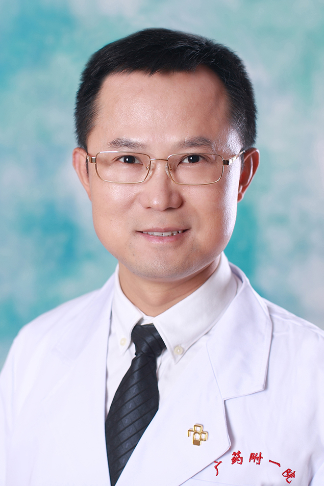

<!-- AUTO-GENERATED-BY: work/generate_obsidian_profiles.py -->

<!-- TEMPLATE: D:\workspace\信息收集整理\医生画像仓库\模板\医生画像模板.md -->

# 吴礼浩

## 基础信息

| 字段 | 内容 |
|---|---|
| 姓名 | 吴礼浩 |
| 医院 | 广东药科大学附属第一医院 |
| 科室 | 消化内科（健康管理中心） |
| 职称/身份 | 教授、主任医师 |
| 来源链接 | [官网原文](https://www.gy120.net/articleshow.asp?articleid=212) |
| 采集日期 | 2026-08-15 |

## 简介/擅长

曾赴日本东京大学附属病院内镜部进修，对复杂消化道疾病的诊治有丰富的经验，擅长消化内镜诊断与治疗，如胆总管结石内镜下取出术、梗阻性黄疸的内镜下引流术以及胃肠道肿瘤及癌前病变的内镜下切除、内镜下硬化剂注射治疗内痔等，对粪菌移植治疗肠道及肠道外疾病有丰富的经验。

## 教育与进修经历

- 个人介绍：曾赴日本东京大学附属病院内镜部进修，对复杂消化道疾病的诊治有丰富的经验，擅长消化内镜诊断与治疗，如胆总管结石内镜下取出术、梗阻性黄疸的内镜下引流术以及胃肠道肿瘤及癌前病变的内镜下切除、内镜下硬化剂注射治疗内痔等，对粪菌移植治疗肠道及肠道外疾病有丰富的经验。

## 可包装亮点

- 官网目录标注：科室负责人；
- 个人介绍：曾赴日本东京大学附属病院内镜部进修，对复杂消化道疾病的诊治有丰富的经验，擅长消化内镜诊断与治疗，如胆总管结石内镜下取出术、梗阻性黄疸的内镜下引流术以及胃肠道肿瘤及癌前病变的内镜下切除、内镜下硬化剂注射治疗内痔等，对粪菌移植治疗肠道及肠道外疾病有丰富的经验。
- 社会任职：岭南名医 中国抗癌协会肿瘤与微生态专委会委员 中华医学会消化内镜分会内痔协作组委 广东省肝病学会肝肠微生态专委会副主任委员 广东省中西医结合学会整合肝肠病学专委会副主任委员 广东省肝病学会内痔专委会副主任委员 广东省基层医药学会中西医脾胃消化专委会副主任委员 广东省医师协会消化科医师分会常务委员 主要论著：1、吴礼浩，谢文瑞，陈羽，等. 代谢综合…

## 重点疾病/人群标签

- 慢性病：代谢、肿瘤、癌、瘤、靶向、肠癌、复杂
- 肿瘤：代谢、肿瘤、癌、瘤、靶向、肠癌、复杂
- 生殖疾病：
- 免疫/风湿：
- 术后恢复/康复：
- 疑难重症：代谢、肿瘤、癌、瘤、靶向、肠癌、复杂

## 证据摘录

> 只摘录官网公开信息中的短句或关键字段，不复制大段原文。

- 官网身份字段：教授、主任医师
- 官网简介/擅长：曾赴日本东京大学附属病院内镜部进修，对复杂消化道疾病的诊治有丰富的经验，擅长消化内镜诊断与治疗，如胆总管结石内镜下取出术、梗阻性黄疸的内镜下引流术以及胃肠道肿瘤及癌前病变的内镜下切除、内镜下硬化剂注射治疗内痔等，对粪菌移植治疗肠道及肠道外疾病有丰富的经验。
- 官网亮眼经历线索：官网目录标注：科室负责人；个人介绍：曾赴日本东京大学附属病院内镜部进修，对复杂消化道疾病的诊治有丰富的经验，擅长消化内镜诊断与治疗，如胆总管结石内镜下取出术、梗阻性黄疸的内镜下引流术以及胃肠道肿瘤及癌前病变的内镜下切除、内镜下硬化剂注射治疗内痔等，对粪菌移植治疗肠道及肠道外疾病有丰富的经验。 社会任职：岭南名医 中国抗癌协会肿瘤与微生态专委会委员 中华医学会消化内镜分会内痔协作组委 广东省肝病学会肝肠微生态专委会副主任委员 广东省中西…
- 来源链接：https://www.gy120.net/articleshow.asp?articleid=212

## BD 画像摘要

吴礼浩医生可作为慢性病、肿瘤、疑难重症方向的基础画像候选。后续 BD 使用应继续以官网来源和人工复核为准，不添加疗效承诺或无来源包装。

## 合规边界

- 仅使用医院官网、官方公众号、官方小程序等公开渠道。
- 不采集私人电话、私人微信、家庭住址、患者隐私或非公开排班信息。
- 不写“保证治愈”“疗效第一”“包治疑难杂症”等无法由官网证明的表述。
