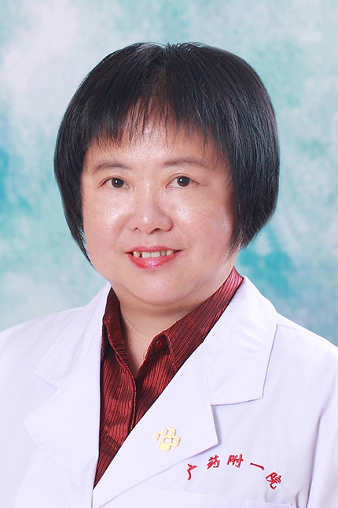

<!-- AUTO-GENERATED-BY: work/generate_obsidian_profiles.py -->

<!-- TEMPLATE: D:\workspace\信息收集整理\医生画像仓库\模板\医生画像模板.md -->

# 吴红卫

## 基础信息

| 字段 | 内容 |
|---|---|
| 姓名 | 吴红卫 |
| 医院 | 广东药科大学附属第一医院 |
| 科室 | 药学部（农林门诊） |
| 职称/身份 | 教授、主任药师 |
| 来源链接 | [官网原文](https://www.gy120.net/articleshow.asp?articleid=171) |
| 采集日期 | 2026-08-15 |

## 简介/擅长

抗菌药物临床应用，围术期的药学监护，心血管、呼吸道以及代谢性慢性病的药学监护。

## 科研项目与成果

- 个人介绍：1989~1996年，在临床药学实验室从事血药浓度监测研究 1996~2004年，在调剂室、制剂室等从事医院药学技术与管理工作 2004至今，在临床药学室从事临床药师的临床与教学工作 社会任职：《全国抗菌药物临床应用监测网》住院病历使用抗菌药物合理性评价专家 广东省药学会抗感染专家委员会委员 中国药学会抗生素委员会委员 广东省药理学会药学监护专业委员会副主任委员 广东省药理学会临床药学专业委员会常务委员 广东省医学会临床药学分会第一届委员会常务委员 广东省药学会抗感染专家委员会委员 《中国临床药学》杂志…
- 科研与获奖：主持广东省医学科研项目1项；
- 参加广东省青年自然科学基金项目1项；
- 参加广州铁路集团公司的科研课题2项。

## 论文与学术产出

- 《中国医院药学杂志》、《药物分析杂志》、《中国药学杂志》、《中国药房》、《广东药学》、《广东药学院学报》等杂志发表学术论文20余篇。

## 可包装亮点

- 个人介绍：1989~1996年，在临床药学实验室从事血药浓度监测研究 1996~2004年，在调剂室、制剂室等从事医院药学技术与管理工作 2004至今，在临床药学室从事临床药师的临床与教学工作 社会任职：《全国抗菌药物临床应用监测网》住院病历使用抗菌药物合理性评价专家 广东省药学会抗感染专家委员会委员 中国药学会抗生素委员会委员 广东省药理学会药学监护专业…
- 科研与获奖：主持广东省医学科研项目...

## 重点疾病/人群标签

- 慢性病：慢性、代谢、感染
- 肿瘤：
- 生殖疾病：
- 免疫/风湿：慢性、代谢、感染
- 术后恢复/康复：
- 疑难重症：

## 证据摘录

> 只摘录官网公开信息中的短句或关键字段，不复制大段原文。

- 官网身份字段：教授、主任药师
- 官网简介/擅长：抗菌药物临床应用，围术期的药学监护，心血管、呼吸道以及代谢性慢性病的药学监护。
- 官网亮眼经历线索：个人介绍：1989~1996年，在临床药学实验室从事血药浓度监测研究 1996~2004年，在调剂室、制剂室等从事医院药学技术与管理工作 2004至今，在临床药学室从事临床药师的临床与教学工作 社会任职：《全国抗菌药物临床应用监测网》住院病历使用抗菌药物合理性评价专家 广东省药学会抗感染专家委员会委员 中国药学会抗生素委员会委员 广东省药理学会药学监护专业委员会副主任委员 广东省药理学会临床药学专业委员会常务委员 广东省医学会临床药学…
- 来源链接：https://www.gy120.net/articleshow.asp?articleid=171

## BD 画像摘要

吴红卫医生可作为慢性病、免疫/风湿/感染方向的基础画像候选。后续 BD 使用应继续以官网来源和人工复核为准，不添加疗效承诺或无来源包装。

## 合规边界

- 仅使用医院官网、官方公众号、官方小程序等公开渠道。
- 不采集私人电话、私人微信、家庭住址、患者隐私或非公开排班信息。
- 不写“保证治愈”“疗效第一”“包治疑难杂症”等无法由官网证明的表述。
