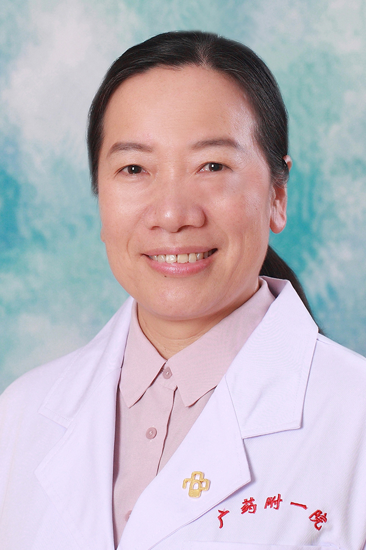

<!-- AUTO-GENERATED-BY: work/generate_obsidian_profiles.py -->

<!-- TEMPLATE: D:\workspace\信息收集整理\医生画像仓库\模板\医生画像模板.md -->

# 周斌兵

## 基础信息

| 字段 | 内容 |
|---|---|
| 姓名 | 周斌兵 |
| 医院 | 广东药科大学附属第一医院 |
| 科室 | 眼科（农林门诊） |
| 职称/身份 | 主任医师，副教授 |
| 来源链接 | [官网原文](https://www.gy120.net/articleshow.asp?articleid=147) |
| 采集日期 | 2026-08-15 |

## 简介/擅长

擅长于眼底荧光造影（FFA+ICGA），视觉电生理检查等检查诊断，擅长玻璃体腔注药术，独立完成晶体超声乳化人工晶体植入术，穿透性角膜移植术，视网膜脱离复位术，硅油取出术，II期人工晶体植入术

## 教育与进修经历

- 个人介绍：1990年东南大学医学院临床医学本科毕业， 2 009年获得暨南大学医学院眼科学硕士。
- 从事眼科临床、教学与科研工作25年，1999年曾于中山眼科中心进修学习一年，2008年曾往美国宾夕法尼亚州St.Luke, s Hospitol的视网膜中心参观学习 社会任职：广东省视光学学会低视力康复学会委员 广东省医院协会眼健康管理专业委员会第一届委员会委员 广东省妇幼保健协会儿童眼保健专业专家委员会第一届委员会委员 广州市医疗鉴定专家 广州市儿童眼科学学会委员 主要论著：（1）， 1.4mm微切口白内障超声乳化联合人工晶体植入术的初步临床观察 周斌兵;

## 科研项目与成果

- 从事眼科临床、教学与科研工作25年，1999年曾于中山眼科中心进修学习一年，2008年曾往美国宾夕法尼亚州St.Luke, s Hospitol的视网膜中心参观学习 社会任职：广东省视光学学会低视力康复学会委员 广东省医院协会眼健康管理专业委员会第一届委员会委员 广东省妇幼保健协会儿童眼保健专业专家委员会第一届委员会委员 广州市医疗鉴定专家 广州市儿童眼科学学会委员 主要论著：（1）， 1.4mm微切口白内障超声乳化联合人工晶体植入术的初步临床观察 周斌兵;
- 科研与获奖： 科研与获奖：1、主持2013年广东省科技计划项目《球结膜下注射Avastin联合PDT和激光光凝消退角膜新生血管的研究》粤科规划字（2013）137号 2、参与2012年广东省科技计划项目（项目编号：2012B061700041）《各期糖尿病性视网膜病变患者房水和血清PEDF表达与眼电生理改变的相关分析》。
- （3、 参与广东省医学科学技术研究基金项目：《真空小梁成形术治疗原发性开角型青光眼的临床研究》（项目编号：A2011320）进行中。

## 可包装亮点

- 从事眼科临床、教学与科研工作25年，1999年曾于中山眼科中心进修学习一年，2008年曾往美国宾夕法尼亚州St.Luke, s Hospitol的视网膜中心参观学习 社会任职：广东省视光学学会低视力康复学会委员 广东省医院协会眼健康管理专业委员会第一届委员会委员 广东省妇幼保健协会儿童眼保健专业专家委员会第一届委员会委员 广州市医疗鉴定专家 广州市儿童眼科…
- 科研与获奖： 科研与获奖：1、主持2013年广东省科技计划项目《球结膜下注射Avastin联合PDT和激光光凝消退角膜新生血管的研究》粤科规划字（2013）137号 2、参与2012年广东省科技计划项目（项目编号：2012B061700041）《各期糖尿病性视网膜病变患者房水和血清PEDF表达与眼电生理改变的相关分析》。
- 4、参与2011年国家自然科学基金立项项目：《...

## 重点疾病/人群标签

- 慢性病：糖尿病、术后、康复
- 肿瘤：
- 生殖疾病：
- 免疫/风湿：
- 术后恢复/康复：糖尿病、术后、康复
- 疑难重症：

## 证据摘录

> 只摘录官网公开信息中的短句或关键字段，不复制大段原文。

- 官网身份字段：主任医师，副教授
- 官网简介/擅长：擅长于眼底荧光造影（FFA+ICGA），视觉电生理检查等检查诊断，擅长玻璃体腔注药术，独立完成晶体超声乳化人工晶体植入术，穿透性角膜移植术，视网膜脱离复位术，硅油取出术，II期人工晶体植入术
- 官网亮眼经历线索：从事眼科临床、教学与科研工作25年，1999年曾于中山眼科中心进修学习一年，2008年曾往美国宾夕法尼亚州St.Luke, s Hospitol的视网膜中心参观学习 社会任职：广东省视光学学会低视力康复学会委员 广东省医院协会眼健康管理专业委员会第一届委员会委员 广东省妇幼保健协会儿童眼保健专业专家委员会第一届委员会委员 广州市医疗鉴定专家 广州市儿童眼科学学会委员 主要论著：（1）， 1.4mm微切口白内障超声乳化联合人工晶体植入术…
- 来源链接：https://www.gy120.net/articleshow.asp?articleid=147

## BD 画像摘要

周斌兵医生可作为慢性病、术后恢复/康复方向的基础画像候选。后续 BD 使用应继续以官网来源和人工复核为准，不添加疗效承诺或无来源包装。

## 合规边界

- 仅使用医院官网、官方公众号、官方小程序等公开渠道。
- 不采集私人电话、私人微信、家庭住址、患者隐私或非公开排班信息。
- 不写“保证治愈”“疗效第一”“包治疑难杂症”等无法由官网证明的表述。
