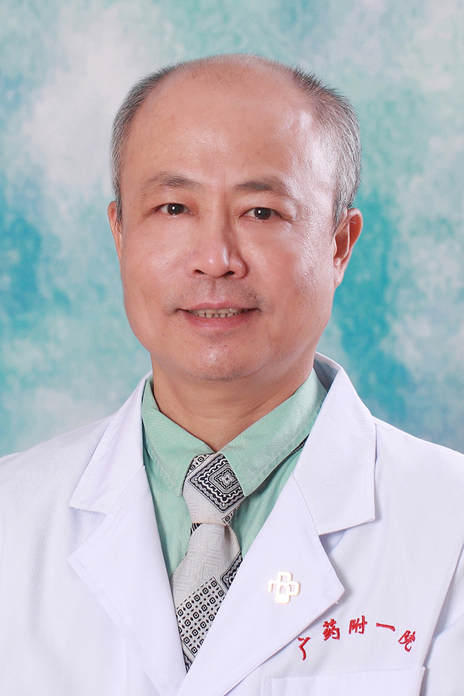

<!-- AUTO-GENERATED-BY: work/generate_obsidian_profiles.py -->

<!-- TEMPLATE: D:\workspace\信息收集整理\医生画像仓库\模板\医生画像模板.md -->

# 周昭远

## 基础信息

| 字段 | 内容 |
|---|---|
| 姓名 | 周昭远 |
| 医院 | 广东药科大学附属第一医院 |
| 科室 | 内分泌科（健康管理中心） |
| 职称/身份 | 副教授、副主任医师、硕士生导师 |
| 来源链接 | [官网原文](https://www.gy120.net/articleshow.asp?articleid=54) |
| 采集日期 | 2026-08-15 |

## 简介/擅长

糖尿病和甲状腺疾病的诊治有丰富经验和良好效果，带领科室取得5次糖尿病调查全省市达标率第一名，经验丰富对其内科疾病也有较丰富的经验和良好诊治效果。

## 教育与进修经历

- 个人介绍：1986年大学本科毕业，1991年晋升主治医师，1992年开始从事内分泌专业工作，1997年晋升内分泌专业副主任医师，2014年10月份起在农林门诊工作。

## 科研项目与成果

- 社会任职：广东省医师协会内分泌代谢分会常委 广东省药学协会内分泌代谢与新委员会常委 广东省管理协会内分泌代谢分会常委 广州市医学会内分泌代谢分会常委 主要论著：《中华内分泌代谢杂志》 《中国实用内科杂志》 《广东医学》 科研与获奖：1998 年作为负责人主持当年省科委立项课题“小剂量强的松对甲亢甲状腺肿和 T 细胞亚群的医学的研究”并于 2004 年通过省科技厅组织的以傅祖植、程桦教授为主的专家成果鉴定。

## 可包装亮点

- 个人介绍：1986年大学本科毕业，1991年晋升主治医师，1992年开始从事内分泌专业工作，1997年晋升内分泌专业副主任医师，2014年10月份起在农林门诊工作。
- 社会任职：广东省医师协会内分泌代谢分会常委 广东省药学协会内分泌代谢与新委员会常委 广东省管理协会内分泌代谢分会常委 广州市医学会内分泌代谢分会常委 主要论著：《中华内分泌代谢杂志》 《中国实用内科杂志》 《广东医学》 科研与获奖：1998 年作为负责人主持当年省科委立项课题“小剂量强的松对甲亢甲状腺肿和 T 细胞亚群的医学的研究”并于 2004 年通过省…

## 重点疾病/人群标签

- 慢性病：糖尿病、代谢
- 肿瘤：
- 生殖疾病：
- 免疫/风湿：
- 术后恢复/康复：
- 疑难重症：

## 证据摘录

> 只摘录官网公开信息中的短句或关键字段，不复制大段原文。

- 官网身份字段：副教授、副主任医师、硕士生导师
- 官网简介/擅长：糖尿病和甲状腺疾病的诊治有丰富经验和良好效果，带领科室取得5次糖尿病调查全省市达标率第一名，经验丰富对其内科疾病也有较丰富的经验和良好诊治效果。
- 官网亮眼经历线索：个人介绍：1986年大学本科毕业，1991年晋升主治医师，1992年开始从事内分泌专业工作，1997年晋升内分泌专业副主任医师，2014年10月份起在农林门诊工作。 社会任职：广东省医师协会内分泌代谢分会常委 广东省药学协会内分泌代谢与新委员会常委 广东省管理协会内分泌代谢分会常委 广州市医学会内分泌代谢分会常委 主要论著：《中华内分泌代谢杂志》 《中国实用内科杂志》 《广东医学》 科研与获奖：1998 年作为负责人主持当年省科委立项…
- 来源链接：https://www.gy120.net/articleshow.asp?articleid=54

## BD 画像摘要

周昭远医生可作为慢性病方向的基础画像候选。后续 BD 使用应继续以官网来源和人工复核为准，不添加疗效承诺或无来源包装。

## 合规边界

- 仅使用医院官网、官方公众号、官方小程序等公开渠道。
- 不采集私人电话、私人微信、家庭住址、患者隐私或非公开排班信息。
- 不写“保证治愈”“疗效第一”“包治疑难杂症”等无法由官网证明的表述。
