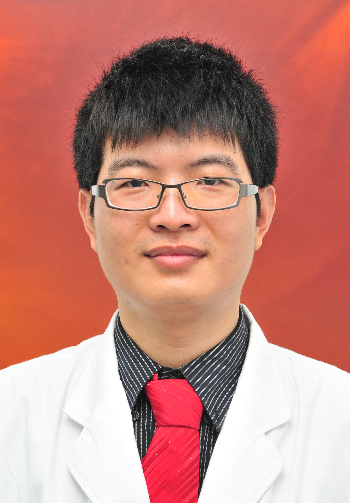

<!-- AUTO-GENERATED-BY: work/generate_obsidian_profiles.py -->

<!-- TEMPLATE: D:\workspace\信息收集整理\医生画像仓库\模板\医生画像模板.md -->

# 周辉

## 基础信息

| 字段 | 内容 |
|---|---|
| 姓名 | 周辉 |
| 医院 | 广东药科大学附属第一医院 |
| 科室 | 神经外科（健康管理中心） |
| 职称/身份 | 副主任医师 |
| 来源链接 | [官网原文](https://www.gy120.net/articleshow.asp?articleid=431) |
| 采集日期 | 2026-08-15 |

## 简介/擅长

颅脑外伤、脑出血、颅内感染的重症诊疗，脑动脉瘤、脑血管畸形以及鼻咽癌相关血管损伤的微创介入治疗，脑胶质瘤、脑膜瘤、垂体瘤、听神经瘤的多模式精准手术，以及三叉神经痛、面肌痉挛、帕金森病、阿尔茨海默病（老年痴呆）、植物人促醒等功能性疾病手术。

## 教育与进修经历

- 个人介绍：毕业于南方医科大学，师从著名神经外科专家徐如祥、姜晓丹教授，在广东三九脑科医院从事神经外科专业工作 8 年，曾在上海华山医院及中国医科大学进修学习。

## 科研项目与成果

- 社会任职：中国解剖学会临床解剖专委会委员 广东省医学会神经外科和神经介入分会青年委员 广东省医学教育协会神经外科专委会副主任委员 广东省医院协会神经外科专委会副主任委员 广东省基层医药学会脑血管病介入专业委员会常委 广东省康复医学会神外加速康复专委会常务理事 广东省医师协会神经介入分会委员 广东省医疗行业协会脑血管病管理分会委员 广东省精准医学应用学会颅神经疾病分会委员 广州市医学会神经外科分会委员 广州市医师协会神经外科医师分会委员 广州市卫健委健康科普专家（心脑血管疾病组） 科研与获奖：主持和参与国家级、省级…

## 可包装亮点

- 官网目录标注：科室负责人；
- 个人介绍：毕业于南方医科大学，师从著名神经外科专家徐如祥、姜晓丹教授，在广东三九脑科医院从事神经外科专业工作 8 年，曾在上海华山医院及中国医科大学进修学习。
- 社会任职：中国解剖学会临床解剖专委会委员 广东省医学会神经外科和神经介入分会青年委员 广东省医学教育协会神经外科专委会副主任委员 广东省医院协会神经外科专委会副主任委员 广东省基层医药学会脑血管病介入专业委员会常委 广东省康复医学会神外加速康复专委会常务理事 广东省医师协会神经介入分会委员 广东省医疗行业协会脑血管病管理分会委员 广东省精准医学应用学会颅神…

## 重点疾病/人群标签

- 慢性病：
- 肿瘤：瘤、鼻咽癌、感染、康复、重症
- 生殖疾病：
- 免疫/风湿：瘤、鼻咽癌、感染、康复、重症
- 术后恢复/康复：瘤、鼻咽癌、感染、康复、重症
- 疑难重症：瘤、鼻咽癌、感染、康复、重症

## 证据摘录

> 只摘录官网公开信息中的短句或关键字段，不复制大段原文。

- 官网身份字段：副主任医师
- 官网简介/擅长：颅脑外伤、脑出血、颅内感染的重症诊疗，脑动脉瘤、脑血管畸形以及鼻咽癌相关血管损伤的微创介入治疗，脑胶质瘤、脑膜瘤、垂体瘤、听神经瘤的多模式精准手术，以及三叉神经痛、面肌痉挛、帕金森病、阿尔茨海默病（老年痴呆）、植物人促醒等功能性疾病手术。
- 官网亮眼经历线索：官网目录标注：科室负责人；个人介绍：毕业于南方医科大学，师从著名神经外科专家徐如祥、姜晓丹教授，在广东三九脑科医院从事神经外科专业工作 8 年，曾在上海华山医院及中国医科大学进修学习。 社会任职：中国解剖学会临床解剖专委会委员 广东省医学会神经外科和神经介入分会青年委员 广东省医学教育协会神经外科专委会副主任委员 广东省医院协会神经外科专委会副主任委员 广东省基层医药学会脑血管病介入专业委员会常委 广东省康复医学会神外加速康复专委会常…
- 来源链接：https://www.gy120.net/articleshow.asp?articleid=431

## BD 画像摘要

周辉医生可作为肿瘤、免疫/风湿/感染、术后恢复/康复、疑难重症方向的基础画像候选。后续 BD 使用应继续以官网来源和人工复核为准，不添加疗效承诺或无来源包装。

## 合规边界

- 仅使用医院官网、官方公众号、官方小程序等公开渠道。
- 不采集私人电话、私人微信、家庭住址、患者隐私或非公开排班信息。
- 不写“保证治愈”“疗效第一”“包治疑难杂症”等无法由官网证明的表述。
