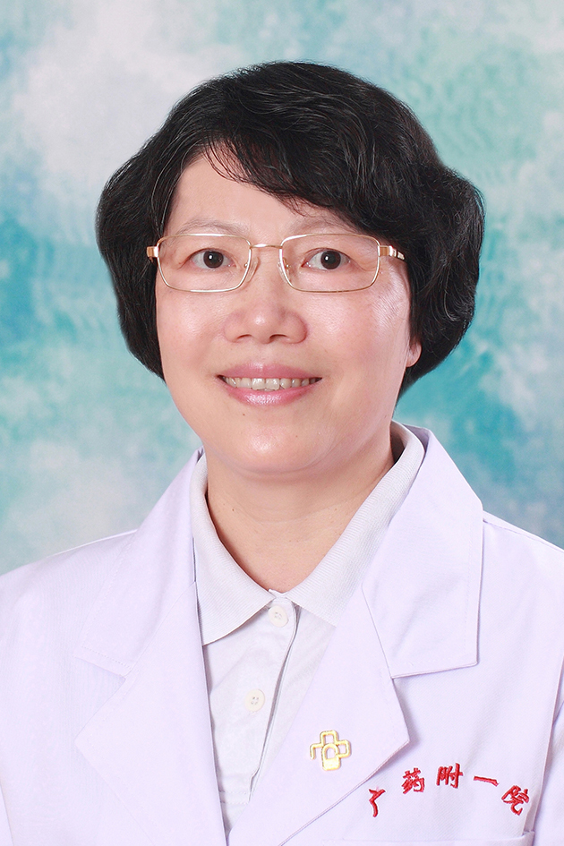

<!-- AUTO-GENERATED-BY: work/generate_obsidian_profiles.py -->

<!-- TEMPLATE: D:\workspace\信息收集整理\医生画像仓库\模板\医生画像模板.md -->

# 周银凤

## 基础信息

| 字段 | 内容 |
|---|---|
| 姓名 | 周银凤 |
| 医院 | 广东药科大学附属第一医院 |
| 科室 | 口腔科 |
| 职称/身份 | 副教授、副主任医师 |
| 来源链接 | [官网原文](https://www.gy120.net/articleshow.asp?articleid=46) |
| 采集日期 | 2026-08-15 |

## 简介/擅长

各类错合畸形的矫治，包括牙列不齐、深咬合，超合、反合，埋伏牙阻生牙的矫正。牙体缺损、牙列缺损、牙列缺失的修复治疗，包括固定修复和活动。

## 教育与进修经历

- 个人介绍：1986年毕业于广州中山医科大学，主修口腔专业，凭着一颗为患者解除痛苦的仁心，掌握了坚实的理论基础知识，积累了丰富的临床经验。

## 可包装亮点

- 各类错合畸形的矫治，包括牙列不齐、深咬合，超合、反合，埋伏牙阻生牙的矫正。
- 牙体缺损、牙列缺损、牙列缺失的修复治疗，包括固定修复和活动。

## 重点疾病/人群标签

- 慢性病：
- 肿瘤：
- 生殖疾病：
- 免疫/风湿：
- 术后恢复/康复：
- 疑难重症：

## 证据摘录

> 只摘录官网公开信息中的短句或关键字段，不复制大段原文。

- 官网身份字段：副教授、副主任医师
- 官网简介/擅长：各类错合畸形的矫治，包括牙列不齐、深咬合，超合、反合，埋伏牙阻生牙的矫正。牙体缺损、牙列缺损、牙列缺失的修复治疗，包括固定修复和活动。
- 来源链接：https://www.gy120.net/articleshow.asp?articleid=46

## BD 画像摘要

周银凤医生可作为广东药科大学附属第一医院口腔科的基础医生资料入库。当前重点方向以总底表标签为准，官网未展示的信息保持空白。

## 合规边界

- 仅使用医院官网、官方公众号、官方小程序等公开渠道。
- 不采集私人电话、私人微信、家庭住址、患者隐私或非公开排班信息。
- 不写“保证治愈”“疗效第一”“包治疑难杂症”等无法由官网证明的表述。
