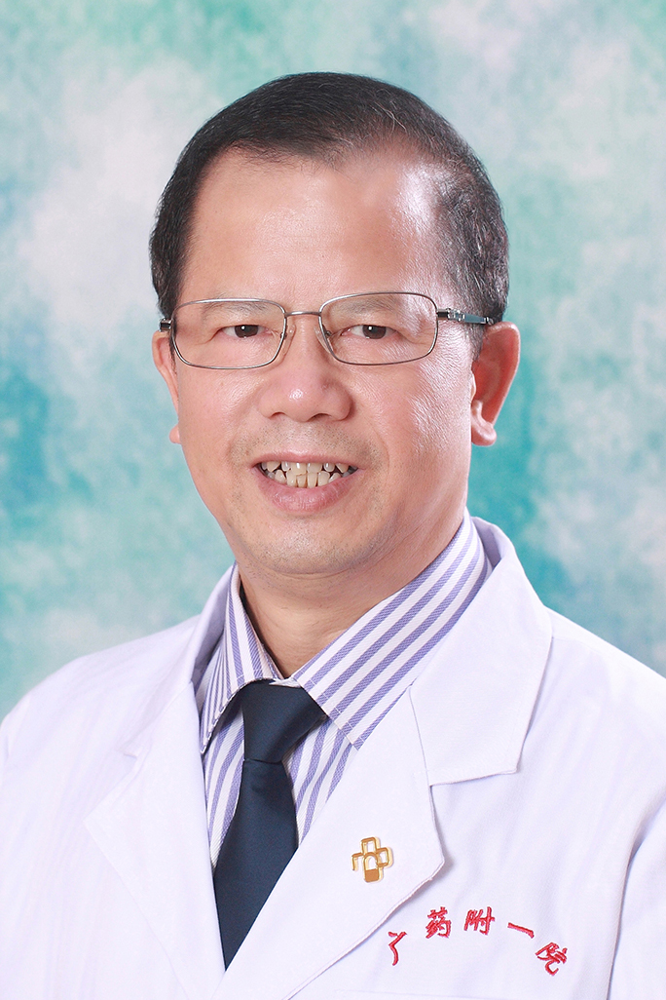

<!-- AUTO-GENERATED-BY: work/generate_obsidian_profiles.py -->

<!-- TEMPLATE: D:\workspace\信息收集整理\医生画像仓库\模板\医生画像模板.md -->

# 姚乃捷

## 基础信息

| 字段 | 内容 |
|---|---|
| 姓名 | 姚乃捷 |
| 医院 | 广东药科大学附属第一医院 |
| 科室 | 正骨科（健康管理中心） |
| 职称/身份 | 教授、主任医师 |
| 来源链接 | [官网原文](https://www.gy120.net/articleshow.asp?articleid=84) |
| 采集日期 | 2026-08-15 |

## 简介/擅长

整骨、整脊疗法及颈椎病、腰椎病和骨伤科疑难杂症的诊治。

## 教育与进修经历

- 1994.6-1995.5: 佛山中医院进修；
- 2003.5-2003.9 ：广西中医学院骨伤研究所进修；

## 科研项目与成果

- 4.《旋转复位治疗环枢关节紊乱症的临床研究》，2010.2期，湖南中医学报 科研与获奖：1.《白药膏外敷治疗颈部皮肤损伤疗效观察》获中管局2010年科研课题。
- 2.《伤痛热敷灵治疗软组织损伤的临床研究》或广州铁路局2011年课题。

## 可包装亮点

- 1994.6-1995.5: 佛山中医院进修；
- 2003.5-2003.9 ：广西中医学院骨伤研究所进修；
- 2004.12-至今：广东医科大学附属第一医院工作 社会任职：中国中医药学会整脊分会常委 广东省推拿按摩专业委员会委员 广东省中西医结合学会脊柱疾病康复专业委员会常委 广东省中西医结合学会骨科特色疗法专业委员会常委 主要论著：1. 《推拿配合针灸治疗神经根型颈椎病的临床探讨》， 2018.8 期，大医生杂志；
- 4.《旋转复位治疗环枢关节紊乱症的临床研究》，2010.2期，湖南中医学报 科研与获奖：1.《白药膏外敷治疗颈部皮肤损伤疗效观察》获中管局2010年科研课题。

## 重点疾病/人群标签

- 慢性病：
- 肿瘤：
- 生殖疾病：
- 免疫/风湿：
- 术后恢复/康复：康复、疑难
- 疑难重症：康复、疑难

## 证据摘录

> 只摘录官网公开信息中的短句或关键字段，不复制大段原文。

- 官网身份字段：教授、主任医师
- 官网简介/擅长：整骨、整脊疗法及颈椎病、腰椎病和骨伤科疑难杂症的诊治。
- 官网亮眼经历线索：1994.6-1995.5: 佛山中医院进修； 2003.5-2003.9 ：广西中医学院骨伤研究所进修； 2004.12-至今：广东医科大学附属第一医院工作 社会任职：中国中医药学会整脊分会常委 广东省推拿按摩专业委员会委员 广东省中西医结合学会脊柱疾病康复专业委员会常委 广东省中西医结合学会骨科特色疗法专业委员会常委 主要论著：1. 《推拿配合针灸治疗神经根型颈椎病的临床探讨》， 2018.8 期，大医生杂志； 4.《旋转复位治疗…
- 来源链接：https://www.gy120.net/articleshow.asp?articleid=84

## BD 画像摘要

姚乃捷医生可作为术后恢复/康复、疑难重症方向的基础画像候选。后续 BD 使用应继续以官网来源和人工复核为准，不添加疗效承诺或无来源包装。

## 合规边界

- 仅使用医院官网、官方公众号、官方小程序等公开渠道。
- 不采集私人电话、私人微信、家庭住址、患者隐私或非公开排班信息。
- 不写“保证治愈”“疗效第一”“包治疑难杂症”等无法由官网证明的表述。
