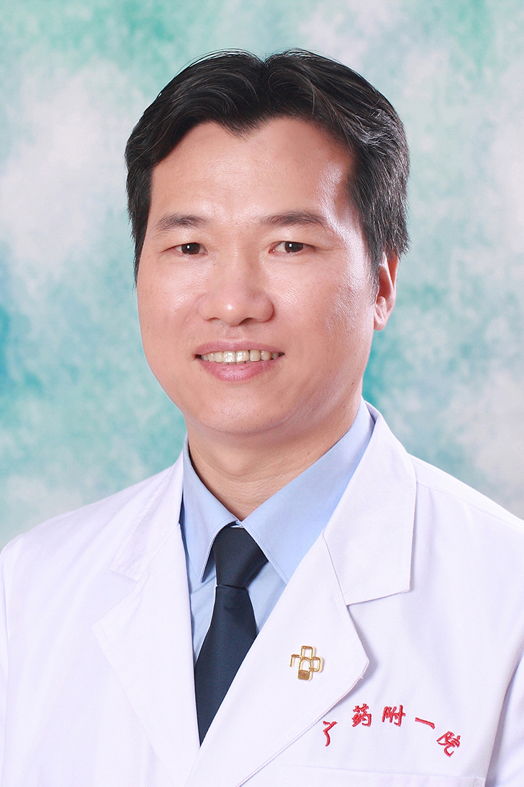

<!-- AUTO-GENERATED-BY: work/generate_obsidian_profiles.py -->

<!-- TEMPLATE: D:\workspace\信息收集整理\医生画像仓库\模板\医生画像模板.md -->

# 姚良忠

## 基础信息

| 字段 | 内容 |
|---|---|
| 姓名 | 姚良忠 |
| 医院 | 广东药科大学附属第一医院 |
| 科室 | 耳鼻咽喉科（农林门诊） |
| 职称/身份 | 主任医师 、教授、 硕士研究生导师、 |
| 来源链接 | [官网原文](https://www.gy120.net/articleshow.asp?articleid=137) |
| 采集日期 | 2026-08-15 |

## 简介/擅长

专注于慢性鼻炎、鼻窦炎、鼻息肉、鼻中隔偏曲、鼻腔及鼻窦良恶性肿瘤、颈部肿块（如腮腺、颌下腺、甲状腺的良恶性肿瘤、不明原因肿块等）、儿童鼾症（扁桃体及腺样体肥大）等疾病的诊断和治疗，熟练手法复位治疗耳石症，擅长鼻内镜手术、颈部手术、以及等离子手术治疗鼻咽喉部疾病。

## 科研项目与成果

- 主持省级科研课题2项，发表论文20余篇，参编专著2部 社会任职：岭南名医 羊城好医生 曾任广药大附一院耳鼻咽喉科主任 广东省医疗行业协会耳鼻咽喉头颈外科管理分会 副主任委员 广东省医师协会耳鼻咽喉科分会 常务委员 广东省中西医结合学会耳鼻咽喉专业委员会 常务委员 广东省预防医学会耳鼻咽喉头颈疾病防治专业委员会 常务委员 广东省医学会耳鼻咽喉学分会 委员 广东省医师协会头颈肿瘤专业委员会 委员 主要论著：1 、纤维鼻咽镜下微波治疗鼻咽部炎性增生病变；
- 《国际医药卫生导报》 2017 年第 23 卷 10 月刊期 7 ．参编著作：《实用耳鼻咽喉头颈外科解剖学》， 2010 年 8 月，人民卫生出版社 8 、参编著作：《实用眼耳鼻咽喉口腔美学解剖学》， 2019 年 6 月，人民卫生出版社 科研与获奖：主持或参与省及厅局级科研课题 5 项，发表论文 20 余篇，参编专著 2 部。

## 论文与学术产出

- 主持省级科研课题2项，发表论文20余篇，参编专著2部 社会任职：岭南名医 羊城好医生 曾任广药大附一院耳鼻咽喉科主任 广东省医疗行业协会耳鼻咽喉头颈外科管理分会 副主任委员 广东省医师协会耳鼻咽喉科分会 常务委员 广东省中西医结合学会耳鼻咽喉专业委员会 常务委员 广东省预防医学会耳鼻咽喉头颈疾病防治专业委员会 常务委员 广东省医学会耳鼻咽喉学分会 委员 广东省医师协会头颈肿瘤专业委员会 委员 主要论著：1 、纤维鼻咽镜下微波治疗鼻咽部炎性增生病变；
- 《国际医药卫生导报》 2017 年第 23 卷 10 月刊期 7 ．参编著作：《实用耳鼻咽喉头颈外科解剖学》， 2010 年 8 月，人民卫生出版社 8 、参编著作：《实用眼耳鼻咽喉口腔美学解剖学》， 2019 年 6 月，人民卫生出版社 科研与获奖：主持或参与省及厅局级科研课题 5 项，发表论文 20 余篇，参编专著 2 部。

## 可包装亮点

- 个人介绍：从事耳鼻咽喉科临床工作30余年，掌握耳鼻咽喉科常见疾病及疑难复杂疾病的诊断治疗。
- 主持省级科研课题2项，发表论文20余篇，参编专著2部 社会任职：岭南名医 羊城好医生 曾任广药大附一院耳鼻咽喉科主任 广东省医疗行业协会耳鼻咽喉头颈外科管理分会 副主任委员 广东省医师协会耳鼻咽喉科分会 常务委员 广东省中西医结合学会耳鼻咽喉专业委员会 常务委员 广东省预防医学会耳鼻咽喉头颈疾病防治专业委员会 常务委员 广东省医学会耳鼻咽喉学分会 委员 广…
- 《国际医药卫生导报》 2017 年第 23 卷 10 月刊期 7 ．参编著作：《实用耳鼻咽喉头颈外科解剖学》， 2010 年 8 月，人民卫生出版社 8 、参编著作：《实用眼耳鼻咽喉口腔美学解剖学》， 2019 年 6 月，人民卫生出版社 科研与获奖：主持或参与省及厅局级科研课题 5 项...

## 重点疾病/人群标签

- 慢性病：慢性、肿瘤、瘤、疑难、复杂
- 肿瘤：慢性、肿瘤、瘤、疑难、复杂
- 生殖疾病：
- 免疫/风湿：
- 术后恢复/康复：
- 疑难重症：慢性、肿瘤、瘤、疑难、复杂

## 证据摘录

> 只摘录官网公开信息中的短句或关键字段，不复制大段原文。

- 官网身份字段：主任医师 、教授、 硕士研究生导师、
- 官网简介/擅长：专注于慢性鼻炎、鼻窦炎、鼻息肉、鼻中隔偏曲、鼻腔及鼻窦良恶性肿瘤、颈部肿块（如腮腺、颌下腺、甲状腺的良恶性肿瘤、不明原因肿块等）、儿童鼾症（扁桃体及腺样体肥大）等疾病的诊断和治疗，熟练手法复位治疗耳石症，擅长鼻内镜手术、颈部手术、以及等离子手术治疗鼻咽喉部疾病。
- 官网亮眼经历线索：个人介绍：从事耳鼻咽喉科临床工作30余年，掌握耳鼻咽喉科常见疾病及疑难复杂疾病的诊断治疗。 主持省级科研课题2项，发表论文20余篇，参编专著2部 社会任职：岭南名医 羊城好医生 曾任广药大附一院耳鼻咽喉科主任 广东省医疗行业协会耳鼻咽喉头颈外科管理分会 副主任委员 广东省医师协会耳鼻咽喉科分会 常务委员 广东省中西医结合学会耳鼻咽喉专业委员会 常务委员 广东省预防医学会耳鼻咽喉头颈疾病防治专业委员会 常务委员 广东省医学会耳鼻咽喉学分…
- 来源链接：https://www.gy120.net/articleshow.asp?articleid=137

## BD 画像摘要

姚良忠医生可作为慢性病、肿瘤、疑难重症方向的基础画像候选。后续 BD 使用应继续以官网来源和人工复核为准，不添加疗效承诺或无来源包装。

## 合规边界

- 仅使用医院官网、官方公众号、官方小程序等公开渠道。
- 不采集私人电话、私人微信、家庭住址、患者隐私或非公开排班信息。
- 不写“保证治愈”“疗效第一”“包治疑难杂症”等无法由官网证明的表述。
