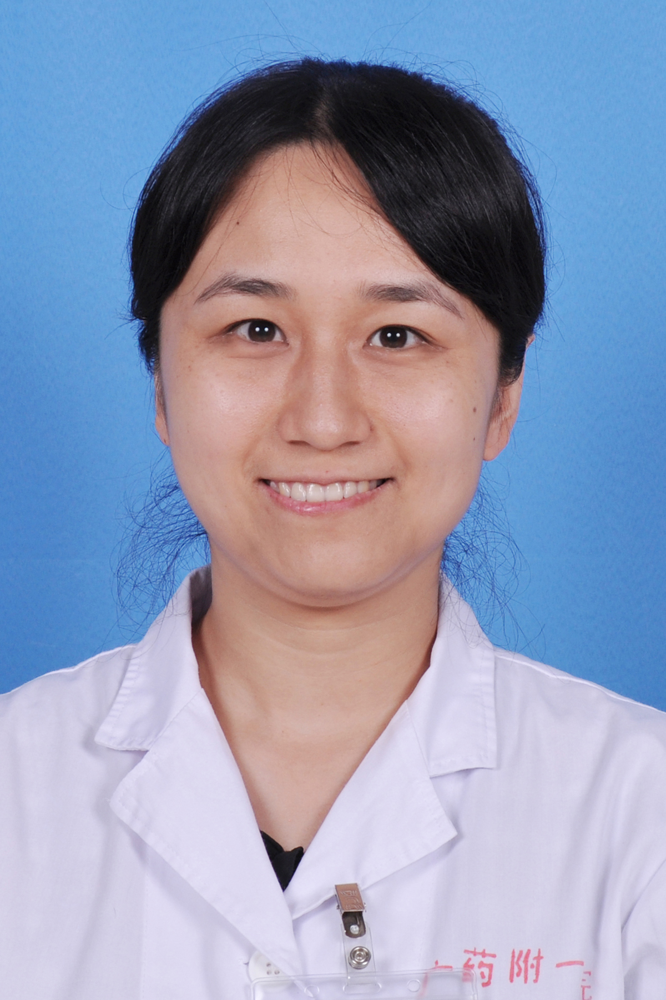

<!-- AUTO-GENERATED-BY: work/generate_obsidian_profiles.py -->

<!-- TEMPLATE: D:\workspace\信息收集整理\医生画像仓库\模板\医生画像模板.md -->

# 孙平

## 基础信息

| 字段 | 内容 |
|---|---|
| 姓名 | 孙平 |
| 医院 | 广东药科大学附属第一医院 |
| 科室 | 内分泌科（健康管理中心、共和门诊） |
| 职称/身份 | 副主任医师，副教授，硕士研究生导师 |
| 来源链接 | [官网原文](https://www.gy120.net/articleshow.asp?articleid=354) |
| 采集日期 | 2026-08-15 |

## 简介/擅长

擅长内分泌科相关疾病的诊治，尤其对代谢性骨病包括原发性骨质疏松症包括绝经后骨质疏松症和老年性骨质疏松症；糖尿病、甲亢、库欣综合征等内分泌疾病、胃肠吸收障碍或恶性肿瘤等引起的继发性骨质疏松症；及其他代谢性骨病，如甲状旁腺功能亢进、肾性骨营养不良、骨软化症等疑难代谢性骨病的诊治。

## 教育与进修经历

- 个人介绍：2010年毕业于南方医科大学，获内分泌专业博士学位，澳洲西澳大学访问学者。

## 科研项目与成果

- 社会任职：广东省医学会骨质疏松学分会青年委员 广东省医学教育协会糖尿病分会常委 广东省中西医学会骨质疏松学分会常委 广州市医学会骨质疏松学分会常委 广东省医师协会骨科分会骨质疏松专业组委员 广州市肠外肠内营养学会委员 广东省基金项目评审专家 广东省高层次人才评审专家 科研与获奖：从事内分泌临床和研究工作近 10年，主持国家自然科学基金青年基金、广东省科技计划项目及广东省医学科研基金各一项，主持校级及院级基金多项，以第一作者身份在国内外专业期刊上发表论文20余篇。

## 论文与学术产出

- 社会任职：广东省医学会骨质疏松学分会青年委员 广东省医学教育协会糖尿病分会常委 广东省中西医学会骨质疏松学分会常委 广州市医学会骨质疏松学分会常委 广东省医师协会骨科分会骨质疏松专业组委员 广州市肠外肠内营养学会委员 广东省基金项目评审专家 广东省高层次人才评审专家 科研与获奖：从事内分泌临床和研究工作近 10年，主持国家自然科学基金青年基金、广东省科技计划项目及广东省医学科研基金各一项，主持校级及院级基金多项，以第一作者身份在国内外专业期刊上发表论文20余篇。

## 可包装亮点

- 个人介绍：2010年毕业于南方医科大学，获内分泌专业博士学位，澳洲西澳大学访问学者。
- 社会任职：广东省医学会骨质疏松学分会青年委员 广东省医学教育协会糖尿病分会常委 广东省中西医学会骨质疏松学分会常委 广州市医学会骨质疏松学分会常委 广东省医师协会骨科分会骨质疏松专业组委员 广州市肠外肠内营养学会委员 广东省基金项目评审专家 广东省高层次人才评审专家 科研与获奖：从事内分泌临床和研究工作近 10年，主持国家自然科学基金青年基金、广东省科技计…

## 重点疾病/人群标签

- 慢性病：糖尿病、代谢、肿瘤、营养、疑难
- 肿瘤：糖尿病、代谢、肿瘤、营养、疑难
- 生殖疾病：
- 免疫/风湿：
- 术后恢复/康复：糖尿病、代谢、肿瘤、营养、疑难
- 疑难重症：糖尿病、代谢、肿瘤、营养、疑难

## 证据摘录

> 只摘录官网公开信息中的短句或关键字段，不复制大段原文。

- 官网身份字段：副主任医师，副教授，硕士研究生导师
- 官网简介/擅长：擅长内分泌科相关疾病的诊治，尤其对代谢性骨病包括原发性骨质疏松症包括绝经后骨质疏松症和老年性骨质疏松症；糖尿病、甲亢、库欣综合征等内分泌疾病、胃肠吸收障碍或恶性肿瘤等引起的继发性骨质疏松症；及其他代谢性骨病，如甲状旁腺功能亢进、肾性骨营养不良、骨软化症等疑难代谢性骨病的诊治。
- 官网亮眼经历线索：个人介绍：2010年毕业于南方医科大学，获内分泌专业博士学位，澳洲西澳大学访问学者。 社会任职：广东省医学会骨质疏松学分会青年委员 广东省医学教育协会糖尿病分会常委 广东省中西医学会骨质疏松学分会常委 广州市医学会骨质疏松学分会常委 广东省医师协会骨科分会骨质疏松专业组委员 广州市肠外肠内营养学会委员 广东省基金项目评审专家 广东省高层次人才评审专家 科研与获奖：从事内分泌临床和研究工作近 10年，主持国家自然科学基金青年基金、广东省…
- 来源链接：https://www.gy120.net/articleshow.asp?articleid=354

## BD 画像摘要

孙平医生可作为慢性病、肿瘤、术后恢复/康复、疑难重症方向的基础画像候选。后续 BD 使用应继续以官网来源和人工复核为准，不添加疗效承诺或无来源包装。

## 合规边界

- 仅使用医院官网、官方公众号、官方小程序等公开渠道。
- 不采集私人电话、私人微信、家庭住址、患者隐私或非公开排班信息。
- 不写“保证治愈”“疗效第一”“包治疑难杂症”等无法由官网证明的表述。
