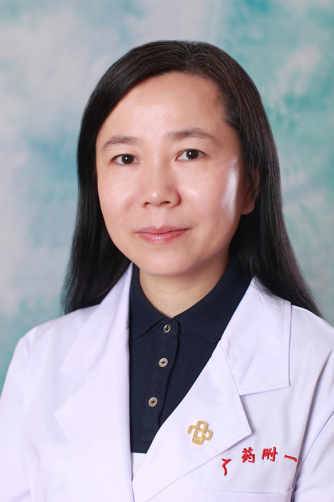

<!-- AUTO-GENERATED-BY: work/generate_obsidian_profiles.py -->

<!-- TEMPLATE: D:\workspace\信息收集整理\医生画像仓库\模板\医生画像模板.md -->

# 孙慧琳

## 基础信息

| 字段 | 内容 |
|---|---|
| 姓名 | 孙慧琳 |
| 医院 | 广东药科大学附属第一医院 |
| 科室 | 肥胖专病治疗组（健康管理中心） |
| 职称/身份 | 主任医师、教授、医学博士、硕士生导师 |
| 来源链接 | [官网原文](https://www.gy120.net/articleshow.asp?articleid=230) |
| 采集日期 | 2026-08-15 |

## 简介/擅长

擅长糖尿病、痛风、甲状腺疾病

## 科研项目与成果

- 个人介绍：从医20余年 社会任职：广东省医师协会健康促进工作委员会常委 广东省中西医结合学会代谢病专业委员会委员 广东省糖尿病协会青年委员 广东省自然科学基金 广东省财政厅评审专家 科研与获奖：主持省自然科学基金等代谢性疾病研究课题7项，在国家级刊物发表代谢性疾病研究论文10余篇

## 论文与学术产出

- 个人介绍：从医20余年 社会任职：广东省医师协会健康促进工作委员会常委 广东省中西医结合学会代谢病专业委员会委员 广东省糖尿病协会青年委员 广东省自然科学基金 广东省财政厅评审专家 科研与获奖：主持省自然科学基金等代谢性疾病研究课题7项，在国家级刊物发表代谢性疾病研究论文10余篇

## 可包装亮点

- 个人介绍：从医20余年 社会任职：广东省医师协会健康促进工作委员会常委 广东省中西医结合学会代谢病专业委员会委员 广东省糖尿病协会青年委员 广东省自然科学基金 广东省财政厅评审专家 科研与获奖：主持省自然科学基金等代谢性疾病研究课题7项，在国家级刊物发表代谢性疾病研究论文10余篇

## 重点疾病/人群标签

- 慢性病：糖尿病、代谢
- 肿瘤：
- 生殖疾病：
- 免疫/风湿：
- 术后恢复/康复：
- 疑难重症：

## 证据摘录

> 只摘录官网公开信息中的短句或关键字段，不复制大段原文。

- 官网身份字段：主任医师、教授、医学博士、硕士生导师
- 官网简介/擅长：擅长糖尿病、痛风、甲状腺疾病
- 官网亮眼经历线索：个人介绍：从医20余年 社会任职：广东省医师协会健康促进工作委员会常委 广东省中西医结合学会代谢病专业委员会委员 广东省糖尿病协会青年委员 广东省自然科学基金 广东省财政厅评审专家 科研与获奖：主持省自然科学基金等代谢性疾病研究课题7项，在国家级刊物发表代谢性疾病研究论文10余篇
- 来源链接：https://www.gy120.net/articleshow.asp?articleid=230

## BD 画像摘要

孙慧琳医生可作为慢性病方向的基础画像候选。后续 BD 使用应继续以官网来源和人工复核为准，不添加疗效承诺或无来源包装。

## 合规边界

- 仅使用医院官网、官方公众号、官方小程序等公开渠道。
- 不采集私人电话、私人微信、家庭住址、患者隐私或非公开排班信息。
- 不写“保证治愈”“疗效第一”“包治疑难杂症”等无法由官网证明的表述。
