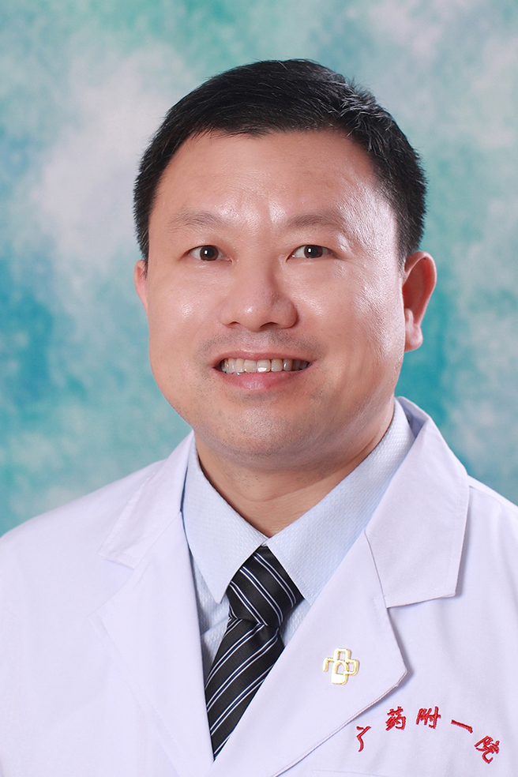

<!-- AUTO-GENERATED-BY: work/generate_obsidian_profiles.py -->

<!-- TEMPLATE: D:\workspace\信息收集整理\医生画像仓库\模板\医生画像模板.md -->

# 宋炎成

## 基础信息

| 字段 | 内容 |
|---|---|
| 姓名 | 宋炎成 |
| 医院 | 广东药科大学附属第一医院 |
| 科室 | 创伤与关节外科（骨一科）（健康管理中心） |
| 职称/身份 | 主任医师、教授、硕士生导师、医学博士 |
| 来源链接 | [官网原文](https://www.gy120.net/articleshow.asp?articleid=420) |
| 采集日期 | 2026-08-15 |

## 简介/擅长

运动损伤的关节镜微创治疗和人工关节初次置换和翻修手术。

## 教育与进修经历

- 个人介绍：2008-2015 年间曾多次在香港、韩国等地参观学习 2006-2008 年中山大学博士后流动站工作 2003-2006 年四川大学华西医学中心临床医学系就读，获得医学博士学位 1999-2002 年暨南大学医学院临床医学系就读，获得医学硕士学位 1991-1996 年皖南医学院临床医学系就读，获得临床医学学士学位 社会任职：中国科学院广州生物医药与健康研究院客座研究员 广东省医学会运动医学分会秘书 中华骨科学会广东分会关节镜学组秘书 广东医学会关节外科学会委员 广东省医师协会骨科分会委员 APKAS…

## 可包装亮点

- 个人介绍：2008-2015 年间曾多次在香港、韩国等地参观学习 2006-2008 年中山大学博士后流动站工作 2003-2006 年四川大学华西医学中心临床医学系就读，获得医学博士学位 1999-2002 年暨南大学医学院临床医学系就读，获得医学硕士学位 1991-1996 年皖南医学院临床医学系就读，获得临床医学学士学位 社会任职：中国科学院广州生物…

## 重点疾病/人群标签

- 慢性病：
- 肿瘤：
- 生殖疾病：
- 免疫/风湿：
- 术后恢复/康复：
- 疑难重症：

## 证据摘录

> 只摘录官网公开信息中的短句或关键字段，不复制大段原文。

- 官网身份字段：主任医师、教授、硕士生导师、医学博士
- 官网简介/擅长：运动损伤的关节镜微创治疗和人工关节初次置换和翻修手术。
- 官网亮眼经历线索：个人介绍：2008-2015 年间曾多次在香港、韩国等地参观学习 2006-2008 年中山大学博士后流动站工作 2003-2006 年四川大学华西医学中心临床医学系就读，获得医学博士学位 1999-2002 年暨南大学医学院临床医学系就读，获得医学硕士学位 1991-1996 年皖南医学院临床医学系就读，获得临床医学学士学位 社会任职：中国科学院广州生物医药与健康研究院客座研究员 广东省医学会运动医学分会秘书 中华骨科学会广东分会关…
- 来源链接：https://www.gy120.net/articleshow.asp?articleid=420

## BD 画像摘要

宋炎成医生可作为广东药科大学附属第一医院创伤与关节外科（骨一科）（健康管理中心）的基础医生资料入库。当前重点方向以总底表标签为准，官网未展示的信息保持空白。

## 合规边界

- 仅使用医院官网、官方公众号、官方小程序等公开渠道。
- 不采集私人电话、私人微信、家庭住址、患者隐私或非公开排班信息。
- 不写“保证治愈”“疗效第一”“包治疑难杂症”等无法由官网证明的表述。
