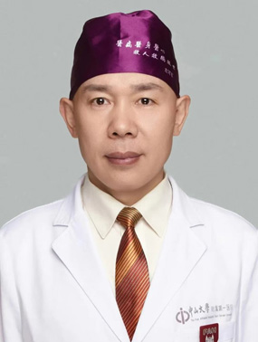

<!-- AUTO-GENERATED-BY: work/generate_obsidian_profiles.py -->

<!-- TEMPLATE: D:\workspace\信息收集整理\医生画像仓库\模板\医生画像模板.md -->

# 左可军

## 基础信息

| 字段 | 内容 |
|---|---|
| 姓名 | 左可军 |
| 医院 | 广东药科大学附属第一医院 |
| 科室 | 耳鼻咽喉科 |
| 职称/身份 | 医学博士，主任医师，教授，硕士生导师 |
| 来源链接 | [官网原文](https://www.gy120.net/articleshow.asp?articleid=532) |
| 采集日期 | 2026-08-15 |

## 简介/擅长

擅长鼻科、鼻眼相关外科、鼻颅底相关外科手术，以及鼻变态反应科的临床和基础工作。 南方青年鼻科联盟创始人

## 可包装亮点

- 南方青年鼻科联盟创始人 社会任职：南方青年鼻科联盟创始人 中国医药教育协会耳鼻咽喉专业委员会副主任委员 海峡两岸医药协会眼科学专委会内镜手术学组委员 广东省精准医学应用学会头颈肿瘤分会副主委 广东省中西医结合学会耳鼻咽喉科分会副主委 广东省基层医药学会慢性鼻窦炎专委会副主委 2018年荣获广东医院最强科室之实力中青年医生 2020年荣获全国卫生系统及医师协…

## 重点疾病/人群标签

- 慢性病：慢性、肿瘤
- 肿瘤：慢性、肿瘤
- 生殖疾病：
- 免疫/风湿：
- 术后恢复/康复：
- 疑难重症：

## 证据摘录

> 只摘录官网公开信息中的短句或关键字段，不复制大段原文。

- 官网身份字段：医学博士，主任医师，教授，硕士生导师
- 官网简介/擅长：擅长鼻科、鼻眼相关外科、鼻颅底相关外科手术，以及鼻变态反应科的临床和基础工作。 南方青年鼻科联盟创始人
- 官网亮眼经历线索：南方青年鼻科联盟创始人 社会任职：南方青年鼻科联盟创始人 中国医药教育协会耳鼻咽喉专业委员会副主任委员 海峡两岸医药协会眼科学专委会内镜手术学组委员 广东省精准医学应用学会头颈肿瘤分会副主委 广东省中西医结合学会耳鼻咽喉科分会副主委 广东省基层医药学会慢性鼻窦炎专委会副主委 2018年荣获广东医院最强科室之实力中青年医生 2020年荣获全国卫生系统及医师协会抗疫先进个人 2021年荣获广东省科技进步一等奖 2023年荣获第七届“羊城好…
- 来源链接：https://www.gy120.net/articleshow.asp?articleid=532

## BD 画像摘要

左可军医生可作为慢性病、肿瘤方向的基础画像候选。后续 BD 使用应继续以官网来源和人工复核为准，不添加疗效承诺或无来源包装。

## 合规边界

- 仅使用医院官网、官方公众号、官方小程序等公开渠道。
- 不采集私人电话、私人微信、家庭住址、患者隐私或非公开排班信息。
- 不写“保证治愈”“疗效第一”“包治疑难杂症”等无法由官网证明的表述。
