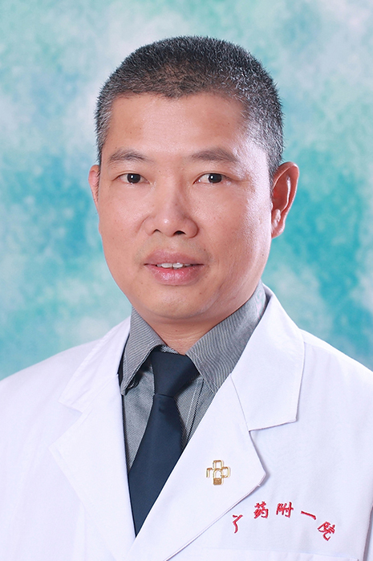

<!-- AUTO-GENERATED-BY: work/generate_obsidian_profiles.py -->

<!-- TEMPLATE: D:\workspace\信息收集整理\医生画像仓库\模板\医生画像模板.md -->

# 庄娘妥

## 基础信息

| 字段 | 内容 |
|---|---|
| 姓名 | 庄娘妥 |
| 医院 | 广东药科大学附属第一医院 |
| 科室 | 医学影像科 |
| 职称/身份 | 副主任医师，副教授 |
| 来源链接 | [官网原文](https://www.gy120.net/articleshow.asp?articleid=226) |
| 采集日期 | 2026-08-15 |

## 简介/擅长

医学影像学专业毕业，从事临床影像诊断20年余，对各系统常见病、多发病的普通X线、CT、MR诊断有一定体会和经验。

## 教育与进修经历

- 个人介绍：1992年8月~1995年7月 广州铁路中心医院放射科助理医师 1996年8月~2001年7月 广州铁路中心医院放射科住院医师 2001年8月~2010年7月 广东药学院附属第一医院放射科主治医师 20010年8月至今 广东药学院附属第一医院放射科副主任医师 期间曾在广州医科大学附属第二医院呼吸研究所、广东省人民医院医学影像研究所进修及学习。

## 科研项目与成果

- 科研与获奖：曾参加并完成省卫生厅科研课题一项。
- 曾参加并完成省科技厅科研课题一项。

## 可包装亮点

- 个人介绍：1992年8月~1995年7月 广州铁路中心医院放射科助理医师 1996年8月~2001年7月 广州铁路中心医院放射科住院医师 2001年8月~2010年7月 广东药学院附属第一医院放射科主治医师 20010年8月至今 广东药学院附属第一医院放射科副主任医师 期间曾在广州医科大学附属第二医院呼吸研究所、广东省人民医院医学影像研究所进修及学习。
- 科研与获奖：曾参加并完成省卫生厅科研课题一项。

## 重点疾病/人群标签

- 慢性病：
- 肿瘤：
- 生殖疾病：
- 免疫/风湿：
- 术后恢复/康复：
- 疑难重症：

## 证据摘录

> 只摘录官网公开信息中的短句或关键字段，不复制大段原文。

- 官网身份字段：副主任医师，副教授
- 官网简介/擅长：医学影像学专业毕业，从事临床影像诊断20年余，对各系统常见病、多发病的普通X线、CT、MR诊断有一定体会和经验。
- 官网亮眼经历线索：个人介绍：1992年8月~1995年7月 广州铁路中心医院放射科助理医师 1996年8月~2001年7月 广州铁路中心医院放射科住院医师 2001年8月~2010年7月 广东药学院附属第一医院放射科主治医师 20010年8月至今 广东药学院附属第一医院放射科副主任医师 期间曾在广州医科大学附属第二医院呼吸研究所、广东省人民医院医学影像研究所进修及学习。 科研与获奖：曾参加并完成省卫生厅科研课题一项。
- 来源链接：https://www.gy120.net/articleshow.asp?articleid=226

## BD 画像摘要

庄娘妥医生可作为广东药科大学附属第一医院医学影像科的基础医生资料入库。当前重点方向以总底表标签为准，官网未展示的信息保持空白。

## 合规边界

- 仅使用医院官网、官方公众号、官方小程序等公开渠道。
- 不采集私人电话、私人微信、家庭住址、患者隐私或非公开排班信息。
- 不写“保证治愈”“疗效第一”“包治疑难杂症”等无法由官网证明的表述。
