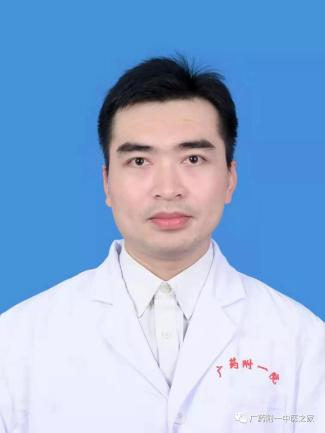

<!-- AUTO-GENERATED-BY: work/generate_obsidian_profiles.py -->

<!-- TEMPLATE: D:\workspace\信息收集整理\医生画像仓库\模板\医生画像模板.md -->

# 廖锐

## 基础信息

| 字段 | 内容 |
|---|---|
| 姓名 | 廖锐 |
| 医院 | 广东药科大学附属第一医院 |
| 科室 | 中医科（健康管理中心） |
| 职称/身份 | 医师 |
| 来源链接 | [官网原文](https://www.gy120.net/articleshow.asp?articleid=463) |
| 采集日期 | 2026-08-15 |

## 简介/擅长

运用中西医结合诊治脾胃病，代谢疾病、糖尿病、肥胖、乳腺病、甲状腺病、皮肤病、肿瘤术后或放化疗后康复，对呼吸道疾病、高血压、颈椎病、腰椎间盘突出症、关节炎等临床常见病和疑难病症方面亦有独到见解。

## 科研项目与成果

- 社会任职：《中华肥胖与代谢病电子杂志》审稿专家 / 吴阶平医学基金会营养学部肥胖管理专业委员会减重手术管理学组组员 / 广东省中西医结合学会活血化瘀专业委员会第三届委员会委员 / 广东省中西医结合学会会员 / 《中医药防治康复保健学》副主编 / 《二十一世纪中医学教材系列 : 中医外科学 ( 本科生用书 ) 》主要参编人员 科研与获奖：2018 年广东省科学技术奖二等奖（ 第四完成人 ） / 2012 年广东省科学技术奖三等奖（ 第六完成人 ） 主要进行 代谢病方向研究，开展中药方剂对 2 型糖尿病胰腺 β 细胞…
- 作为主要参与人参与国家自然科学基金 3 项，广东省自然科学基金 1 项，广东省科技计划项目 1 项，广州市科技计划 1 项，发表国内外论文 31 篇， 其中英文论文 14 篇， 研究成果发表于 《 Diabetes 》、《 Acta Medica Mediterranea 》 《 Journal of Investigative Medicine 》、《 Journal of Traditional Chinese Medicine 》、《 Chinese Journal of Integrative Medic…

## 论文与学术产出

- 社会任职：《中华肥胖与代谢病电子杂志》审稿专家 / 吴阶平医学基金会营养学部肥胖管理专业委员会减重手术管理学组组员 / 广东省中西医结合学会活血化瘀专业委员会第三届委员会委员 / 广东省中西医结合学会会员 / 《中医药防治康复保健学》副主编 / 《二十一世纪中医学教材系列 : 中医外科学 ( 本科生用书 ) 》主要参编人员 科研与获奖：2018 年广东省科学技术奖二等奖（ 第四完成人 ） / 2012 年广东省科学技术奖三等奖（ 第六完成人 ） 主要进行 代谢病方向研究，开展中药方剂对 2 型糖尿病胰腺 β 细胞…
- 作为主要参与人参与国家自然科学基金 3 项，广东省自然科学基金 1 项，广东省科技计划项目 1 项，广州市科技计划 1 项，发表国内外论文 31 篇， 其中英文论文 14 篇， 研究成果发表于 《 Diabetes 》、《 Acta Medica Mediterranea 》 《 Journal of Investigative Medicine 》、《 Journal of Traditional Chinese Medicine 》、《 Chinese Journal of Integrative Medic…

## 可包装亮点

- 社会任职：《中华肥胖与代谢病电子杂志》审稿专家 / 吴阶平医学基金会营养学部肥胖管理专业委员会减重手术管理学组组员 / 广东省中西医结合学会活血化瘀专业委员会第三届委员会委员 / 广东省中西医结合学会会员 / 《中医药防治康复保健学》副主编 / 《二十一世纪中医学教材系列 : 中医外科学 ( 本科生用书 ) 》主要参编人员 科研与获奖：2018 年广东省科…
- 作为主要参与人参与国家自然科学基金 3 项，广东省自然科学基金 1 项，广东省科技计划项目 1 项，广州市科技计划 1 项，发表国内外论文 31 篇， 其中英文论文 14 篇， 研究成果发表于 《 Diabetes 》、《 A...

## 重点疾病/人群标签

- 慢性病：高血压、糖尿病、代谢、肿瘤、化疗、术后、康复、营养、疑难
- 肿瘤：高血压、糖尿病、代谢、肿瘤、化疗、术后、康复、营养、疑难
- 生殖疾病：
- 免疫/风湿：
- 术后恢复/康复：高血压、糖尿病、代谢、肿瘤、化疗、术后、康复、营养、疑难
- 疑难重症：高血压、糖尿病、代谢、肿瘤、化疗、术后、康复、营养、疑难

## 证据摘录

> 只摘录官网公开信息中的短句或关键字段，不复制大段原文。

- 官网身份字段：医师
- 官网简介/擅长：运用中西医结合诊治脾胃病，代谢疾病、糖尿病、肥胖、乳腺病、甲状腺病、皮肤病、肿瘤术后或放化疗后康复，对呼吸道疾病、高血压、颈椎病、腰椎间盘突出症、关节炎等临床常见病和疑难病症方面亦有独到见解。
- 官网亮眼经历线索：社会任职：《中华肥胖与代谢病电子杂志》审稿专家 / 吴阶平医学基金会营养学部肥胖管理专业委员会减重手术管理学组组员 / 广东省中西医结合学会活血化瘀专业委员会第三届委员会委员 / 广东省中西医结合学会会员 / 《中医药防治康复保健学》副主编 / 《二十一世纪中医学教材系列 : 中医外科学 ( 本科生用书 ) 》主要参编人员 科研与获奖：2018 年广东省科学技术奖二等奖（ 第四完成人 ） / 2012 年广东省科学技术奖三等奖（ 第六…
- 来源链接：https://www.gy120.net/articleshow.asp?articleid=463

## BD 画像摘要

廖锐医生可作为慢性病、肿瘤、术后恢复/康复、疑难重症方向的基础画像候选。后续 BD 使用应继续以官网来源和人工复核为准，不添加疗效承诺或无来源包装。

## 合规边界

- 仅使用医院官网、官方公众号、官方小程序等公开渠道。
- 不采集私人电话、私人微信、家庭住址、患者隐私或非公开排班信息。
- 不写“保证治愈”“疗效第一”“包治疑难杂症”等无法由官网证明的表述。
